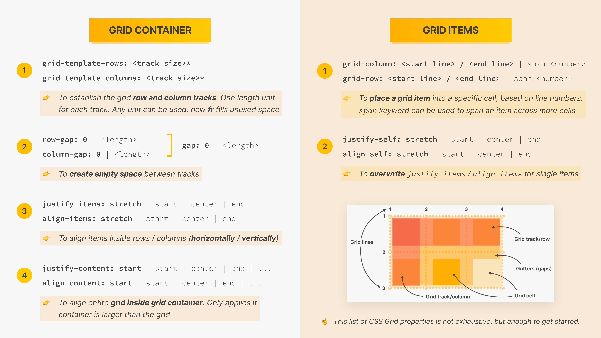

# CSS

!!! info ""

    + [CSS Tricks](https://css-tricks.com/almanac/){target=_blank}
    + [Learn CSS](https://web.dev/learn/css/){target=_blank}
    + [Шпаргалка по CSS](https://www.exlab.net/tools/sheets/css.html){target=_blank}

    .png){: .zoom}

## CSS Fundamentals

**C**ascading **S**tyle **S**heets describes the ^^visual style and presentation^^ of the ^^content written in HTML.^^<br>
CSS at the most basic level it indicates that the order of *CSS Rules* matter.<br>
CSS consist of countless *properties* that developer use to format the content: preperties about font, text, spacing, layout, etc.

### A CSS Rule

**`h1 { color: blue; }`** - this is the *CSS Rule*, where:

+ `h1` - is a *Selector*
+ `{ color: blue; }` - is a *Decalration Block*
+ `color: blue;` - is a *Declararion/Style*
+ `color` - is a *Property*
+ `blue` - is a *Value* and it can be one of the two types: ^^length^^(like `20px`) or ^^keyword^^(like `blue`)

### 3 ways to connect CSS to HTML

1. *Inline CSS*, using `style` attribute. Should usually never be used, because of *separarion of concern* principle.

    `#!html <h1 style="color: blue">The Code Magazine</h1>`

2. *Internal CSS*, using `#!html <style>` element inside `#!html <head>` element.

    ```html
    <head>
        <meta charset="UTF-8" />
        <title>The Basic Language of the Web: HTML</title>

        <style>
            h1 {
                color: blue;
            }
        </style>
    </head>
    ```

3. *External CSS*, using completely different file(e.g. style.css) and link it to the index.html through the `#!html <link />` element inside `#!html <head>` element.

    ```html
    <head>
        <meta charset="UTF-8" />
        <title>The Basic Language of the Web: HTML</title>

        <link href="style.css" rel="stylesheet" />

    </head>
    ```

### Selectors (the most used ones)

!!! info ""

    [CSS selectors full list (W3S)](https://www.w3schools.com/cssref/css_selectors.asp){target=_blank}

#### Element selectors

+ `element` - *element selector*, selects the element by its name

+ `element, element` - combining selectors into one list, so the *selector* here is now a *list selector*

+ `element1 element2` - *descendant(= the very next) selector*, selects ^^all^^ the `element2` elements **inside** the `element1` elements

+ `element > element`

+ `element1 + element2` - *adjacent sibling selector*, selects the ^^first^^ `element2` element that is placed immediately **after** `element1` elements

!!! tip "*Encoding the HTML structure* problem"

    Usnig the selectors above encodes the HTML structure into our CSS selector. That is if in a certain point of time the HTML structure changes then our selector is no more applied as was intended.<br>
    Therefore the good practice is to use *element naming selcetors* from the next paragraph below.

+ `*` - *universal selector*, selects every single element on the page

    !!! note "Inheritance and the Universal Selector"

        *Inheritance* - is a mechanism by which some style properties gets their values inherited from parent elements to child elements.

        Not all properties get inherited. It’s mostly ones related to **text**:<br>
        `font-family`<br>
        `font-size`<br>
        `font-weight`<br>
        `font-style`<br>
        `color`<br>
        `line-height`<br>
        `letter-spacing`<br>
        `text-align`<br>
        `text-transform`<br>
        `text-shadow`<br>
        `list-style`<br>
        etc.

        If we actually want a certain style property, ^^which does not get inherited^^, applied to all elements we use the *universal selector*.

#### Element naming selectors

+ `.class` - selects the element by its `class` attribute value

+ `.class1.class2` - *`and` selector* - selects all elements with both ^^class1^^ and ^^class2^^ set within its `class` attribute

+ `#id` - selects the element by its `id` attribute value

!!! note "`class` and `id` HTML attributes naming convention"

    If we have a Class or an ID name with multiple words, we separate these words by Dashes like this:<br>
    `#!html <p class="related-author">By Jim Dillon</p>`

!!! tip "Prefer Class over ID"

    In contrast to HTML `class` attribute the `id` attribute has to have unique value. Therefore having ID selector can be inconvenient when in a certain point of time we will want to add same as `id` attribute naming to another element.

#### Pseudo-classes

+ `elem:first-child` - selects every `elem` element that is the first child of its parent

+ `elem:last-child` - selects every `elem` element that is the last child of its parent

+ `elem:nth-child(n)` - selects every `elem` element that is the `n`th child of its parent

    `n` can be a **number**, a *keyword* (**odd** or **even**), or a formula **an + b**, where **a** represents a cycle size, **n** is a counter (starts at 0), and **b** is an offset value.

    ```css
    /* Here, we specify a background color for all p elements whose index is a multiple of 3.
    Then we subtract 1 (will select the second, fifth, eight, etc)  */
    p:nth-child(3n-1) {
      background: red;
    }
    ```

+ `:active` - selects elements when mouse clicks them

    !!! warning "`:active` MUST come after `:hover` (if present) in the CSS definition in order to be effective!"

+ `:hover` - selects elements when mouse over them

    !!! warning "`:hover` MUST come after `:link` and `:visited` (if they are present) in the CSS definition, in order to be effective!"

Anchor elements(`#!html <a>`) should always be selected with following pseudo-classes that allow us to target different states:

+ `:link` - target all ^^unvisited^^ anchor elements that have an `href` attribute
+ `:visited` - target all ^^visited^^ anchor elements

!!! tip "Anchors styling best practice"

    Always style the different anchor states specifying ^^all^^ the four states in **LHVA**(`:link` &rarr; `:visited` &rarr; `:hover` &rarr; `:active`) order!

+ `:not(<selector>)` - selects every element that is not a `<selector>` element

    !!! example "Setting element's bottom margin everytime except when it is a last one."

        ```css
        .grid:not(:last-child) {
            margin-bottom: 9.6rem;
        }
        ```

#### Pseudo-elements

Elements that don't exist in the HTML, but that we can still select and style in CSS.

+ `::first-letter`
+ `::first-line`
+ `::after` - creates a pseudo element, that will automatically be the very ^^last^^ child of the selected element
+ `::before` - creates a pseudo element, that will automatically be the very ^^first^^ child of the selected element

!!! tip "`::after` and `::before` usage"

    Can be very useful for some small cosmetic style for which we don't want to necessarily add a new element to the HTML"

    ```css
    h1::after {
        content: "TOP"; /* this property is mandatory, can be an empty string */
        background-color: #ffe70e;
        font-size: 16px;
        font-weight: bold;
        display: inline-block; /* because by default it is inline element */
        padding: 5px 10px;
        position: absolute;
        top: -10px;
        right: -25px;
    }
    ```

### Conflicts between selectors

What seletors win out in the cascade depends on:

1. Resolving conflicting declarations(styles) steps ordered by priority from **5-highest** to **0-lowest**:

    !!! quote ""

        **5** - Importance (styles marked with `#!css !important`)<br>
        a `!` delimiter followed by the `important` *keyword* marks the style more important than ^^all^^ the other ones, e.g. `#!css p { color: green !important; }`

    &darr;

    !!! quote ""

        **4** - Inline style(`style` attribute in HTML)

    !!! tip "Steps 5-4 should be used as a last resort only!"

        Use it only in case you really, really cannot figure out what's happening in your code.<br>
        **BUT** even then , instead of using the `important` keyword, write your selectors as simple as possible:<br>
        - do not add too much nesting selectors<br>
        - don't add too many IDs and Classes all in the same selector

    &darr;

    !!! quote ""

        **3** - ID (`#`) selector

    &darr;

    !!! quote ""

        **2** - Class (`.`) or pseudo-class (`:`) selector

    &darr;

    !!! quote ""

        **1** - Element Selector (`p` , `div`, `li`, etc.)

    !!! note "Selectors Specificity (steps 3-1)"

        Official Docs: [CSS specificity](https://www.w3.org/TR/selectors-3/#specificity){target=_blank}<br>
        Specificity Calculator: [https://specificity.keegan.st/](https://specificity.keegan.st){target=_blank}<br>
        When there are multiple **different** selectors ^^selecting the same element^^ that have ^^confilicting styles^^ then ^^all of them^^(all rules and properties) are applied! **BUT** only one wins out, i.e. gets active depending on its *specificity* value.

    &darr;

    !!! quote ""

        **0** - Universal Selector (`*`)

2. Source order

    + When there are multiple **same** selectors ^^selecting the same element^^ that have ^^confilicting styles^^ then ^^the last of them^^ gets applied!

### Properties (the most used ones)

!!! warning "Properties' browser support and vendor prefixes"

    1. When using new(in a sense of timeline) CSS properties that may be not yet implemented in all browsers we must check their compatibility on this resoure: [caniuse.com](https://caniuse.com){target=_blank}.

    2. Some of the "newly presented" properties can be availabe in specific browser only using its *vendor prefix* by writing it in front of the property.<br>

        List of nowadays used *vendor prefixes* for modern browsers:

        + `-webkit-` - Chrome, Safari, Opera, Edge and browsers using the Webkit engine
        + `-moz-` - Firefox and other browsers using Mozilla's browser engine
        + `-o-`(deprecated) - Opera
        + `-ms-` - Internet Explorer(but not always)

        ```css
        /* to support specific browser write its vendor prefix in from of desired property */
        .main-nav {
            background-color: rgba(255, 255, 255, 0.75);
            backdrop-filter: blur(10px);
            -webkit-backdrop-filter: blur(10px); /* to support safari browser */
        }
        ```

#### Text

+ `font-family: sans-serif;`

    By default the font family of the html elements content is **serif**<br>
    We cannot set font that we have in our computer because that wouldn't then work for all the users that are going to visit our page(unless they also have that font installed on their computer).<br>
    Using `sans-serif` *keyword* here we are not actually specify a real font family but rather "tell" the browser to use any font family that is a "sans serif".

+ `font-size: 26px` - changes font size to 26px of the ^^physical screen^^

    By default the font size of the html elements content(or `<li>` elements only ?) is **16px**

+ `font-weight: bold;`

+ `font-style: italic;`

+ `text-transform: uppercase;`

+ `text-align: center;` - puts element content at the center of its parent element

+ `text-decoration: none;` - decorations applied to font used for an element's text; a *shorthand* for:<br>
     `text-decoration-line`<br>
     `text-decoration-style`<br>
     `text-decoration-color`<br>
     `text-decoration-thickness`

+ `line-height: 1.5;` - here the *value* is without the unit and it simply means that the line height will be 1.5 times the `font-size`

+ `letter-spacing`

#### Boxes

!!! note "The CSS Box Model"

    + **Content:** Element's content: text, images, etc. Has **content width** and **content height**
    + **Padding:** Invisible space around the *Content*, **inside** of the element
    + **Fill area = Content + Padding:** area that gets filled with `background-color` or `background-image`
    + **Border:** A line around the element, still **inside** of the element
    + **Margin:** Space **outside** of the element, between elements

    **`width` / `height` properties behaviour** depends on `box-sizing` property value:

    + `box-sizing: content-box;` - sets the ^^default^^ behaviour: the specified `width` and `height` (and respective `min` / `max` properties) apply to the width and height respectively of the *content box* of the element, and therefore:<br>
    **final element width** = left border + left padding + content width(defined by `width`) + right padding + right border<br>
    **final element height** = top border + top padding + content height(defined by `height`) + bottom padding + bottom border

    + `box-sizing: border-box;` - sets the ^^alternative^^ behaviour: the specified `width` and `height` (and respective `min` / `max` properties) on the element determine the *border box* of the element, and therefore:<br>
    **final element width** = defined by `width`<br>
    **final element height** = defined by `height`

        Padding and borders that we do specify will now reduce the inner width of the content area, but that's usually not a problem.

!!! note "Type of Boxes"

    Elements are formatted visually as **boxes**. Thera are 3 boxes(= elements) types:

    1. Block-Level Boxes

        + Elements are formatted visually as **blocks**.
        + Elements are always start on a new line and occupy **100% of parent element’s width**, no matter the content.

            !!! note "Browsers typically display the block-level element with a newline both ^^before^^ and ^^after^^ the element. "

        + Elements are **stacked vertically** by default, one after another.
        + The box-model **applies as showed** earlier in previous note.
        + **Default elements:** `body`, `main`, `header`, `footer`, `section`, `nav`, `aside`, `div`, `h1-h6`, `p`, `ul`, `ol`, `li`, etc.
        + CSS style to change from inline boxes to block-level boxes: `#!css display: block;`

            !!! tip "Getting rid of little gaps between inline/inline-block elements"

                This is useful for a stack of images especially, e.g. `#!css .gallery img { display: block; }`

    2. Inline Boxes

        + Occupies only the space **necessary for its content**.
        + Causes **no line-breaks** after or before the element.
        + Box model applies in a different way: **heights and widths do not apply**.
        + **Paddings and margins** are applied **only horizontally** (left and right).<br>
        That is the padding will be added to all sides expanding the *fill area* **BUT VISUALLY** the *content area* will move right/left only and stay on its place vertically(^^no new space^^ actually gets created on the page) unlike when we set padding on *block-level* boxes where the *content area* moves right/left and up/down also, affecting the content verticall alignment by actually creating a ^^new space^^ on the page.
        + **Default elements:** `::any-pseudo-elements`, `a`, `strong`, `em`, etc.
        + CSS style to change from block-level boxes to inline boxes: `#!css display: inline;`

    3. Inline-Block Boxes

        + Looks like *inline* from the **outside**, behaves like *block-level* on the **inside**.
        + Occupies only the space **necessary for its content**.
        + Causes **no line-breaks** after or before the element.
        + The box-model **applies as showed** earlier in previous note.
        + **Default elements:** `img`, `button`, etc.
        + CSS style to change from block-level/inline boxes to inline-block boxes: `#!css display: inline-block;`

        !!! tip "Good ^^old^^ technic to arrange links in navigation bar"

            ```css
            nav a:link {
                margin-right: 30px;
                margin-top: 10px;
                display: inline-block;
            }

            nav a:link:last-child {
                margin-right: 0;
            }
            ```

            Nowadays there is more modern tools achieving this like *Flexbox* and *CSS Grid*.

+ `padding` - a *shorthand* for:<br>
    `padding-top`<br>
    `padding-right`<br>
    `padding-bottom`<br>
    `padding-left`

    !!! note "Syntax"

        ```css
        padding: 5%;                /* All sides: 5% padding */

        padding: 10px;              /* All sides: 10px padding */

        padding: 10px 20px;         /* top and bottom: 10px padding */
                                    /* left and right: 20px padding */

        padding: 10px 3% 20px;      /* top:            10px padding */
                                    /* left and right: 3% padding   */
                                    /* bottom:         20px padding */

        padding: 1em 3px 30px 5px;  /* top:    1em padding  */
                                    /* right:  3px padding  */
                                    /* bottom: 30px padding */
                                    /* left:   5px padding  */
        ```

    !!! note "Values"

        `<length>` - The size of the padding as a fixed value. Must be nonnegative.

        `<percentage>` - The size of the padding as a percentage, relative to the inline size (`width` in a horizontal language, defined by [:simple-mdnwebdocs: writing-mode - property that sets whether lines of text are laid out horizontally or vertically, as well as the direction in which blocks progress](https://developer.mozilla.org/en-US/docs/Web/CSS/writing-mode){target=_blank}) of the *containing block*(most often it is the *content area* of an element's nearest block-level ancestor, but this is not always the case(see [:simple-mdnwebdocs: Identifying the containing block](https://developer.mozilla.org/en-US/docs/Web/CSS/Containing_block#identifying_the_containing_block){target=_blank})). Must be nonnegative.

    !!! tip "Usage"

        When we need some space **inside** of an element, mostly for applying a ^^background coloror^^ a ^^border^^ on the element.

+ `margin` - a *shorthand* for:<br>
    `margin-top`<br>
    `margin-right`<br>
    `margin-bottom`<br>
    `margin-left`

    !!! warning "Collapsing Margins of Block-Level elements"

        **For Block-Level boxes only:** When we have two margins that occupied the same space, ^^the larger one^^ of them is actually visible on the page.<br>
        Margins **aren't** collapsed in *Inline* and *Inline-Block* boxes.

    !!! tip "Usage"

        When we need some space **outside** of an element, or also to create **space between** multiple elements.

        In case of adding vertical space between elements across the whole page, we, ^^most of the time^^, should stick to `margin-bottom`.

+ `border: 5px solid #1098ad;` - a *shorthand* for:<br>
    `border-width`<br>
    `border-style`<br>
    `border-color`

+ `border-top/right/bottom/left: 5px solid #1098ad;` - same as above, but sets border in specific direction; a *shorthand* for:<br>
  `border-top/rifht/bottom/left-width`<br>
  `border-top/rifht/bottom/left-style`<br>
  `border-top/rifht/bottom/left-color`

+ `border-collapse: collapse` - being set on the parent element transforms neighboring borders of the child elements into **one** border, e.g.:

    ```css
    table {
      border-collapse: collapse;
    }

    th,
    td {
      border: 1px solid #343a40;
    }
    ```

#### Positioning

+ `position: relative;` - default positioning
+ `position: absolute;` - absolute positioning

!!! note "Normal Flow vs. Absolute Positioning"

    1. Normal Flow

        + Default positioning of element on the page.
        + Element is “**in** flow”
        + Elements are simply laid out according to their HTML code.

    2. Absolute Positioning

        + Element is removed from the normal flow: “**out of** flow”.
        + No impact on surrounding elements, might overlap them.
        + Use `top`, `bottom`, `left`, or `right` properties(can have negative values) to offset the element from its **relatively positioned container**.<br>
        The ^^default^^ relatively positioned container is the **viewport(= visible part of the page after reloading)**.<br>
        To position the *absolute displayed element*(that is set by `position: absolute;` style) in relation to specific element we need to style that element with `position: absolute;`.

+ `z-index:1;` - sets the z-order of a *positioned*(`position: relative/absolute/fixed/sticky;`) element and its descendants or flex items. Overlapping elements with a larger z-index cover those with a smaller one.

    !!! note "Values:"

        ```css
        /* Keyword value */

        z-index: auto;

        /*<integer> values*/
        z-index: 0;
        z-index: 3;
        z-index: 289;
        z-index: -1; /*Negative values to lower the priority*/

        /*Global values*/
        z-index: inherit;
        z-index: initial;
        z-index: revert;
        z-index: revert-layer;
        z-index: unset;
        ```

        `auto` - The box does not establish a new local stacking context. The stack level of the generated box in the current stacking context is `0`.

        `<integer>` - Is the stack level of the generated box in the current stacking context. The box also establishes a local stacking context. This means that the z-indexes of descendants are not compared to the z-indexes of elements outside this element.

+ `overflow: <keyword>;` - sets the desired behavior for a ^^parent^^ element's overflow — i.e. when its ^^child^^ elements' content is too big to fit in its [:simple-mdnwebdocs: block formatting context](https://developer.mozilla.org/en-US/docs/Web/Guide/CSS/Block_formatting_context){target=_blank} — in both directions; a *shorthand* for:<br>
    `overflow-x`<br>
    `overflow-y`<br>

    !!! note "Syntax"

        ```css
        /* Keyword values */
        overflow: visible;
        overflow: hidden;
        overflow: clip;
        overflow: scroll;
        overflow: auto;
        overflow: hidden visible;

        /*Global values*/
        overflow: inherit;
        overflow: initial;
        overflow: revert;
        overflow: revert-layer;
        overflow: unset;
        ```

    !!! note "Values"

        `visible` - Content is not clipped and may be rendered outside the padding box.

        `hidden` - Content is clipped if necessary to fit the padding box. No scrollbars are provided, and no support for allowing the user to scroll (such as by dragging or using a scroll wheel) is allowed. The content can be scrolled programmatically (for example, by setting the value of a property such as [:simple-mdnwebdocs: scrollLeft](https://developer.mozilla.org/en-US/docs/Web/API/Element/scrollLeft){target=_blank} or the [:simple-mdnwebdocs: scrollTo()](https://developer.mozilla.org/en-US/docs/Web/API/Element/scrollTo){target=_blank} method), so the element is still a scroll container.

        `scroll` - Content is clipped if necessary to fit the padding box. Browsers always display scrollbars whether or not any content is actually clipped, preventing scrollbars from appearing or disappearing as content changes. Printers may still print overflowing content.

        [:simple-mdnwebdocs: Other values](https://developer.mozilla.org/en-US/docs/Web/CSS/overflow#values){target=_blank}

    !!! example "Setting the 45 degree rotated badge(child) over the card element(parent)."

        ```css
        /* parent(card) element */
        .pricing-plan--complete {
            background-color: #fdf2e9;
            padding: 4.8rem;
            position: relative;
            overflow: hidden; /* hides the corners of the rectangle 'after' element */
        }

        /* child(badge) element */
        .pricing-plan--complete::after {
            content: "Best value";
            position: absolute;
            top: 6%;
            right: -18%;

            text-transform: uppercase;
            font-size: 1.4rem;
            font-weight: 700;
            color: #333;
            background-color: #ffd43b;
            padding: 0.8rem 8rem;
            transform: rotate(45deg);
        }
        ```

+ `transform: <transform-function>` - lets ^^rotate^^, ^^scale^^, ^^skew^^, or ^^translate^^ an element. It modifies the coordinate space of the CSS [:simple-mdnwebdocs: visual formatting model](https://developer.mozilla.org/en-US/docs/Web/CSS/Visual_formatting_model){target=_blank}.

    If the property has a value different than `none`, a [:simple-mdnwebdocs: stacking context](https://developer.mozilla.org/en-US/docs/Web/CSS/CSS_Positioning/Understanding_z_index/The_stacking_context){target=_blank} will be created. In that case, the element will act as a *containing block* for any `position: fixed;` or `position: absolute;` elements that it contains.

    !!! warning "Only transformable elements can be `transform`ed."

        That is, all elements whose layout is governed by the CSS box model except for: *non-replaced inline boxes*, [:simple-mdnwebdocs: *table-column boxes*](https://developer.mozilla.org/en-US/docs/Web/HTML/Element/col){target=_blank}, and [:simple-mdnwebdocs: *table-column-group boxes*](https://developer.mozilla.org/en-US/docs/Web/HTML/Element/colgroup){target=_blank}.

    !!! note "Syntax"

        ```css
        /* Keyword values */
        transform: none;

        /*Function values*/
        transform: matrix(1, 2, 3, 4, 5, 6);
        transform: matrix3d(1, 0, 0, 0, 0, 1, 0, 0, 0, 0, 1, 0, 0, 0, 0, 1);
        transform: perspective(17px);
        transform: rotate(0.5turn);
        transform: rotate3d(1, 2, 3, 10deg);
        transform: rotateX(10deg);
        transform: rotateY(10deg);
        transform: rotateZ(10deg);
        transform: translate(12px, 50%);
        transform: translate3d(12px, 50%, 3em);
        transform: translateX(2em);
        transform: translateY(3in);
        transform: translateZ(2px);
        transform: scale(2, 0.5);
        transform: scale3d(2.5, 1.2, 0.3);
        transform: scaleX(2);
        transform: scaleY(0.5);
        transform: scaleZ(0.3);
        transform: skew(30deg, 20deg);
        transform: skewX(30deg);
        transform: skewY(1.07rad);

        /*Multiple function values*/
        transform: translateX(10px) rotate(10deg) translateY(5px);
        transform: perspective(500px) translate(10px, 0, 20px) rotateY(3deg);

        /*Global values*/
        transform: inherit;
        transform: initial;
        transform: revert;
        transform: revert-layer;
        transform: unset;
        ```

        The `transform` property may be specified as either the keyword value `none` or as one or more `<transform-function>` values.

        If `perspective()` is one of multiple function values, it must be listed first.

    !!! note "Values"

        `none` - Specifies that no transform should be applied.

        `<transform-function>` - One or more of the CSS transform functions to be applied. The transform functions are multiplied in order from left to right, meaning that composite transforms are effectively applied in order from right to left.

        6 categories of *transform functions*(click on links below to see all possible functions for each category):

        1. [:simple-mdnwebdocs: Matrix transformation](https://developer.mozilla.org/en-US/docs/Web/CSS/transform-function#matrix_transformation){target=_blank}

        2. [:simple-mdnwebdocs: Perspective](https://developer.mozilla.org/en-US/docs/Web/CSS/transform-function#perspective){target=_blank}

        3. [:simple-mdnwebdocs: Rotation](https://developer.mozilla.org/en-US/docs/Web/CSS/transform-function#rotation){target=_blank}

        4. [:simple-mdnwebdocs: Scaling (resizing)](https://developer.mozilla.org/en-US/docs/Web/CSS/transform-function#scaling_resizing){target=_blank}

        5. [:simple-mdnwebdocs: Skewing (distortion)](https://developer.mozilla.org/en-US/docs/Web/CSS/transform-function#skewing_distortion){target=_blank}

        6. [:simple-mdnwebdocs: Translation (moving)](https://developer.mozilla.org/en-US/docs/Web/CSS/transform-function#translation_moving){target=_blank}

            + `translate(<length-percentage>, <length-percentage>?)` - Translates an element on the 2D plane, i.e. repositions an element in the horizontal and/or vertical directions.

                !!! note "Syntax"

                    ```css
                    /* Single <length-percentage> values */
                    transform: translate(200px);
                    transform: translate(50%);

                    /*Double <length-percentage> values*/
                    transform: translate(100px, 200px);
                    transform: translate(100px, 50%);
                    transform: translate(30%, 200px);
                    transform: translate(30%, 50%);
                    ```

                !!! note "Values"

                    Single `<length-percentage>` values - a `<length>` or `<percentage>` representing the abscissa (horizontal, x-coordinate) of the translating vector. The ordinate (vertical, y-coordinate) of the translating vector will be set to `0`.<br>
                    A percentage value refers to the width of the reference box defined by the `transform-box`([:simple-mdnwebdocs:](https://developer.mozilla.org/en-US/docs/Web/CSS/transform-box){target=_blank}) property.

                    Double `<length-percentage>` values - describes two `<length>` or `<percentage>` values representing both the abscissa (x-coordinate) and the ordinate (y-coordinate) of the translating vector.<br>
                    A percentage as first value refers to the width, as second part to the height of the reference box defined by the `transform-box`([:simple-mdnwebdocs:](https://developer.mozilla.org/en-US/docs/Web/CSS/transform-box){target=_blank}) property.

                !!! tip "Place ^^absolute-positioned^^ child element in the middle of its parent element"

                    ```css
                    /* parent element */
                    .step-img-box {
                        position: relative;
                    }

                    /* absolute-positioned child element */
                    .step-img-box::before {
                        content: "";
                        display: block;

                        position: absolute;
                        top: 50%;
                        left: 50%;
                        transform: translate(-50%, -50%);
                    }
                    ```

+ `transition: all 0s ease 0s;`(initial values) - enable you to define the transition between two states of an element; a *shorthand* for:<br>
  `transition-property` - sets the CSS properties to which a [:simple-mdnwebdocs: *transition effect*](https://developer.mozilla.org/en-US/docs/Web/CSS/CSS_Transitions/Using_CSS_transitions){target=_blank} should be applied([:simple-mdnwebdocs: see more](https://developer.mozilla.org/en-US/docs/Web/CSS/transition-property){target=_blank}).<br>
  `transition-duration` - sets the length of time a transition animation should take to complete. By default, the value is `0s`, meaning that no animation will occur([:simple-mdnwebdocs: see more](https://developer.mozilla.org/en-US/docs/Web/CSS/transition-duration){target=_blank}).<br>
  `transition-timing-function` - sets how intermediate values are calculated for CSS properties being affected by a *transition effect*([:simple-mdnwebdocs: see more](https://developer.mozilla.org/en-US/docs/Web/CSS/transition-timing-function){target=_blank}).<br>
  `transition-delay` - specifies the duration to wait before starting a property's *transition effect* when its value changes([:simple-mdnwebdocs: see more](https://developer.mozilla.org/en-US/docs/Web/CSS/transition-delay){target=_blank}).

    Transitions enable you to define the transition between two states of an element. Different states may be defined using pseudo-classes like `:hover` or `:active` or dynamically set using JavaScript.

    !!! warning "ALWAYS set `transition` on the ^^original state^^ of an element"

        ```css
        /* original state */
        .link:link,
        .link:visited {
            display: inline-block;
            color: #e67e22;
            text-decoration: none;
            border-bottom: 1px solid currentcolor;
            padding-bottom: 2px;

            transition: all 0.3s;
        }

        /* transitioned state */
        .link:hover,
        .link:active {
            color: #cf7111;
            border-bottom: 1px solid transparent;
        }
        ```

    !!! note "Syntax"

        ```css
        /* Apply to 1 property */
        /*property name | duration*/
        transition: margin-right 4s;

        /*property name | duration | delay*/
        transition: margin-right 4s 1s;

        /*property name | duration | easing function*/
        transition: margin-right 4s ease-in-out;

        /*property name | duration | easing function | delay*/
        transition: margin-right 4s ease-in-out 1s;

        /*Apply to 2 properties*/
        transition: margin-right 4s, color 1s;

        /*Apply to all changed properties*/
        transition: all 0.5s ease-out;

        /*Global values*/
        transition: inherit;
        transition: initial;
        transition: revert;
        transition: revert-layer;
        transition: unset;
        ```

        The `transition` property is specified as one or more single-property transitions, separated by commas.<br>
        Each single-property transition describes the transition that should be applied to a single property (or the special values `all` and `none`).

    !!! tip "Design tips"

        + for average elements set `transition-duration` to `0.3s` &rarr; `transition: all 0.3s;`
        + for bigger elements set bigger `transition-duration`

#### Dimensions

+ `width: 100%;` - sets the width of the *content area*, *padding area* or *border area* (depending on `box-sizing`) of certain boxes

+ `height: 20px;` - sets the height of the *content area*, *padding area* or *border area* (depending on `box-sizing`) of certain boxes

+ `max-width: 1000px` - constrain content width to a certain range:

    a. if the parent container width is ^^larger^^ than the specified `max-width`, then the width of the element is **equal** the value that was specified for `max-width`

    b. if the parent container width is ^^less^^ than the specified `max-width`, then the width of the element will be **100%** of the parent's container element width

+ `min-width: 400px;` - constrain content width to a certain range

+ `aspect-ratio: auto/<ratio>;` - sets a ^^preferred aspect ratio^^ for the box, which will be used in the calculation of auto sizes and some other layout functions

    !!! note "Syntax"

        ```css
        aspect-ratio: 1 / 1;

        aspect-ratio: 1;

        /*Global values*/
        aspect-ratio: inherit;
        aspect-ratio: initial;
        aspect-ratio: revert;
        aspect-ratio: revert-layer;
        aspect-ratio: unset;
        ```

    !!! note "Values"

        `auto` - [:simple-mdnwebdocs: Replaced elements](https://developer.mozilla.org/en-US/docs/Web/CSS/Replaced_element){target=_blank} with an intrinsic aspect ratio use that aspect ratio, otherwise the box has no preferred aspect ratio. Size calculations involving intrinsic aspect ratio always work with the *content box* dimensions.

        `<ratio>` - The box's preferred aspect ratio is the specified ratio of `width / height`. If `height` and the preceding slash character are omitted, `height` defaults to `1`. Size calculations involving preferred aspect ratio work with the dimensions of the box specified by `box-sizing`.

##### units

Relative:

+ `%` - percentage

    !!! note "Calculating percentage values from the containing block"

        When *box model properties* and *offset properties* are given a ^^percentage value^^, the computed value depends on the element's *containing block*(most often it is the *content area* of an element's nearest block-level ancestor, but this is not always the case(see [:simple-mdnwebdocs: Identifying the containing block](https://developer.mozilla.org/en-US/docs/Web/CSS/Containing_block#identifying_the_containing_block){target=_blank}):

        1. The `height`, `top`, and `bottom` properties compute percentage values from the `height` of the *containing block*.
        2. The `width`, `left`, `right`, `padding`, and `margin` properties compute percentage values from the `width` of the *containing block*.

        !!! tip "Square elelment inside the rectangle parent element"

            Setting 3 squared(20px x 20px) elements(`div`, `anchor` and `::after`) insdide rectangle parent element(200px x 100px) using `padding-bottm` or `aspect-ratio` trick:

            ```html
            <!DOCTYPE html>
            <html lang="en">
            <head>
                <meta charset="UTF-8" />
                <meta http-equiv="X-UA-Compatible" content="IE=edge" />
                <meta name="viewport" content="width=device-width, initial-scale=1.0" />
                <title>Document</title>
                <style>
                .rectangle {
                    background-color: aqua;
                    width: 200px;
                    height: 100px;
                    margin: 100px auto;
                }

                .square-div {
                    background-color: blue;
                    width: 10%; /* 10% of parent's width */
                    /*height: 10%; --> will give us only 10px instead of desired 20px */
                    padding-bottom: 10%; /* 10% of parent's width; instead, 'aspect-ratio: 1' could also be used here */
                }

                .square-anchor:link,
                .square-anchor:visited {
                    display: block; /* instead, 'inline-block' could also be used here */
                    background-color: magenta;
                    width: 10%;
                    padding-bottom: 10%; /* instead, 'aspect-ratio: 1' could also be used here */
                }

                .rectangle::after {
                    content: "";
                    display: block; /* instead, 'inline-block' could also be used here */
                    background-color: orange;
                    width: 10%;
                    padding-bottom: 10%; /* instead, 'aspect-ratio: 1' could also be used here */
                }
                </style>
            </head>
            <body>
                <div class="rectangle">
                <div class="square-div"></div>
                <a href="#" class="square-anchor"></a>
                </div>
            </body>
            </html>
            ```

#### Colors and Images

!!! note "Defining colors in CSS"

    + RGB/RGBA Notation

        `rgb(0, 255, 255)` - regular RGB model<br>
        `rgb(0, 255, 255, 0.3)` - RGB with **trasparency(alpha)**

    + Hexademical notation

        Instead of using a scale from 0 to 255, we go from **0 to ff**(255 in hexademical numbers)<br>
        `#00ffff` or `#off` for shorthand(only when al colors are identical pairs)

    !!! tip "In practice we mostly use *hexademical* colors, and *rgba* when we need transparency"

    **Shades of grey:**

    When colors in all 3 channels(RGB) are the same, we get a **grey color**. There are 256 pure grays to choose from. There are some that worse to remember:<br>
    `rgb(0, 0, 0)` / `#000` - black<br>
    `rgb(69, 69, 69)` / `#444` - good for test color<br>
    `rgb(183, 183, 183)` / `#b7b7b7`<br>
    `rgb(119, 119, 119)` / `#777`<br>
    `rgb(247, 247, 247)` / `#f7f7f7`<br>
    `rgb(255, 255, 255)` / `#fff` - white

+ `color: #1098ad;` - defines the color of the element's content text

    !!! note "`currentcolor` keyword"

        Represents the value of an element's `color` property. This lets you use the color value on properties that do not receive it by default.

        If `currentcolor` is used as the value of the `color` property, it instead takes its value from the ^^inherited value^^ of the `color` property.

+ `background` - sets all background style properties at once; a *shorthand* for:<br>
  `background-attachment`<br>
  `background-clip`<br>
  `background-color`<br>
  `background-image`<br>
  `background-origin`<br>
  `background-position`<br>
  `background-repeat`<br>
  `background-size`

    !!! note "Syntax"

        ```css
        /* Using a <background-color> */
        background: green;

        /*Using a <bg-image> and <repeat-style>*/
        background: url("test.jpg") repeat-y;

        /*Using a <box> and <background-color>*/
        background: border-box red;

        /*A single image, centered and scaled*/
        background: no-repeat center/80% url("../img/image.png");

        /*Global values*/
        background: inherit;
        background: initial;
        background: revert;
        background: revert-layer;
        background: unset;
        ```

        The `background` property is specified as one or more ^^background layers^^, separated by commas.

        The syntax of each layer is as follows:

        + Each layer may include zero or one occurrences of any of the following values:

            + `<attachment>`
            + `<bg-image>`
            + `<position>`
            + `<bg-size>`
            + `<repeat-style>`

        + The `<bg-size>` value may only be included immediately after` <position>`, separated with the `/` character, like this: `center/80%`.

        + The `<box>` value may be included zero, one, or two times.<br>
            If included **once**, it sets both `background-origin`([:simple-mdnwebdocs:](https://developer.mozilla.org/en-US/docs/Web/CSS/background-origin){target=_blank}) and `background-clip`([:simple-mdnwebdocs:](https://developer.mozilla.org/en-US/docs/Web/CSS/background-clip){target=_blank}).<br>
            If it is included **twice**, the first occurrence sets `background-origin`, and the second sets `background-clip`.

        + The `<background-color>` value may only be included in the last layer specified.

    !!! note "Values"

        + `<attachment>` - See [:simple-mdnwebdocs: `background-attachment: scroll;`(init value)](https://developer.mozilla.org/en-US/docs/Web/CSS/background-attachment){target=_blank}.

        + `<box>` - See [:simple-mdnwebdocs: `background-clip: border-box;`(init value)](https://developer.mozilla.org/en-US/docs/Web/CSS/background-clip){target=_blank} and [:simple-mdnwebdocs: `background-origin: padding-box;`(init value)](https://developer.mozilla.org/en-US/docs/Web/CSS/background-origin){target=_blank}.

        + `<background-color>` - See[ :simple-mdnwebdocs: `background-color: transparent;`(init value)](https://developer.mozilla.org/en-US/docs/Web/CSS/background-color){target=_blank}.

            `background-color` - sets the background color of an element.

            !!! note "Syntax"

                The `background-color` property is specified as a single `<color>` value. It is rendered behind any `background-image` that is specified, although the color will still be visible through any transparency in the image.

                ```css
                /* Keyword values */
                background-color: red;
                background-color: indigo;

                /*Hexadecimal value*/
                background-color: #bbff00; /*Fully opaque*/
                background-color: #bf0; /*Fully opaque shorthand*/
                background-color: #11ffee00; /*Fully transparent*/
                background-color: #1fe0; /*Fully transparent shorthand*/
                background-color: #11ffeeff; /*Fully opaque*/
                background-color: #1fef; /*Fully opaque shorthand*/

                /*RGB value*/
                background-color: rgb(255, 255, 128); /*Fully opaque*/
                background-color: rgba(117, 190, 218, 0.5); /*50% transparent*/

                /*HSL value*/
                background-color: hsl(50, 33%, 25%); /*Fully opaque*/
                background-color: hsla(
                    50,
                    33%,
                    25%,
                    0.75
                ); /*75% opaque, i.e. 25% transparent*/

                /*Special keyword values*/
                background-color: currentcolor;
                background-color: transparent;

                /*Global values*/
                background-color: inherit;
                background-color: initial;
                background-color: revert;
                background-color: revert-layer;
                background-color: unset;
                ```

        + `<bg-image>` - See [:simple-mdnwebdocs: `background-image: none;`(init value)](https://developer.mozilla.org/en-US/docs/Web/CSS/background-image){target=_blank}.

            `background-image` - sets one or more background images on an element.

            The background images are drawn on stacking context layers on top of each other. The first layer specified is drawn as if it is closest to the user.

            The `border`s of the element are then drawn on top of them, and the `background-color` is drawn beneath them. How the images are drawn relative to the box and its borders is defined by the `background-clip` and `background-origin` CSS properties.

            !!! note "Syntax"

                Each background image is specified either as the keyword none or as an`<image>` value.<br>
                To specify multiple background images, supply multiple values, separated by a comma:

                ```css
                background-image: linear-gradient( /* see note below about this function */
                    to right bottom,
                    rgba(255, 255, 0, 0.5),
                    rgba(0, 0, 255, 0.5)
                ), url("catfront.png");

                /*Global values*/
                background-image: inherit;
                background-image: initial;
                background-image: revert;
                background-image: revert-layer;
                background-image: unset;
                ```

            !!! note "Values"

                `none` - Is a keyword denoting the absence of images.

                `<image>` - Is an `<image>` denoting the image to display. There can be several of them, separated by commas, as [:simple-mdnwebdocs: multiple backgrounds](https://developer.mozilla.org/en-US/docs/Web/CSS/CSS_Backgrounds_and_Borders/Using_multiple_backgrounds){target=_blank} are supported.

            !!! note "Image-related functions([:simple-mdnwebdocs:](https://developer.mozilla.org/en-US/docs/Web/CSS/background-image#see_also){target=_blank})"

                + `cross-fade()`
                + `element()`
                + `image()`
                + `image-set()`
                + `paint()`
                + `url()`

                Gradient:

                !!! info ""

                    [Using CSS gradients(:simple-mdnwebdocs:)](https://developer.mozilla.org/en-US/docs/Web/CSS/CSS_Images/Using_CSS_gradients){target=_blank}

                + `linear-gradient()` - creates an image consisting of a progressive transition between two or more colors along a straight line. Its result is an object of the `<gradient>` data type, which is a special kind of `<image>`. See more at [:simple-mdnwebdocs:](https://developer.mozilla.org/en-US/docs/Web/CSS/gradient/linear-gradient){target=_blank}

                    !!! note "Syntax"

                        ```css
                        /* A gradient tilted 45 degrees,
                        starting blue and finishing red */
                        linear-gradient(45deg, blue, red);

                        /* A gradient going from the bottom right to the top left corner,
                        starting blue and finishing red */
                        linear-gradient(to left top, blue, red);

                        /* Color stop: A gradient going from the bottom to top,
                        starting blue, turning green at 40% of its length,
                        and finishing red */
                        linear-gradient(0deg, blue, green 40%, red);

                        /* Color hint: A gradient going from the left to right,
                        starting red, getting to the midpoint color
                        10% of the way across the length of the gradient,
                        taking the rest of the 90% of the length to change to blue */
                        linear-gradient(.25turn, red, 10%, blue);

                        /* Multi-position color stop: A gradient tilted 45 degrees,
                        with a red bottom-left half and a blue top-right half,
                        with a hard line where the gradient changes from red to blue */
                        linear-gradient(45deg, red 0 50%, blue 50% 100%);
                        ```

                    !!! note "Values"

                        `<side-or-corner>` - The position of the gradient line's starting point. If specified, it consists of the word `to` and up to two keywords: one indicates the horizontal side (`left` or `right`), and the other the vertical side (`top` or `bottom`). The order of the side keywords does not matter. If unspecified, it defaults to `to bottom`.

                        The values` to top`, `to bottom`, `to left`, and `to right` are equivalent to the angles `0deg`, `180deg`, `270deg`, and `90deg`, respectively. The other values are translated into an angle.

                        `<angle>` - The gradient line's angle of direction. A value of `0deg` is equivalent to `to top`; increasing values rotate clockwise from there.

                        `<linear-color-stop>` - A color-stop's `<color>` value, followed by one or two optional stop positions, (each being either a `<percentage>` or a `<length>` along the gradient's axis).

                        `<color-hint>` - An interpolation hint defining how the gradient progresses between adjacent color stops. The length defines at which point between two color stops the gradient color should reach the midpoint of the color transition. If omitted, the midpoint of the color transition is the midpoint between two color stops.

                + `radial-gradient()`
                + `conic-gradient()`
                + `repeating-linear-gradient()`
                + `repeating-radial-gradient()`
                + `repeating-conic-gradient()`

        + `<position>` - See [:simple-mdnwebdocs: `background-position: 0% 0%;`(init value)](https://developer.mozilla.org/en-US/docs/Web/CSS/background-position){target=_blank}.

            `background-position` - sets the initial position for each background image. The position is relative to the position layer set by `background-origin`.

            !!! note "Syntax"

                ```css
                /* Keyword values */
                background-position: top;
                background-position: bottom;
                background-position: left;
                background-position: right;
                background-position: center;

                /*<percentage> values*/
                background-position: 25% 75%;

                /*<length> values*/
                background-position: 0 0;
                background-position: 1cm 2cm;
                background-position: 10ch 8em;

                /*Multiple images*/
                background-position: 0 0, center;

                /*Edge offsets values*/
                background-position: bottom 10px right 20px;
                background-position: right 3em bottom 10px;
                background-position: bottom 10px right;
                background-position: top right 10px;

                /*Global values*/
                background-position: inherit;
                background-position: initial;
                background-position: revert;
                background-position: revert-layer;
                background-position: unset;
                ```

            !!! note "Value - [:simple-mdnwebdocs:](https://developer.mozilla.org/en-US/docs/Web/CSS/background-position#values){target=_blank}"

                `center` - is the frquently used value, which centers the image.

        + `<repeat-style>` - See [:simple-mdnwebdocs: `background-repeat: repeat;`(init value)](https://developer.mozilla.org/en-US/docs/Web/CSS/background-repeat){target=_blank}.

        + `<bg-size>` - See [:simple-mdnwebdocs: `background-size: auto auto;`(init value)](https://developer.mozilla.org/en-US/docs/Web/CSS/background-size){target=_blank}.

            `background-size` - sets the size of the element's background image. The image can be left to its natural size, stretched, or constrained to fit the available space.

            !!! note "Syntax"

                ```css
                /* Keyword values */
                background-size: cover;
                background-size: contain;

                /*One-value syntax*/
                /*the width of the image (height becomes 'auto')*/
                background-size: 50%;
                background-size: 3.2em;
                background-size: 12px;
                background-size: auto;

                /*Two-value syntax*/
                /*first value: width of the image, second value: height*/
                background-size: 50% auto;
                background-size: 3em 25%;
                background-size: auto 6px;
                background-size: auto auto;

                /*Multiple backgrounds*/
                background-size: auto, auto; /*Not to be confused with `auto auto`*/
                background-size: 50%, 25%, 25%;
                background-size: 6px, auto, contain;

                /*Global values*/
                background-size: inherit;
                background-size: initial;
                background-size: revert;
                background-size: revert-layer;
                background-size: unset;
                ```

                The `background-size` property is specified in one of the following ways:

                + Using the keyword values `contain` or `cover`.
                + Using a width value only, in which case the height defaults to `auto`.
                + Using both a width and a height value, in which case the first sets the width and the second sets the height. Each value can be a `<length>`, a `<percentage>`, or `auto`.

                To specify the size of multiple background images, separate the value for each one with a comma.

            !!! note "Values"

                `contain` - Scales the image as large as possible within its container without cropping or stretching the image. If the container is larger than the image, this will result in image tiling, unless the `background-repeat` property is set to` no-repeat`.

                `cover` - Scales the image (while preserving its ratio) to the smallest possible size to fill the container (that is: both its height and width completely cover the container), leaving no empty space. If the proportions of the background differ from the element, the image is cropped either vertically or horizontally.

                `auto` - Scales the background image in the corresponding direction such that its [:simple-mdnwebdocs: intrinsic proportions](https://developer.mozilla.org/en-US/docs/Web/CSS/background-size#intrinsic_dimensions_and_proportions){target=_blank} are maintained.

                `<length>` - Stretches the image in the corresponding dimension to the specified length. Negative values are not allowed.

                `<percentage>` - Stretches the image in the corresponding dimension to the specified percentage of the *background positioning area*. The background positioning area is determined by the value of `background-origin` (by default, the padding box). However, if the background's `background-attachment` value is `fixed`, the positioning area is instead the entire viewport. Negative values are not allowed.

+ `background-color: #444;` - set the backgroud color of an element(`#444` is a shorthand of `#444444`)

+ `stroke: #087f5b;` - paints along(рисует по контурту) the outline of the given graphical element: used to set color for **outline icons**

+ `fill: #087f5b;` - paints the interior(рисует внутреннюю часть) of the given graphical element: used to set color for **fill icons**

+ `box-shadow: [inset] <offset-x> <offset-y> <blur-radius> <spread-radius> [<color>];` - adds shadow effects around an element's frame. You can set multiple effects separated by commas. To specify multiple shadows, provide a comma-separated list of shadows.

    !!! note "Syntax"

        ```css
        /* Keyword values */

        box-shadow: none;

        /*offset-x | offset-y | color*/
        box-shadow: 60px -16px teal;

        /*offset-x | offset-y | blur-radius | color*/
        box-shadow: 10px 5px 5px black;

        /*offset-x | offset-y | blur-radius | spread-radius | color*/
        box-shadow: 2px 2px 2px 1px rgba(0, 0, 0, 0.2);

        /*inset | offset-x | offset-y | color*/
        box-shadow: inset 5em 1em gold;

        /*Any number of shadows, separated by commas*/
        box-shadow: 3px 3px red, -1em 0 0.4em olive;

        /*Global values*/
        box-shadow: inherit;
        box-shadow: initial;
        box-shadow: revert;
        box-shadow: revert-layer;
        box-shadow: unset;
        ```

        Two, three, or four` <length>` values:

        + If only two values are given, they are interpreted as `<offset-x>` and `<offset-y>` values.
        + If a third value is given, it is interpreted as a `<blur-radius>`.
        + If a fourth value is given, it is interpreted as a` <spread-radius>`.

    !!! note "Values"

        `inset` - If not specified (default), the shadow is assumed to be a drop shadow (as if the box were raised above the content). The presence of the `inset` keyword changes the shadow to one inside the frame (as if the content was debossed inside the box). Inset shadows are drawn inside the border (even transparent ones), above the background, but below content.

        `<offset-x>`, `<offset-y>` - These are two `<length>`values to set the shadow offset. `<offset-x>` specifies the horizontal distance. Negative values place the shadow to the left of the element. `<offset-y>` specifies the vertical distance. Negative values place the shadow above the element. If both values are `0`, the shadow is placed behind the element (and may generate a blur effect if `<blur-radius>` and/or `<spread-radius>` is set).

        `<blur-radius>` - This is a third `<length>` value. The larger this value, the bigger the blur, so the shadow becomes bigger and lighter. Negative values are not allowed. If not specified, it will be 0 (the shadow's edge is sharp).

        `<spread-radius>` - This is a fourth` <length>` value. Positive values will cause the shadow to expand and grow bigger, negative values will cause the shadow to shrink. If not specified, it will be `0`(the shadow will be the same size as the element).

        `<color>` - If not specified, it defaults to `currentcolor`.

    !!! tip "Design tip"

        The darker the background is, then the more dark the shadow also needs to be.

    !!! example "Setting 2 shadows for an element and its hover state"

        ```css
        .meal {
            box-shadow: 0 2.4rem 4.8rem rgba(0, 0, 0, 0.075);
        }
        /* the hover shadow is darker, like in reality
        when the object gets closer to the source of light */
        .meal:hover {
            box-shadow: 0 3.2rem 6.4rem rgba(0, 0, 0, 0.06);
        }
        ```

    !!! example "Add border ^^inside^^ of a button"

        ```css
        .btn--outline:hover,
        .btn--outline:active {
            /* border: 3px solid #fff;*/ /* --> this will not work
            as expected, becaus it wiil create NEW space in the document */
            box-shadow: inset 0 0 0 3px #fff;
        }
        ```

+ `backdrop-filter: none;` - lets you apply graphical effects such as blurring or color shifting to the area behind an element. Because it applies to everything behind the element, to see the effect you must make the element or its background at least partially transparent.

    !!! note "Syntax"

        ```css
        /* Keyword value */
        backdrop-filter: none;

        /*URL to SVG filter*/
        backdrop-filter: url(commonfilters.svg#filter);

        /*<filter-function> values*/
        backdrop-filter: blur(2px);
        backdrop-filter: brightness(60%);
        backdrop-filter: contrast(40%);
        backdrop-filter: drop-shadow(4px 4px 10px blue);
        backdrop-filter: grayscale(30%);
        backdrop-filter: hue-rotate(120deg);
        backdrop-filter: invert(70%);
        backdrop-filter: opacity(20%);
        backdrop-filter: sepia(90%);
        backdrop-filter: saturate(80%);

        /*Multiple filters*/
        backdrop-filter: url(filters.svg#filter) blur(4px) saturate(150%);

        /*Global values*/
        backdrop-filter: inherit;
        backdrop-filter: initial;
        backdrop-filter: revert;
        backdrop-filter: revert-layer;
        backdrop-filter: unset;
        ```

    !!! note "Values"

        `none` - No filter is applied to the backdrop.

        `<filter-function-list>` - A space-separated list of `<filter-function>`s([:simple-mdnwebdocs:](https://developer.mozilla.org/en-US/docs/Web/CSS/filter-function){target=_blank}) or an SVG filter([:simple-mdnwebdocs:](https://developer.mozilla.org/en-US/docs/Web/SVG/Element/filter){target=_blank}) that will be applied to the backdrop.

        The `<filter-function>` data type is specified using one of the filter functions listed below. Each function requires an argument which, if invalid, results in no filter being applied.

        + `blur()` - Blurs the image.

            ```css
            .main-nav {
                background-color: rgba(255, 255, 255, 0.75);
                backdrop-filter: blur(10px);
            }
            ```

        + `brightness()` - Makes the image brighter or darker.
        + `contrast()` - Increases or decreases the image's contrast.
        + `drop-shadow()` - Applies a drop shadow behind the image.
        + `grayscale()` - Converts the image to grayscale.
        + `hue-rotate()` - Changes the overall hue of the image.
        + `invert()` - Inverts the colors of the image.
        + `opacity()` - Makes the image transparent.
        + `saturate()` - Super-saturates or desaturates the input image.
        + `sepia()` - Converts the image to sepia.


#### Other

+ `cursor: pointer;` - sets the cursor shape

+ `list-style: none;` - sets the bullet point for the list elements(`<li>`s inside the `<ul>` or `<ol>`)

+ `scroll-behavior: auto;` - sets the behavior for a scrolling box when scrolling is triggered by the navigation or CSSOM scrolling APIs.

    !!! warning "Note that:"

        + any other scrolls, such as those performed by the user, are not affected by this property
        + when this property is specified on the root element, it applies to the viewport instead
        + this property specified on the body element will not propagate to the viewport
        + user agents are allowed to ignore this property

    !!! note "Syntax"

        ```css
        /* Keyword values */
        scroll-behavior: auto;
        scroll-behavior: smooth;

        /*Global values*/
        scroll-behavior: inherit;
        scroll-behavior: initial;
        scroll-behavior: revert;
        scroll-behavior: revert-layer;
        scroll-behavior: unset;
        ```

    !!! note "Values"

        `auto` - The scrolling box scrolls instantly.

        `smooth` - The scrolling box scrolls in a smooth fashion using a user-agent-defined timing function over a user-agent-defined period of time. User agents should follow platform conventions, if any.

### Layouts

Layout:

+ Layout is the way text, images and other content is placed and arranged on a webpage.
+ Layout gives the page a visual structure, into which we place our content.
+ **Building a layout(верстка):** arranging page elements into a visual structure, instead of simply having them placed one after another (normal flow).
+ There are 2 types of layouts: **page layout** and **component layout**.
+ There are 3 ways of building layouts with css: **Float Layouts**, **Flexbox** and **CSS Grid**.

#### Float Layouts

The **old way of building layouts** of all sizes, using the `float` CSS property. Still used, but getting outdated fast.

Float properties:

`float: left;`, `float: right;`

+ Element is removed from the normal flow: “**out of** flow“(like *absolute positioning*).

+ Element's content ^^text^^ only (**not including** element's contetnt area, paddings or margins) and ^^inline elements^^ will **wrap around(float around)** the floated element.

    !!! tip "Locating *wraped around* element right after the *floated element*"

        If we want the whole *wraped around* element to start being located ^^right after^^(on the right/left) of the *floated element* we should also add `float` porperty to that *wraped around* element with the:<br>
        - same direction value, if we want elements to be "sticked" to each other<br>
        - oppozite direction value, if we want elements to be "devided"

+ The container element of the *floated element* will **not** adjust its height to that *floated element*. This phenomena when the container element's height has collapsed is called "collapsing elements".

    !!! tip "Clearing Floats: Solving the "collapsing elements" issue."

        Clearing Floats means ridding off the wrapping around the *floating element* by its first adjacent element(**= clearing the float** of that ajacent element). There are two technics to achieve this:

        1. Adding an empty last child element with e.g. `clear` class to the container element and then style it with the `clear` property.

            ```html title="index.html"
            <header>  <!-- this is a container element -->
                .  <!-- elements here are floating elements -->
                .
                .

                <div class="clear"></div> <!-- last child empty element of the container -->
            </header>
            ```

            ```css title="style.css"
            .clear {
                clear: both; /* other values are: left - for left float and right - for right float */
            }
            ```

            This method is a bad practice because we could have many "collapsing element"(e.g. when we have a row container element with many columns elements in it) on the page and for each of them we would to add an emtpy container's last child element thereby cluttering our index.html file. Therefore the best practice is to use the second technic below.

        2. The Clearfix Hack

            ```html title="index.html"
            <header class="clearfix">  <!-- this is a container element -->
                .  <!-- elements here are floating elements -->
                .
                .
            </header>
            ```

            ```css title="style.css"
            .clearfix::after {  /* last child empty element of the container */
                content: "";
                display: block;
                clear: both; /* other values are: left - for left float and right - for right float */
            }
            ```

#### Flexbox

Modern way of laying out elements in a 1-dimensional row without using floats. Perfect for *component layouts*.

+ Flexbox is a set of related **CSS properties** for **building 1-dimensional layouts**.
+ The main idea behind flexbox is that empty space inside a container element can be **automatically divided** by its child elements.
+ Flexbox makes it easy to automatically **align items to one another** inside a parent container, both horizontally and vertically.
+ Flexbox solves common problems such as **vertical centering** and creating **equal-height columns**.
+ Flexbox is perfect for **replacing floats**, allowing us to write fewer and cleaner HTML and CSS code.

##### Flexbox Properties

{: .zoom}

`align-items` - pay attention that the ^^margins^^ of the flex itmes also taken in account when using this property!

`flex-grow` - determines whether the element are allowed to grow as large as it can(to fill up the remaining **width** of the flex container) or not(in this the element would simply occupy the width that it need to fit its *content area*).<br>
If `flex-grow: [amy number greater than 1];` set for ^^all flex items^^, then the remaining width of the flex container ^^devided evenly^^ between them, so this makes them to have the same witdh.<br>
BUT if, for instance, when all flex items set to `flex-grow: 1;` exept one item that set to `flex-grow: 2;`, then it means that this item will have ^^double^^ of the devided remaining **width** of the flex container ^^comparing to^^ the devided remaining **width** of all other items.<br>
Ussually we set `flex-grow: 1;` to all of the flex items to basically having all the elements expanding in order to fill the container's empty space.

`flex-shrink` - determines whether flexbox is allowed to shrink element(in orfer to fit to the **width** of the flex container) if necessary or not. Ussually we don't need to change the default `1` value.

`flex` - as a best practice we should ^^always^^ use this property instead of `flex-grow`, `flex-shrink` and `flex-basis`.

#### CSS Grid

For laying out element in a fully-fledged(полноценный) **2-dimensional grid**. Perfect for *page layouts and complex components*.

+ CSS Grid is a set of **CSS properties** for building **2-dimensional layouts**.
+ The main idea behind CSS Grid is that we **divide a container element into rows and columns** that can be filled with its child elements.
+ In two-dimensional contexts, CSS Grid allows us to write **less nested HTML** and **easier-to-read CSS**.
+ CSS Grid is **not meant to replace flexbox!** Instead, they work perfectly together. Need a **1D** layout? Use flexbox. Need a **2D** layout? Use CSS Grid.

##### CSS Grid Properties

{: .zoom}

`display: grid;` - defines a grid container. By default CSS grid places its grid items into rows(one after another).

`grid-template-rows/columns: <track-size>*;`

+ If one(or more) of the grid items has its own defined width/height and these dimension are higher then of the grid tracks' ones(`<track-size>`s), then the grid tracks' sizes will be defined by that grid items dimensions(or by highest dimensions among these items), otherwise they are defined wether by `<track-size>`s or by highest grid items' *content area* dimensions(when `<track-size>` < *content area* dimensions).

+ `fr` unit - stands for **fractional** or just **fraction**. When set the grid item width can be maximally shrinked to its *content area* width.

    If, for instace, we set `grid-template-rows: 2fr 100px 100px 1fr;` then the first track width(`2fr`) will take ^^double^^ of the grid container's remaining width comaring to the last track width(`1fr`).

    !!! tip "Usually the `fr` unit is actually more helpful on columns."

        So in fact, in many situations, it's actually enough to only define columns and let the rows be filled automatically by whatever content they contain.

+ `auto` unit - set the track size to always fit the grid item's *conten area* size.

+ `repeat(<number of tracks>, <trakc size>);` - a shorhand to define similar sized tracks, e.g.:<br>
  `grid-template-columns: repeat(4, 1fr);`

`grid-column/row: <start line> / <end line> | span <number>;`

+ `<start line> / <end line>` - if `<end line>` > `<start line>` then we can ommit it, e.g.:<br>
  `grid-column: 2 / 3;` &rarr; `grid-column: 2;`

+ Spanning item across multiple grid cells: when `<end line>` > `<start line>` more than by 1, then the grid item will span across `<end line> - <start line>` number of cells(the *span number*).

    Instead of specifying the `<end line>` we can use a shorthand for this, e.g.:<br>
    `grid-column: 1 / 4;` &rarr; `grid-column: 1 / span 3;` (`span 3` means *span across three cells*).

    !!! tip "Spannig one elemnt all the way to the end."

        In some situations, we might not even know how many columns there are in a grid, or we might simply not want to think about how many cells we need to span.<br>
        For this we can use following trick: `grid-column: 1 / -1;`

`justify-items` and `align-items`: aligning items inside cells - is all about moving items around inside cells.

`justify-content` and `align-content`: aligning tracks inside of the grid container - is all about distributing containers' empty space.

### Tips & Tricks

#### Keeping aspect ratio of images

If we **don't** specified `width` / `height` HTML attributes for the `#!html ` element then setting just one of the `width` or `height` CSS property will keep the aspect ratio. **BUT** if we **do** specified all or one of these HTML attributes then to keep aspect ratio while setting up just one of the `width` or `height` CSS property we will need to specify the remaining property to the value of `auto`, e.g.:

```css
.post-img {
    width: 800px;
    height: auto;
}
```

#### Centering a page inside of the browser

```html title="index.htnl"
<!DOCTYPE html>
<html lang="en">
<head>
    <meta charset="UTF-8">
    <meta http-equiv="X-UA-Compatible" content="IE=edge">
    <meta name="viewport" content="width=device-width, initial-scale=1.0">
    <title>Document</title>
    <link href="style.css" rel="stylesheet" />
</head>
    <body>
    <div class="container">
        .
        .
        .
    </div>
    </body>
</html>
```

```css title="style.css"
/* OPTION 1 */
.container {
    /* we actually need to give this container a width because otherwise
    there is not really anything to center, and so all the element inside
    this container will able to have maximum this widh. And this is not
    "inheritance" but a simple logic that the child element can never be wider than the parent element.*/
    width: 800px;
    /* centering container inside of the <body> element */
    margin: 0 auto;

    /* OPTION 2 */
    /* Here we don't need to define width for the container.
    The flexbox container width is defined by all the flex items' widths added together! */
    .body {
        display: flex;
        justify-content: center;
    }
}
```

#### Global Reset

Before adding `marging`s,`padding`s and other properties to elements on the page we should remove/set all default instaces of these properties' values as follows:

```css
* {
    /* whenever we use zero, we do not specify any unit after it */
    margin: 0;
    padding: 0;
    /* setting up an alternative box-model where `width` and `height`
    (and respective `min` / `max` properties) on the element
    determine the border box of the element */
    box-sizing: border-box;
}

/* Percentage of user's browser font-size setting! */
html {
    font-size: 62.5%; /* 10px / 16px = 0.625 = 62.5%  */
    /* disabling page sidewise scrolling,
    useful to hide elements triggered by event, e.g. 'mobile navigation' */
    overflow-x: hidden;
    scroll-behavior: smooth; /* sets the viewport to scroll in a smooth fashion */
}

body {
    /* setting font-family for our design(with fallback 'sans-serif'),
    its color to be non-completely black
    and reseting its predefined line-height to 1 */
    font-family: "Inter", sans-serif;
    color: #555; /* or #343a40(more blueish from Open Color) */
    line-height: 1;
    font-weight: 400;
}
```

Without doing this it is quite hard to style the page.

!!! note "Global Reset hides numbers and bullet poits of `<ol>`, `<ul>` lists"

    In order to reveal them back we should set `margin-left` for them, e.g. `#!css ul, ol { margin-left: 50px; }`

## Web Design

### Rule #1: Typography

!!! info ""

    **Free fonts:**

    + [Google Fonts](https://fonts.google.com/){target=_blank}

    **Typeface frameworks:**

    +

Embedding free font:

```html title="index.html"
<head>
    .
    .
    .
    <link rel="preconnect" href="https://fonts.googleapis.com">
    <link rel="preconnect" href="https://fonts.gstatic.com" crossorigin>
    <link href="https://fonts.googleapis.com/css2?family=Inter:wght@400;500;700&display=swap" rel="stylesheet">
    .
    .
    .
</head>
```

```css title="style.css"
body {
  font-family: 'Inter', sans-serif; /* setting 'sans-serif' here as a backup font in case of issues with loading of 'Inter' font */
}
```

Typeface framework for font size (best to be placed at the top of the CSS file for reference):

```css title="style.css"
/*
- Font sizes (px)
10 / 12 / 14 / 16 / 18 / 20 / 24 / 30 / 36 / 44 / 52 / 62 / 74 / 86 / 98
*/
```

### Rule #2: Colors

!!! info ""

    **Color Schemes:**

    + [Open-color](https://yeun.github.io/open-color){target=_blank}
    + [Coolors](https://coolors.co/){target=_blank}

    **Contrast checkers:**

    + [Coolors](https://coolors.co/contrast-checker/112a46-acc8e5){target=_blank}

Color system may be placed at the top of the CSS file for reference, e.g.:

```css title="style.css"
/*
MAIN COLOR: #087f5b
GREY COLOR: #343a40
*/
```

### Rule #3: Images

### Rule #4: Icons

!!! info ""

    **Icon Packs:**

    + [Heroicons](https://heroicons.com/){target=_blank}

### Rule #5: Shadows

Following properties used for setting shadows:

+ `#!css box-shadow: 0 20px 30px 0 rgba(0, 0, 0, 0.07);` - used to set *box* shadow

    More than one ^^comma separated^^ shadows can be created using this 5 values(from left to right):

    + `0` - horizontal offset between the box and the shadow
    + `20px` - vertical offset between the box and the shadow
    + `30px` - blur of the shadow(larger value &rarr; more blur)
    + `0` - scales the shadow up(optional)
    + `rgba(0, 0, 0, 0.07)` - color of the shadow

+ `#!css text-shadow: 0 5px 5px rgba(0, 0, 0, 0.2);` - used to set *text* shadow

    More than one ^^comma separated^^ shadows can be created using this 4 values(from left to right):

    + `0` - horizontal offset between the box and the shadow
    + `5px` - vertical offset between the box and the shadow
    + `5px` - blur of the shadow(larger value &rarr; more blur)
    + `rgba(0, 0, 0, 0.2)` - color of the shadow

    !!! tip "Usage: As ^^yet another technique^^ of handling texts on top of images."

### Rule #6: Border-radius

Following properties used for setting border-radius:

+ `#!css border-raius: 12px;` - a *shorthand* for:<br>
   `border-bottom-left-radius`
   `border-top-left-radius`
   `border-bottom-right-radius`
   `border-top-right-radius`

    !!! tip "Setting completely rounded border-radius"

        If an element is a **square:** `#!css border-raius: 50%;`

        If an element is a **rectangle:** `#!css border-raius: 100px;` - the rule here is too use big enough value, so it is **bigger** than the `height` length of the element.

### Rule #7: Whitespace

Spacing framework for whitespace handling (best to be placed at the top of the CSS file for reference):

```css title="style.css"
/*
- Spacing system (px)
2 / 4 / 8 / 12 / 16 / 24 / 32 / 48 / 64 / 80 / 96 / 128
*/
```

### Rule #8: Visual Hierarchy

### Rule #9: User Experience (UX)

### Rule #10: Components and Layouts

#### Elements and Componenets

??? Example "Accordion component"

    ```html
    <!DOCTYPE html>
    <html lang="en">

    <head>
      <meta charset="UTF-8">
      <meta http-equiv="X-UA-Compatible" content="IE=edge">
      <meta name="viewport" content="width=device-width, initial-scale=1.0">

      <link rel="preconnect" href="https://fonts.googleapis.com">
      <link rel="preconnect" href="https://fonts.gstatic.com" crossorigin>
      <link href="https://fonts.googleapis.com/css2?family=Inter:wght@400;500;700&display=swap" rel="stylesheet">

      <title>Accordion Component</title>

      <style>

        * {
          margin: 0;
          padding: 0;
          box-sizing: border-box;
        }

        body {
          font-family: 'Inter', sans-serif;
          color: #343a40;
          line-height: 1;
        }

        .accordion {
          width: 700px;
          margin: 100px auto;

          display: flex;
          flex-direction: column;
          gap: 24px;
        }

        .item {
          box-shadow: 0 0 32px rgba(0, 0, 0, 0.1);
          padding: 24px;

          display: grid;
          grid-template-columns: auto 1fr auto;
          column-gap: 24px;
          row-gap: 32px;
          align-items: center;
        }

        .number,
        .text {
          font-size: 24px;
          font-weight: 500;
          /* color: #087f5b; */
        }

        .number {
          color: #ced4da;
        }

        .icon {
          width: 24px;
          height: 24px;
          stroke: #087f5b;
        }

        .hidden-box {
          grid-column: 2;
          display: none;
        }

        .hidden-box p {
          line-height: 1.6;
          margin-bottom: 24px;
        }

        .hidden-box ul {
          color: #868e96;
          margin-left: 20px;

          display: flex;
          flex-direction: column;
          gap: 12px;
        }

        /* OPEN STATE */
        .open {
          border-top: 4px solid #087f5b;
        }

        .open .hidden-box {
          display: block;
        }

        .open .number,
        .open .text {
          color: #087f5b;
        }

      </style>
    </head>

    <body>
    <div class="accordion">
        <div class="item">
        <p class="number">01</p>
        <p class="text">Where are these chairs assembled?</p>
        <svg xmlns="http://www.w3.org/2000/svg" fill="none" viewBox="0 0 24 24" stroke-width="1.5" stroke="currentColor"
            class="icon">
            <path stroke-linecap="round" stroke-linejoin="round" d="M19.5 8.25l-7.5 7.5-7.5-7.5" />
        </svg>
        <div class="hidden-box">
            <p>
            Lorem ipsum dolor sit amet consectetur adipisicing elit. Iure blanditiis velit iste exercitationem accusantium
            tenetur quidem odit aspernatur! Enim est quibusdam illo unde repudiandae, at tempore exercitationem sapiente
            velit necessitatibus.
            </p>
            <ul>
            <li>Lorem ipsum dolor, sit amet consectetur adipisicing elit. </li>
            <li>Laudantium commodi nulla porro quasi error.</li>
            <li>Harum veniam laborum sed dolorem nulla temporibus.</li>
            <li>Praesentium dicta, reprehenderit nisi in quam eum.
            </li>
            </ul>
        </div>
        </div>
        <div class="item open">
        <p class="number">02</p>
        <p class="text">How long do I have to return my chair?</p>
        <svg xmlns="http://www.w3.org/2000/svg" fill="none" viewBox="0 0 24 24" stroke-width="1.5" stroke="currentColor"
            class="icon">
            <path stroke-linecap="round" stroke-linejoin="round" d="M19.5 8.25l-7.5 7.5-7.5-7.5" />
        </svg>
        <div class="hidden-box">
            <p>
            Lorem ipsum dolor sit amet consectetur adipisicing elit. Iure blanditiis velit iste exercitationem accusantium
            tenetur quidem odit aspernatur! Enim est quibusdam illo unde repudiandae, at tempore exercitationem sapiente
            velit necessitatibus.
            </p>
            <ul>
            <li>Lorem ipsum dolor, sit amet consectetur adipisicing elit. </li>
            <li>Laudantium commodi nulla porro quasi error.</li>
            <li>Harum veniam laborum sed dolorem nulla temporibus.</li>
            <li>Praesentium dicta, reprehenderit nisi in quam eum.
            </li>
            </ul>
        </div>
        </div>
        <div class="item">
        <p class="number">03</p>
        <p class="text">Do you ship to countries outside the EU?</p>
        <svg xmlns="http://www.w3.org/2000/svg" fill="none" viewBox="0 0 24 24" stroke-width="1.5" stroke="currentColor"
            class="icon">
            <path stroke-linecap="round" stroke-linejoin="round" d="M19.5 8.25l-7.5 7.5-7.5-7.5" />
        </svg>
        <div class="hidden-box">
            <p>
            Lorem ipsum dolor sit amet consectetur adipisicing elit. Iure blanditiis velit iste exercitationem accusantium
            tenetur quidem odit aspernatur! Enim est quibusdam illo unde repudiandae, at tempore exercitationem sapiente
            velit necessitatibus.
            </p>
            <ul>
            <li>Lorem ipsum dolor, sit amet consectetur adipisicing elit. </li>
            <li>Laudantium commodi nulla porro quasi error.</li>
            <li>Harum veniam laborum sed dolorem nulla temporibus.</li>
            <li>Praesentium dicta, reprehenderit nisi in quam eum.
            </li>
            </ul>
        </div>
        </div>
    </div>

    </body>

    </html>
    ```

??? Example "Carousel(=Slider) component"

    ```html
    <!DOCTYPE html>
    <html lang="en">

    <head>
    <meta charset="UTF-8">
    <meta http-equiv="X-UA-Compatible" content="IE=edge">
    <meta name="viewport" content="width=device-width, initial-scale=1.0">

    <link rel="preconnect" href="https://fonts.googleapis.com">
    <link rel="preconnect" href="https://fonts.gstatic.com" crossorigin>
    <link href="https://fonts.googleapis.com/css2?family=Inter:wght@400;500;700&display=swap" rel="stylesheet">

    <title>Carousel Component</title>

    <style>

        * {
        margin: 0;
        padding: 0;
        box-sizing: border-box;
        }

        body {
        font-family: 'Inter', sans-serif;
        color: #343a40;
        line-height: 1;
        }

        .carousel {
        width: 800px;
        margin: 100px auto;
        background: #087f5b;
        padding: 32px 48px 32px 86px;
        border-radius: 8px;
        position: relative;

        display: flex;
        align-items: center;
        gap: 86px;
        }

        img {
        height: 200px;
        border-radius: 8px;
        transform: scale(1.5);
        box-shadow: 0 12px 24px rgba(0, 0, 0, 0.25);
        }

        .testimonial-text {
        font-size: 18px;
        font-weight: 500;
        line-height: 1.5;
        margin-bottom: 32px;
        color: #e6fcf5;
        }

        .testimonial-author {
        font-size: 14px;
        margin-bottom: 4px;
        color: #e6fcf5;
        }

        .testimonial-job {
        font-size: 12px;
        color: #e6fcf5;
        }

        /*CONTROLS*/
        .btn {
        background: #fff;
        border: none;
        width: 40px;
        height: 40px;
        border-radius: 50%;
        position: absolute;
        cursor: pointer;

        display: flex;
        align-items: center;
        justify-content: center;
        }

        .btn--left {
        /*In relation to PARENT ELEMENT*/
        left: 0;
        top: 50%;

        /*In relation to ELEMENT ITSELF*/
        transform: translate(-50%, -50%);
        box-shadow: 0 12px 24px rgba(0, 0, 0, 0.2);
        }

        .btn--right {
        right: 0;
        top: 50%;
        transform: translate(50%, -50%);
        box-shadow: 0 12px 24px rgba(0, 0, 0, 0.2);
        }

        .btn-icon {
        height: 24px;
        width: 24px;
        stroke: #087f5b;
        }

        .dots {
        position: absolute;
        left: 50%;
        bottom: 0;
        transform: translate(-50%, 32px);

        display: flex;
        gap: 12px;
        }

        .dot {
        height: 12px;
        width: 12px;
        background-color: #fff;
        border: 2px solid #087f5b;
        border-radius: 50%;
        cursor: pointer;
        }

        .dot--fill {
        background-color: #087f5b;
        }

    </style>
    </head>

    <body>
    <div class="carousel">
        
        <blockquote class="testimonial">
        <p class="testimonial-text">"Lorem ipsum dolor sit amet consectetur adipisicing elit. Magnam eligendi, quas a ab
            fuga deleniti, cumque, illo reprehenderit numquam obcaecati corrupti et quibusdam".</p>
        <p class="testimonial-author">Maria de Almeida</p>
        <p class="testimonial-job">Senior Product Mananger ar EDP Comercial</p>
        </blockquote>
        <button class="btn btn--left">
        <svg xmlns="http://www.w3.org/2000/svg" fill="none" viewBox="0 0 24 24" stroke-width="1.5" stroke="currentColor"
            class="btn-icon">
            <path stroke-linecap="round" stroke-linejoin="round" d="M15.75 19.5L8.25 12l7.5-7.5" />
        </svg>
        </button>
        <button class="btn btn--right">
        <svg xmlns="http://www.w3.org/2000/svg" fill="none" viewBox="0 0 24 24" stroke-width="1.5" stroke="currentColor"
            class="btn-icon">
            <path stroke-linecap="round" stroke-linejoin="round" d="M8.25 4.5l7.5 7.5-7.5 7.5" />
        </svg>
        </button>
        <div class="dots">
        <button class="dot dot--fill">&nbsp;</button>
        <button class="dot">&nbsp;</button>
        <button class="dot">&nbsp;</button>
        <button class="dot">&nbsp;</button>
        </div>
    </div>
    </body>

    </html>
    ```

??? Example "Table component"

    ```html
    <!DOCTYPE html>
    <html lang="en">

    <head>
    <meta charset="UTF-8">
    <meta http-equiv="X-UA-Compatible" content="IE=edge">
    <meta name="viewport" content="width=device-width, initial-scale=1.0">

    <link rel="preconnect" href="https://fonts.googleapis.com">
    <link rel="preconnect" href="https://fonts.gstatic.com" crossorigin>
    <link href="https://fonts.googleapis.com/css2?family=Inter:wght@400;500;700&display=swap" rel="stylesheet">

    <title> Component</title>

    <style>

        * {
        margin: 0;
        padding: 0;
        box-sizing: border-box;
        }

        body {
        font-family: 'Inter', sans-serif;
        color: #343a40;
        line-height: 1;
        display: flex;
        justify-content: center;
        }

        table {
        width: 800px;
        margin-top: 100px;
        font-size: 18px;
        /*border: 1px solid #343a40;*/

        /*
        WE ALWAYS NEED TO SET THIS EVEN IF th, td BORDERS ARE NOT SET,
        OTHERWISE THERE WILL BE VISIBLE GAPS BETWEEN CELLS!
        */
        border-collapse: collapse;
        }

        th,
        td {
        /*border: 1px solid #343a40;*/
        padding: 16px 24px;
        text-align: left;
        }

        /*TO STYLE ALL THE CELLS INDIVIDUALLY WE NEVER STYLE thead, tbody, tr BUT CELLS(th, td) ONLY!*/
        thead th {
        background-color: #087f5b;
        color: #fff;
        /*
        TO SET ALL COLUMNS' WIDTH EQUAL WE SET THE CELLS' WIDTH
        OF THE FIRST ROW TO BE EQUAL USIN THI FORMULA: (100% / NUM OF CELLS(=COLUMNS))%.
        THEN THE ENTIRE TABLE WILL ADJUST ITSELF TO THESE DIMENSIONS.
        */
        width: 25%;
        }

        tbody tr:nth-child(odd) {
        background-color: #f8f9fa;
        }

        tbody tr:nth-child(even) {
        background-color: #e9ecef;
        }

    </style>
    </head>

    <body>
    <table>
        <thead>
        <tr>
            <th>Chair</th>
            <th>The Laid Back</th>
            <th>The Worker Bee</th>
            <th>The Chair 4/2</th>
        </tr>
        </thead>
        <tbody>
        <tr>
            <th>Width</th>
            <td>80 cm</td>
            <td>60 cm</td>
            <td>22 0cm</td>
        </tr>
        <tr>
            <th>Heght</th>
            <td>100 cm</td>
            <td>110 cm</td>
            <td>90 cm</td>
        </tr>
        <tr>
            <th>Depth</th>
            <td>70 cm</td>
            <td>65 cm</td>
            <td>80 cm</td>
        </tr>
        <tr>
            <th>Weight</th>
            <td>16 kg</td>
            <td>22 kg</td>
            <td>80 kg</td>
        </tr>
        </tbody>
    </table>
    </body>

    </html>
    ```

??? Example "Pagination Component"

    ```html
    <!DOCTYPE html>
    <html lang="en">

    <head>
    <meta charset="UTF-8">
    <meta http-equiv="X-UA-Compatible" content="IE=edge">
    <meta name="viewport" content="width=device-width, initial-scale=1.0">

    <link rel="preconnect" href="https://fonts.googleapis.com">
    <link rel="preconnect" href="https://fonts.gstatic.com" crossorigin>
    <link href="https://fonts.googleapis.com/css2?family=Inter:wght@400;500;700&display=swap" rel="stylesheet">

    <title> Component</title>

    <style>

        * {
        margin: 0;
        padding: 0;
        box-sizing: border-box;
        }

        body {
        font-family: 'Inter', sans-serif;
        color: #343a40;
        line-height: 1;
        display: flex;
        justify-content: center;
        }

        .pagination {
        display: flex;
        align-items: center;
        gap: 12px;
        margin-top: 200px;
        }

        .page-link:link,
        .page-link:visited {
        font-size: 18px;
        color: #343a40;
        text-decoration: none;
        /*WE CAN SPECIFY HERE WIDTH FOR ANCHOR ELEMENTS BECAUSE THEY ARE NOW BECAME BLOCK ELEMENTS
    AS EACH OF THEM IS A FLEX ELEMENT NOW AND FLEX ELEMENT IS ALWAYS A BLOCK ELEMENT!*/
        height: 36px;
        width: 36px;
        border-radius: 50%;

        display: flex;
        justify-content: center;
        align-items: center;
        }

        .page-link:hover,
        .page-link:active,
        .page-link.page-link--current {
        color: #fff;
        background-color: #087f5b;
        }

        .btn {
        /*border: none;*/
        border: 1px solid #087f5b;
        height: 48px;
        width: 48px;
        border-radius: 50%;
        background: none;
        cursor: pointer;
        }

        .btn:hover {
        background-color: #087f5b;
        }

        .btn:hover .btn-icon {
        stroke: #fff;
        }

        .btn-icon {
        height: 24px;
        width: 24px;
        stroke: #087f5b;
        }

        .dots {
        color: #868e96;
        }

    </style>
    </head>

    <body>
    <div class="pagination">
        <button class="btn btn--left">
        <svg xmlns="http://www.w3.org/2000/svg" fill="none" viewBox="0 0 24 24" stroke-width="1.5" stroke="currentColor"
            class="btn-icon">
            <path stroke-linecap="round" stroke-linejoin="round" d="M15.75 19.5L8.25 12l7.5-7.5" />
        </svg>
        </button>
        <a href="#" class="page-link">1</a>
        <a href="#" class="page-link">2</a>
        <a href="#" class="page-link page-link--current">3</a>
        <a href="#" class="page-link">4</a>
        <a href="#" class="page-link">5</a>
        <a href="#" class="page-link">6</a>
        <span class="dots">...</span>
        <a href="#" class="page-link">23</a>
        <button class="btn btn--right">
        <svg xmlns="http://www.w3.org/2000/svg" fill="none" viewBox="0 0 24 24" stroke-width="1.5" stroke="currentColor"
            class="btn-icon">
            <path stroke-linecap="round" stroke-linejoin="round" d="M8.25 4.5l7.5 7.5-7.5 7.5" />
        </svg>
        </button>
    </div>
    </body>

    </html>
    ```

#### Layout Patterns

??? Example "Hero Section"

    ```html
    <!DOCTYPE html>
    <html lang="en">

    <head>
    <meta charset="UTF-8">
    <meta http-equiv="X-UA-Compatible" content="IE=edge">
    <meta name="viewport" content="width=device-width, initial-scale=1.0">
    <title>Omnifood Hero Section</title>
    <link rel="preconnect" href="https://fonts.googleapis.com">
    <link rel="preconnect" href="https://fonts.gstatic.com" crossorigin>
    <link href="https://fonts.googleapis.com/css2?family=Rubik:wght@400;600;700&display=swap" rel="stylesheet">
    <style>
        * {
        margin: 0;
        padding: 0;
        box-sizing: border-box;
        }

        html {
        font-family: "Rubik", sans-serif;
        color: #444;
        }

        .container {
        margin: 0 auto;
        width: 1800px;
        }

        header {
        /* background-color: orangered; */
        height: 100vh;
        position: relative;

        background-image: linear-gradient(rgba(34, 34, 34, 0.6), rgba(34, 34, 34, 0.6)), url(hero.jpg);
        background-size: cover;
        color: #fff;
        }

        nav {
        font-size: 20px;
        font-weight: 700;
        display: flex;
        justify-content: space-between;
        padding-top: 32px;
        /* background-color: green; */
        }

        .header-container {
        width: 1800px;
        position: absolute;

        /* In relation to PARENT size */
        left: 50%;
        top: 50%;
        /* In relation to ELEMENT size */
        transform: translate(-50%, -50%);

        /* background-color: violet; */
        }

        .header-container-inner {
        width: 50%;
        }

        h1 {
        font-size: 52px;
        margin-bottom: 32px;
        line-height: 1.05;
        }

        p {
        font-size: 20px;
        line-height: 1.6;
        margin-bottom: 48px;
        }

        .btn:link,
        .btn:visited {
        font-size: 20px;
        font-weight: 600;
        background-color: #e67e22;
        color: #fff;
        text-decoration: none;
        display: inline-block;
        padding: 16px 32px;
        border-radius: 9px;
        }

        h2 {
        font-size: 44px;
        margin-bottom: 48px;
        }

        section {
        padding: 96px 0;
        background-color: #f7f7f7;
        }

    </style>
    </head>

    <body>
    <header>
        <nav class="container">
        <div>LOGO</div>
        <div>NAVIGATION</div>
        </nav>

        <div class="header-container">
        <div class="header-container-inner">
            <h1>A healthy meal delivered to your door, every single day</h1>
            <p>The smart 365-days-per-year food subscription that will make you eat healthy algain. Tailored to your
            personal
            tastes and nutritional needs</p>
            <a href="#" class="btn">Start eating well</a>
        </div>
        </div>
    </header>

    <section>
        <div class="container">
        <h2>Some random heading</h2>
        <p>Lorem ipsum dolor sit amet consectetur adipisicing elit. Quibusdam fuga est necessitatibus! Eius similique
            perspiciatis dignissimos officiis pariatur inventore. Rem quisquam tempora adipisci rerum illum magni excepturi
            molestias nesciunt repellendus, eligendi aspernatur odio labore nisi, quos sunt! Consequatur, quidem, voluptatum
            illo, fuga necessitatibus temporibus neque provident vero minima culpa ratione excepturi non. Deserunt, ex harum
            perspiciatis deleniti ut labore eaque facere aliquid quo aut dolores consectetur molestiae debitis porro rem,
            quia ullam minus magnam nobis! Ex aliquam assumenda ut non ipsa rem distinctio! A nobis earum perferendis culpa
            tempora atque ea nam eos sequi neque, illum, delectus distinctio expedita accusamus.</p>
        </div>
    </section>
    </body>

    </html>
    ```

??? Example "Web App Layout"

    Fake Email Application:

    ```html
    <!DOCTYPE html>
    <html lang="en">

    <head>
    <meta charset="UTF-8">
    <meta http-equiv="X-UA-Compatible" content="IE=edge">
    <meta name="viewport" content="width=device-width, initial-scale=1.0">
    <title>App Layout</title>

    <style>
        * {
        margin: 0;
        padding: 0;
        box-sizing: border-box;
        }

        body {
        font-family: sans-serif;
        color: #343a40;
        font-size: 24px;
        height: 100vh;
        text-align: center;
        font-weight: bold;

        display: grid;
        grid-template-columns: 80px 400px 1fr 250px;
        grid-template-rows: 80px 1fr;
        }

        nav,
        section,
        main,
        aside {
        padding-top: 24px;
        }

        nav {
        background-color: #343a40;
        grid-row: 1 / -1;
        color: #fff;
        }

        menu {
        background-color: #7048e8;
        grid-column: 2 / -1;

        display: flex;
        align-items: center;
        gap: 12px;
        padding: 0 40px;
        }

        button {
        display: inline-block;
        font-size: 16px;
        font-weight: bold;
        background-color: #5f3dc4;
        border: none;
        cursor: pointer;
        color: #fff;
        padding: 8px 12px;
        }

        button:last-child {
        background-color: #d6336c;
        margin-left: auto;
        }

        section {
        background-color: #e9ecef;
        padding: 40px;

        /*How elements that don't fit into container appear*/
        overflow-y: scroll;

        display: flex;
        flex-direction: column;
        gap: 40px;
        }

        .email {
        background-color: #adb6bd;
        height: 96px;
        /*Beacuse of flex we need to set this in order to
    'overflow-y' in 'section' selector will take effect*/
        flex-shrink: 0;

        display: flex;
        align-items: center;
        justify-content: center;
        }

        aside {
        background-color: #e9ecef;
        }

    </style>
    </head>

    <body>
    <nav>Nav</nav>
    <menu>
        <button>New</button>
        <button>Reply</button>
        <button>Forward</button>
        <button>Mark unread</button>
        <button>Trash</button>
    </menu>
    <section>
        <div class="email">Email 1</div>
        <div class="email">Email 2</div>
        <div class="email">Email 3</div>
        <div class="email">Email 4</div>
        <div class="email">Email 5</div>
        <div class="email">Email 6</div>
        <div class="email">Email 7</div>
        <div class="email">Email 8</div>
        <div class="email">Email 9</div>
        <div class="email">Email 10</div>
    </section>
    <main>Email view</main>
    <aside>Additional info</aside>
    </body>

    </html>
    ```

### Responsive Design

Responsive Web Design:

+ Design technique to make a webpage adjust its layout and visual style to **any possible screen size** (window or viewport size).
+ In practice, this means that responsive design makes websites usable on all devices, such as **desktop computers, tablets, and mobile phones**.
+ It’s a set of best practices and of techniques, **not a separate technology**. It’s all just CSS!

Responsive Design Ingredients:

1. FLUID LAYOUTS

    + To allow webpage to adapt to the **current viewport** width (or even height).
    + Use `%` (or `vh` / `vw`) unit instead of `px` for elements that should adapt to viewport(usually layout).
    + Use `max-width` instead of `width`.

    !!! note "*Flexbox* and *CSS grid*, which are **fluid** by default."

2. RESPONSIVE UNITS

    + Use `rem` unit instead of `px` for most lengths.

        !!! note "`rem` unit"

            **rem** means root(root of the document = `#!html <html>` element) element's font-size

            `1rem` = `16px`(default browser font-size, unless the user does actually change it)

    + To make it easy to **scale the entire layout down(or up)** automatically.

    + **Helpful trick:** setting `1rem` to `10px` for easy calculations.

        !!! tip "Setting `1rem` to `10px`"

            :material-thumb-down: Incorrect way:

            ```css
            /* doing it like this, we will not respect the user's definition of the browser font-size */
            html {
                font-size: 10px;
            }
            ```

            :material-thumb-up: Correct way:

            ```css
            /* Percentage of user's browser font-size setting! */
            html {
                font-size: 62.5%; /* 10px / 16px = 0.625 = 62.5%  */
            }
            ```

3. FLEXIBLE IMAGES

    + By default, images **don’t scale automatically** as we change the viewport, so we need to fix that.
    + Always use `%` for image dimensions, together with the `max-width` property.

4. MEDIA QUERIES

    + Brings all the other ingredients together and realy brings responsive sites to life!
    + Without media queries, responsive web design would not work at all.
    + To change CSS styles on **certain viewport widths(called breakpoints)**, allowing to create different versions of a website for different types of devices.

    !!! tip "We usually write media queries ^^only^^ at the end of building a certain page or a certain component."

| DESKTOP FIRST DEVELOPMENT                                 | MOBILE FIRST DEVELOPMENT                                              |
| :-------------------------------------------------------- | :-------------------------------------------------------------------- |
| Start writing CSS for the desktop: **large screen**.      | Start writing CSS for mobile devices: **small screen**.               |
| Then, media queries **shrink design** to smaller screens. | Then, media queries **expand design** to a large screen.              |
|                                                           | Forces us to reduce websites and apps to the **absolute essentials**. |

## Useful staff

### CSS Tricks

+ [Using @font-face](https://css-tricks.com/snippets/css/using-font-face/){target=_blank}

### Code snippets

+ [Converting Color Spaces in JavaScript](https://css-tricks.com/converting-color-spaces-in-javascript/){target=_blank}
+ [Stackoverflow: Javascript function to convert color names to hex codes](https://stackoverflow.com/questions/1573053/javascript-function-to-convert-color-names-to-hex-codes){target=_blank}

### Fonts

+ [CUFON Fonts](https://www.cufonfonts.com/){target=_blank}

## SCSS

[What is SCSS?](https://stackoverflow.com/questions/46400443/what-is-the-difference-between-css-and-scss){target=_blank}
