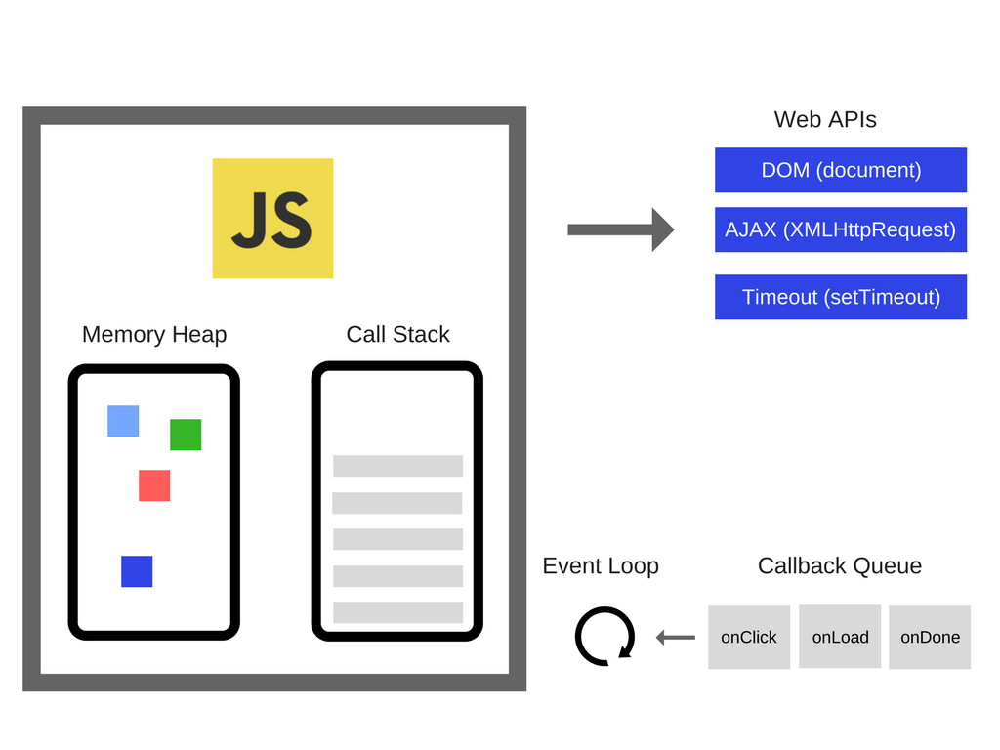

# Js

## Js Learning Sources

[MDN: JavaScript Guide](https://developer.mozilla.org/en-US/docs/Web/JavaScript/Guide){target=_blank}

[MDN: JavaScript reference](https://developer.mozilla.org/en-US/docs/Web/JavaScript/Reference){target=_blank}

[Airbnb JavaScript Style Guide](https://github.com/airbnb/javascript){target=_blank}

[Simplified Js Jargon](http://jargon.js.org/){target=_blank}

[Modern JavaScript Tutorial](https://javascript.info/){target=_blank}<sup> recommended in ZTM course</sup>

[Javascript-The-Core Book](http://dmitrysoshnikov.com/ecmascript/javascript-the-core-2nd-edition/){target=_blank}<sup> recommended in ZTM course</sup>

[You-Dont-Know-JS Book](https://github.com/getify/You-Dont-Know-JS){target=_blank}<sup> recommended in ZTM course</sup>

[ES Features](https://github.com/daumann/ECMAScript-new-features-list){target=_blank}<sup> recommended in ZTM course</sup>

[Functional Programming Jargon](https://github.com/hemanth/functional-programming-jargon)

[Elevator Saga - The elevator programming game](https://play.elevatorsaga.com/){target=_blank} - Try playing this game, read the documentation, and use the developer tools to "debug".

[101 вопрос по JavaScript (с ответами) шпаргалка к собеседованию + 15 практических задач](https://teletype.in/@day0now/7mpAXOPCeTd)

[ ] IT-Incubator: [Sandbox](https://sandbox.it-incubator.io/), [Front-end course](https://it-incubator.io/education/front-end), [Back-end coursehttps://it-incubator.io/education/back-end](https://it-incubator.io/education/back-end)

**Books:**

+ Eloquent JavaScript

    <object data="./eloquent-javascript.pdf" type="application/pdf" class="pdf"></object>

## Import Javascript into HTML

Inside `<body> </body>` at the **bottom**:

```html
<script type="text/javascript" src="script.js"></script>
```

## Data Types

!!! info ""

    reference: [MDN](https://developer.mozilla.org/en-US/docs/Web/JavaScript/Data_structures)

### Primitives

+ Primitives are **non-reference types** i.e. they **passed by value**(when we assign one variable to another) and defined by programming language.
So when we copy a variable into another variable - we copy the value and then create that value somewhere else in the memory heap.

    ```js
    let a = 5; // "a" now has an address of where this primitive value "5" sits in memory.
    let b = a; // variable "a" passed by value to variable "b"
    /* Any time even though we did "b" equals to "a"
    we simply copied the value of "a" and put it
    into a new memory space in our machine for the "b" variable.
    They don't really have any connection whatsoever
    and that's what passed by value means. */
    b++;
    console.log(a); // 5
    console.log(b); // 6 --> value of "b' isn't connected with value of "a"
    ```

+ *Data Types*

    + **Undefined**

        + Used when nothing is assigned to a variable, e.g.: `var password;`

    + **Boolean**

    + Numeric

        > In other programming languages different numeric types exist; for example, Integers, Floats, Doubles, or Bignums.

        + **Number**

            + Can be a *floating-point* or `Infinity` / `-Infinity` value

            + <space>

                ```js
                // Using Infinity
                console.log(Infinity          ); /* Infinity */
                console.log(Infinity + 1      ); /* Infinity */
                console.log(Math.pow(10, 1000)); /* Infinity */
                console.log(Math.log(0)       ); /* -Infinity */
                console.log(1 / Infinity      ); /* 0 */
                console.log(1 / 0             ); /* Infinity */
                ```

        + **NaN**

            > Undefined value or value that cannot be represented, especially results of floating-point calculations.

            + There are five different types of operations that return NaN:

                1. Number cannot be parsed (e.g. `parseInt("blabla")` or `Number(undefined)`)
                2. Math operation where the result is not a real number (e.g. `Math.sqrt(-1)`)
                3. Operand of an argument is `NaN` (e.g. `7 ** NaN`)
                4. Indeterminate form (e.g. `0 * Infinity`, or `undefined + undefined`)
                5. Any operation that involves a string and is not an addition operation (e.g. `"foo" / 3`)

    + **BigInt**

        > [BigInt](https://developer.mozilla.org/en-US/docs/Web/JavaScript/Reference/Global_Objects/BigInt) is a built-in object whose constructor returns a bigint primitive — also called a BigInt value, or sometimes just a BigInt — to represent whole numbers larger than 2^53 - 1 (Number.MAX_SAFE_INTEGER), which is the largest number JavaScript can represent with a number primitive (or Number value). BigInt values can be used for arbitrarily large integers.

    + **String**

        + *Template strings* - backticks ``` `` ``` are used to specify string literals instead of ```''``` or ```""```. Allows us to avoid the ```+``` separation and elements and variables should be added with syntax ${element}. We can do any sort of expression inside the curly brackets.

            ```js
              const name = "Sally";
              const age = 34;
              const pet = "horse";

              const greetingBest = `Hello ${name} you seem to be ${age-10}. What a lovely ${pet} you have`;
            ```

        + Strings methods

            + `split()`: splits a string into an array of substrings
            + `padStart(param1,param2)`: param1 number of characters param2 are added before the value of element declared. The default param2 is " "
            + `padEnd(param1,param2)`: same as above but at the end
            + `trimStart()`: eliminates empty spaces from the start of a variable
            + `trimEnd()`: same as above but from the end
            + `replace(searchvalue, newvalue)`: Searches a string for a specified value, or a regular expression, and returns a new string where the specified values are replaced.

    + **Symbol**

        + ES6.

        + Each symbol creates a completely unique data type.

            ```js
              let sym1 = Symbol();
              let sym2 = Symbol('foo');
              let sym3 = Symbol('foo');
              sym2 === sym3; // false
            ```

        + Symbol value used as an identifier, mostly for object properties, because sometimes(e.g. when we have thousand of properties) we don't want them to collide and be the same ones in order to avoid bugs.

+ *Structural Root Primitive*

    + **Null** (Means "nothing" i.e "completely empty").

### Structural Types

+ **Object**

    Objects are **reference types**, i.e. they **passed by reference**(when we assign one object to another) and defined by a programmer.
    So when we assign "object1" to "object2" we don't copy the values like we did with primitive types. We simply address "object2" to the same place in memory heap where is "object1" is.

    :material-thumb-up: *Pros:* By just having one object we're saving space and memory. We're not copying and cloning the object creating multiple version. We simply save memory reference(just one location!) instead of just loading up our memory heap.

    :material-thumb-down: *Cons:* Unlike a primitive type we might have issue where by mistake somebody else changes a property on the referenced object(by changing "original object" property).

    ```js
    // Object Example:
    const object1 = { value: 10 };
    const object2 = object1; // "object1" passed by reference to "object2"
    /* "object1" and "object2" are both
    pointing to the same address in memory heap
    where their(the same!) value is located. */
    const object3 = { value: 10 };
    console.log(object1 === object2); // true
    console.log(object1 === object3); // false
    object1.value = 15;
    console.log(object2.value); // 15
    console.log(object3.value); // 10

    // Array Example:
    const c = [1,2,3,4,5];
    const d = c; // "c" passed by reference to "d"
    d.push(13451534636);
    console.log(c); // [1, 2, 3, 4, 5, 13451534636]

    // More Examples:
    console.log([] === []) // false
    console.log([2] === [2]) // false
    console.log({} === {}) // false
    console.log({a:3, b:'hi'} === {a:3, b:'hi'}) // false
    ```

+ **Function**

### Type Coercion

+ Javascript convert certain type into another type:

    ```js
    1 == '1' //true, '1' change to 1

    // should always use ====
    1 === '1' //false, compare exactly without coercion

    if (1)  // if(true)
    if (0)  // if(false)

    NaN === NaN //false
    // should be true, use:
    Object.is(NaN,NaN)  //true
    ```

+ [Type Coercion table](https://dorey.github.io/JavaScript-Equality-Table/)

+ [MDN - Equality Comparisons](https://developer.mozilla.org/en-US/docs/Web/JavaScript/Equality_comparisons_and_sameness)

+ [ECMA Comparison Algorithm](https://262.ecma-international.org/5.1/#sec-11.9.3)

## Operators

> reference: [MDN](https://developer.mozilla.org/en-US/docs/Web/JavaScript/Reference/Operators), [W3S](https://www.w3schools.com/js/js_operators.asp)

### Arithmetic

+ ``+`` ``-`` ``*`` ``/``
+ ``+`` : numeric addition vs. string concatenation

    ```js
        // NUMERIC ADDITION:
        // Number + Number -> addition
        1 + 2 // 3

        // Boolean + Number -> addition
        true + 1 // 2

        // Boolean + Boolean -> addition
        false + false // 0
        true + true   // 2

        // STRING CONCATENATION:
        // String + String -> CONCATENATION
        'foo' + 'bar' // "foobar"

        // Number + String -> concatenation
        5 + 'foo' // "5foo"

        // String + Boolean -> concatenation
        'foo' + false // "foofalse"
    ```

+ ``**`` (ES7(2016): Exponentiation)
+ ``%`` (Modulus)
+ ``++A`` (increments and returns the value after incrementing)
+ ``A++`` (increments and returns the value before incrementing)
+ ``--A`` (decrements and returns the value after decrementing)
+ ``A--`` (decrements and returns the value before decrementing)

### Assignment

+ ``=`` ``+=`` ``-=`` ``*=`` ``/=`` ``**=`` ``%=``
+ ``+=`` : *addition* or *concatenation* behavior of the addition assignment

    ```js
        // Assuming the following variables
        //  foo = 'foo'
        //  bar = 5
        //  baz = true

        // Number + Number -> addition
        bar += 2 // 7

        // Boolean + Number -> addition
        baz += 1 // 2

        // Boolean + Boolean -> addition
        baz += false // 1
        baz += true  // 2

        // Number + String -> concatenation
        bar += 'foo' // "5foo"

        // String + Boolean -> concatenation
        foo += false // "foofalse"

        // String + String -> concatenation
        foo += 'bar' // "foobar"
    ```

### String operators

+ concatenaton: ``+`` ``+=``

### Unary operators

> A unary operation is an operation with only one operand.

+ `!` (logical NOT operator)

+ `~` (bitwise NOT operator)

+ `+` (converts operand to Number type)

    ```js
        const x = 1;
        const y = -1;

        console.log(+x);
        // expected output: 1

        console.log(+y);
        // expected output: -1

        console.log(+'');
        // expected output: 0

        console.log(+true);
        // expected output: 1

        console.log(+false);
        // expected output: 0

        console.log(+'hello');
        // expected output: NaN
    ```

+ **`-`** (converts operand to Number type and then negates it)

    ```js
        const x = 4;
        const y = -x;

        console.log(y);
        // expected output: -4

        const a = '4';
        const b = -a;

        console.log(b);
        // expected output: -4
    ```

### Chaining operators

+ `.`

+ [`?.`](https://developer.mozilla.org/en-US/docs/Web/JavaScript/Reference/Operators/Optional_chaining) (*optional chaining*:  enables you to read the value of a property located deep within a chain of connected objects without having to check that each reference in the chain is valid.)

    + ES2020.

    + The `?.` operator is like the `.` chaining operator, except that instead of causing an error if a reference is *nullish* (null or undefined), the expression short-circuits with a return value of `undefined`. When used with function calls, it returns `undefined` if the given function does not exist.

    + <space>

        ```js
        // Exercise: Clean up this code using optional chaining
        let will_pokemon = {
            pikachu: {
                species: 'Mouse Pokemon',
                height: 0.4,
                power: 'lightning',
                friend: {
                    charizard: {
                        species: 'Dragon Pokemon',
                        height: 1.7,
                        weight: 90.5,
                        power: 'fire'
                    }
                }
            }
        }

        let andrei_pokemon = {
            raichu: {
                species: 'Mouse Pokemon',
                height: 0.8,
                weight: 30,
                power: ''
            }
        }

        if (andrei_pokemon && andrei_pokemon.raichu && will_pokemon
            && will_pokemon.pikachu && will_pokemon.pikachu.friend
            && will_pokemon.pikachu.friend.charizard) {
                console.log('fight!')
            } else {
                console.log('walk away...')
            }

        // Solution:
        if (andrei_pokemon?.raichu && will_pokemon?.pikachu?.friend?.charizard) {
                console.log('fight!')
            } else {
                console.log('walk away...')
            }
        ```

### Logical

+ `&&`

+ [`||`](https://developer.mozilla.org/en-US/docs/Web/JavaScript/Reference/Operators/Logical_OR)

+ [`??`](https://developer.mozilla.org/en-US/docs/Web/JavaScript/Reference/Operators/Nullish_coalescing_operator) (*nullish coalescing operator*: returns its right-hand side operand when its left-hand side operand is `null` or `undefined`, and otherwise returns its left-hand side operand.)

    + This can be contrasted with the logical OR (`||`) operator, which returns the right-hand side operand if the left operand is ^^any^^ *falsy value*(`null`, `NaN`, `0`, empty string: `""` or `''` or ` `` `, `undefined`), not only `null` or `undefined`. In other words, if you use `||` to provide some default value to another variable `foo`, you may encounter unexpected behaviors if you consider some falsy values as usable (e.g., `''` or `0`).

    + <space>

        ```js
        // Example 1:
        let andrei_pokemon = {
            pikachu: {
                species: 'Mouse Pokemon',
                height: 0.8,
                weight: 30,
                power: 0,
            }
        }

        let power = andrei_pokemon?.pikachu?.power || 'no power'; // "no power"

        let power = andrei_pokemon?.pikachu?.power ?? 'no power'; // 0

        // Example 2:
        console.log(false ?? 'hellooo') // false
        console.log(null ?? 'hellooo') // 'hellooo'
        console.log(null || 'hellooo') // 'hellooo'
        console.log((false || null) ?? 'hellooo') // 'hellooo'
        console.log(null ?? (false || 'hellooo')) // 'hellooo'
        ```

### Comparisons

+ `==` (*equal to* : comparison by value only - not recommended)

+ `===` (*equal value and equal type* : comparison by both value and data type - recommended)

+ `!=` (*not equal*)

+ `!==` (*not equal value or not equal type*)

+ `>=`

+ `<=`

+ `>`

+ `<`

### Conditionals (operators and statements)

+ `if`, `else`, `else if`

    + <space>

        ```js
        if (condition) {
            statements1
        } else if {
            statements2
        } else {
            statements3
        }
        ```

+ `condition ? exprIfTrue : exprIfFalse`

    + ES6: ternary operator

    + <space>

        ```js
        // change this function into a ternary and assign it to variable called experiencePoints
        function experiencePoints() {
            if (winBattle()) {
                return 10;
            } else {
                return 1;
            }
        }
        // solution:
        var experiencePoints = winBattle() ? 10 : 1;
        ```

+ `switch`

    + <space>

        ```js
        function moveCommand(direction) {
            var whatHappens;
            switch (direction) {
                case "forward":
                    whatHappens = "you encounter a monster";
                    break;
                case "back":
                    whatHappens = "you arrived home";
                    break;
                case "right":
                    whatHappens = "you found a river";
                    break;
                case "left":
                    whatHappens = "you run into a troll";
                    break;
                default:
                    whatHappens = "please enter a valid direction";
            }
            return whatHappens;
        }
        ```

## Statements

### try...catch

+ The `try...catch` statement marks a block of statements to try and specifies a response should an exception be thrown.

+ Syntax:

    ```js
    try {
        try_statements
    }
    catch (exception_var) {
        catch_statements
    }
    finally {
        finally_statements
    }
    ```

    **try_statements** - the statements to be executed.

    **catch_statements** - statement that is executed if an exception is thrown in the try-block.

    **exception_var** - an optional(since ES10) identifier to hold an exception object for the associated catch-block.

    **finally_statements** - statements that are executed after the try statement completes. These statements execute regardless of whether an exception was thrown or caught.

+ Example:

    ```js
    try {
        nonExistentFunction();
    } catch (error) {
        console.error(error);
        // expected output: ReferenceError: nonExistentFunction is not defined
        // Note - error messages will vary depending on browser
    }
    ```

### export

+ refrerence: [MDN](https://developer.mozilla.org/en-US/docs/Web/JavaScript/Reference/Statements/export)
+ The `export` statement is used when creating JavaScript ==[modules](#modules)== to export live bindings to functions, objects, or primitive values from the module so they can be used by other programs with the `import` statement. Bindings that are exported can still be modified locally; when imported, although they can only be read by the importing module the value updates whenever it is updated by the exporting module.

    Exported modules are in ==[strict mode](#strict-mode)== whether you declare them as such or not. The export statement cannot be used in embedded scripts.

### import

+ refrerence: [MDN](https://developer.mozilla.org/en-US/docs/Web/JavaScript/Reference/Statements/import)
+ The static `import` statement is used to import read only live bindings which are exported by another module.

    Imported modules are in ==[strict mode](#strict-mode)== whether you declare them as such or not. The import statement cannot be used in embedded scripts unless such script has a `type="module"`. Bindings imported are called live bindings because they are updated by the module that exported the binding.

    There is also a function-like dynamic `import()`, which does not require scripts of `type="module"`.

    Backward compatibility can be ensured using attribute `nomodule` on the `#!html <script>` tag.

## Looping

`for` : *Loops through a block of code a number of times*

+ <space>

    ```js
    let todos = [
        'clean room',
        'brush teeth',
        'exercise',
        'study javascript',
        'eat healthy'
    ];
    const todosLength = todos.length;
    for (let i=0; i < todosLength; i++) {
        todos.pop();
    }

    console.log(todos);
    // []
    ```

`while`, `do/while` : *Loops through a block of code while a specified condition is true*

+ <space>

    ```js
    // while loop:
    let counterOne = 0;
    while (counterOne < 10) {
        console.log(counterOne);
        counterOne++;
    }
    // 0
    // 1
    // 2
    // 3
    // 4
    // 5
    // 6
    // 7
    // 8
    // 9

    // do while loop:
    let counterTwo = 0;
    do {
        console.log(counterTwo);
        counterTwo++;
    } while (counterTwo < 10);
    // 0
    // 1
    // 2
    // 3
    // 4
    // 5
    // 6
    // 7
    // 8
    // 9

    // while vs. do while:
    let counterOne = 10;
    while (counterOne < 10) {
        console.log('while', counterOne);
        counterOne++;
    }
    // undefined

    let counterTwo = 10;
    do {
        console.log('do while', counterTwo);
        counterTwo++;
    } while (counterTwo < 10);
    // do while 10

    /* we see that 'do while' ran while 'while' never did
    because of condition position in each loop */
    ```

`for/in` : *Loops(**enumirates**) through the properties(that can include its prototypes' properties too) of an object*

> **Note:** *Enumerables* - something, which we **can't** ^^iterate through^^ out of the box. To be able to access one property after another, we need the property names. This is the reason why we have methods like `#!js Object.entries` to make them iterable.

+ ES6.

+ <space>

    ```js
    const detailedBasket = {
        apples: 5,
        oranges: 10,
        grapes: 1000,
    }

    for (let item in detailedBasket) {
        if (detailedBasket.hasOwnProperty(item)) { // to consider properties attached to the object itself, and not its prototypes
            console.log(item);
        }
    }
    /* apples
       oranges
       grapes */

    const basket = ['apples', 'oranges', 'grapes'];

    for (let item in basket) {
        if (basket.hasOwnProperty(item)) { // to consider properties attached to the object itself, and not its prototypes
            console.log(item);
        }
    }
    /* 0
       1
       2 */
    ```

`for/of` : *Loops(**iterates**) through the values of an **iterable** object(array, string)*

> **Note:** *Iterables* - everything which has a **length**(like arrays and strings).

+ ES6.

+ <space>

    ```js
    const basket = ['apples', 'oranges', 'grapes'];

    for (let item of basket) {
        console.log(item);
    }
    /* apples
       oranges
       grapes */
    ```

`forEach` : *Is the Array method. See below in the ==[Array](#array)== section.*

## Variables

> **Note:** Variables created **without** a declaration keyword (`var`, `let`, or `const`) are always **global**, even if they are created inside a function.

### var

+ Its value can be altered.

+ It is **Function Scope variable**: Any time it is declared inside curly brackets **inside a function** it creates a **new scope**.

+ Global variables defined with the **var** keyword **belong** to the `window` object.

    ```js
    // in console run firstly:
    var carName = "Volvo";
    // code here can use window.carName:
    window.carName; // "Volvo"
    ```

### let

+ ES6.

+ Its value can be altered.

+ It is **Block Scope variable**: Any time it is declared inside curly brackets **in any place**(function, if etc.) it creates a **new scope**:

    ```js
    const player = 'bobby';
    let experience = 100;
    let wizardLevel = false;

    if (experience > 90) {
        let wizardLevel = true;
        console.log('inside', wizardLevel); // inside true (because `let` inside curly brackets created a new scope!)
    }
    console.log('outside', wizardLevel); // outside false
    ```

+ Global variables defined with the **let** keyword **do not belong** to the `window` object.

    ```js
    // in console run firstly:
    let carName = "Volvo";
    // code here cannot use window.carName:
    window.carName; // undefined
    ```

### const

> **Tip:** When we work with *objects*, *arrays* and *function expressions*, we should always use `const` to make sure, that we can't change the type of the variable.

+ ES6.

+ Its value can't be altered(i.e. the variable can't be reassigned) once declared, but you can change properties of an object declared using `const`.

+ It is **Block Scope constant**: Any time it is declared inside curly brackets **in any place**(function, if etc.) it creates a **new scope**.

+ Global variables defined with the **const** keyword **do not belong** to the `window` object.

    ```js
    // in console run firstly:
    const carName = "Volvo";
    // code here cannot use window.carName:
    window.carName; // undefined
    ```

## Functions

### Function Basics

**`function name() {}` : Function Declaration, a.k.a. *Function Definition* or *Function Statement***

**`var a = function name() {}` : Function Expression, *named function* is assigned to a variable.**

**`var a = function() {}` : Function Expression, *anonymous function* is assigned to a variable.**

**`()` : we *calling/invoking* a function using brackets**

> **Note:** Values inside brackets called **parameters** when we *declare* the function and **arguments** when we *call* the function.
>
> **Note:** [Func. Declaration vs. Func. Expression](https://javascriptweblog.wordpress.com/2010/07/06/function-declarations-vs-function-expressions/){target=_blank}:
> The difference lies in how the browser loads them into the *execution context*.
> *Function declarations* load **before** any code is executed.
> *Function expressions* load **only when** the interpreter reaches that line of code.
> So if you try to call a *function expression* before it's loaded, you'll get an error! If you call a *function declaration* instead, it'll always work, because no code can be called until all declarations are loaded.

**`return`**

+ We use **return** in two ways:

  1. When we need the function to return a value that we can assign to other value

      ```js
      // EXAMPLE OF A GLOBAL VARIABLE:
      // We assign the function's return TYPE to this variable.
      // We then pass this global variable to console.log() function.
      // It really helps to build a strong logic,
      // and reuse the same code,
      // instead of creating new functions again and again.

      var publicsum=0;
      function Multiply(a,b)
      {
          // debugger;
          var sum = a*b;
          return sum
      }

      publicsum = Multiply(6,8);
      console.log(publicsum);
      ```

  2. When we need to exit function's execution (it is especially relevant to loops)

      ```js
      // RETURN STATEMENT AS A BREAK COMMAND:
      // The for loop will iterate 10 times.
      // However if i == to 5 the code jumps into the return statement
      // which escapes the loop iteration, and ends the code execution.

      function ExitWithReturn()
          {
              for(var i=0; i<10;i++)
              {
                  console.log(i);
                  if(i == 5)
                  {
                      return;
                  }
              }
          }

      ExitWithReturn();
      ```

### Js Callbacks

[Explained Using Minions](https://blog.codeanalogies.com/2016/04/11/javascript-callbacks-explained-using-minions/)

### Arrow Funciton

+ ES6: `const functionname = (param1,param2...) => action`

+ If there is an only return, there is no need to type "return" and if it's just one parameter, no need to add "()"

    ```js
    function add(a, b) {
        return a + b;
    }

    // arrow function
    const add = (a, b) => a + b;
    ```

### IIFE

+ reference: [Medium](https://vvkchandra.medium.com/essential-javascript-mastering-immediately-invoked-function-expressions-67791338ddc6)

### *REST* Parameter syntax

+ `...` : Allows a function to accept an indefinite number of arguments as an ***array***, providing a way to represent variadic functions.

+ <space>

    ```js
    const sumAll = (...all) => {
    let result = 0;
    for (let num of all) {
        result += num;
    }
    return result
    }
    ```

### Default Arguments

+ ES6

+ <space>
  ```js
  function greet(name = '', age = 30, pet = 'cat') {
      return `Hello ${name} you seem to be ${age-10}. What a lovely ${pet} you have`;
  }

  greet(); // "Hello  you seem to be 20. What a lovely cat you have"
  ```

### Closure

> reference: [MDN](https://developer.mozilla.org/en-US/docs/Web/JavaScript/Closures)(very good explanation), [W3S](https://www.w3schools.com/js/js_function_closures.asp)(has interesting example at the end with IIFE)

+ A **closure** is the combination of a function and the lexical environment within which that function was declared.

+ Closures are created every time a function is created, **at function creation time**.

+ Closure "mechanism"(very simplified):
    + A function ran.
    + The funciton executed. It's never going to execute again.
    + BUT it's going to remember that there are references to those variables. So the child scope always has access to the parent scope.

        ```js
        // Example 1:
        const first = () => {
            const greet = 'Hi';
            const second = () => {
                alert(greet);
            }
            return second;
        }

        const newFunc = first();
        newFunc();

        // Example 2:
        const addTo = x => y => x + y
        var addToTen = addTo(10)
        addToTen(3) // 13
        ```

### Currying

+ `#!js const functionname = param1 => param2 => action`

+ To properly call function syntax is: `#!js functionname (param1)(param2)`

+ **Currying** is the process of converting a function that takes multiple arguments into a function that takes them one at a time.

    ```js
    const multiply = (a,b) => a * b;
    const curriedMultiply = (a) => (b) => a * b;
    curriedMultiply(2)(3); // 6

    const multiplyBy5  = curriedMultiply(5);
    multiplyBy5(11); //55

    const volume = length => width => height => length * width * height;
    volume(5); // width => height => length * width * height
    volume(5)(4); // height => length * width * height
    volume(5)(4)(3); // 60
    ```

### Compose

+ `#!js const functionname = (param2,param3) => param1 => param2(param3(param1))` : Being param2 and 3 *functions* when param1 a *value*. Executes a function inside a function executed with the initial param1.

+ **Compose** is the act of putting two functions together to form a third function where the output of one function is the input of the other.

    ```js
    const compose = (f,g) => (a) => f(g(a));

    const sum = (num) => num + 1;

    compose(sum, sum)(5); // 7
    ```

### *Tip: Functional Purity(Determinism)*

+ Two elements of a pure function:

    + **No Side Effects** -->  It does not depend on any state, or data, change during a program’s execution. It must only depend on its input elements.

        + Side Effects - any of actions that happen inside of the function that we don't really know anything about. If function *interacts* or *reads* or *writes* to an external variable, for example, or *console logs*, well, that's a side effect.
        In other words it is something that the functions doing to affect the outside world.

            ```js
            let a = 1;
            function b() {
                a = 2; // <= This is a side effect.
            }
            ```

    + **Always Returning** - creating something **deterministic** --> always produces the same results given the same inputs, i.e. given the same input the *return value* will be **always** the *same* and not *undefined*.

### *Useful Functions*

+ <space>

    ```js
    const getRandomBetween = (min, max) => Math.floor(Math.random() * (max - min + 1) + min)
    ```

+ <space>

    ```js
    // Recursion function:

    // as function declaration
    function fac(num) {
        // emergency termination condition
        if (num < 0) return
        // it is necessary to limit the number of recursion calls =>
        // basic check to stop recursion
        if (num === 1) return num
        // recursion - the function calls itself
        return num * fac(num - 1)
    }

    // as arrow function
    const fac = num => num < 0 ? undefined : num === 1 ? num : num * fac(num - 1);
    ```

## Data Structures

### Array

#### Array Definition

+ The Array object is used to store multiple values in a single variable.

+ Arrays are **iterables** which means, you can iterate over them.

> reference: [W3S](https://www.w3schools.com/jsref/jsref_obj_array.asp), [MDN](https://developer.mozilla.org/en-US/docs/Web/JavaScript/Reference/Global_Objects/Array)
> useful links: [JavaScript Array Explorer](https://sdras.github.io/array-explorer/)
>
> **Good for:** Creating lists, e.g. shopping list, todo list, list of users(when each user in it is an object).
> **Tip:** We can have arrays with different types inside them but it is not advised because it's actually a bit of a performance issue, e.g.: `#!js ['apples', 3, undefined, true, () => console.log('apples')]`

#### Common Operations

+ **Create an Array**

    **`length`** : *Sets or returns the number of elements in an array*

    ```js
    let fruits = ['Apple', 'Banana']

    console.log(fruits.length)
    // 2
    ```

+ **Empty Array**

    ```js
    const list = [];

    console.log (list);
    // []

    // in contrast to variable than can't be empty
    let a;

    console.log(a);
    // undefined
    ```

+ **Access an Array item using the index position**

    ```js
    let first = fruits[0]
    // Apple

    let last = fruits[fruits.length - 1]
    // Banana
    ```

    ```js
    // Array inside Array
    let list = [['tiger', 'cat', 'bear', 'bird']]

    console.log(list[0][2])
    // bear
    ```

    **`at()`** : *ES2022. takes an integer value and returns the item at that index, allowing for positive and negative integers. Negative integers count back from the last item in the array. Returns `undefined` if the given index can not be found.*

    ```js
    const arr = [100, 200, 400, 50000, 10];
    arr.at(-1); // as default '-1' is the last item
    // 10
    arr.at(-2);
    // 50000
    arr.at(0);
    // 100
    ```

+ **Loop over an Array**

    **`forEach()`** : *ES5. Calls a function for each array element*
    > **Tip:** We can define in advance the callback function of forEach and use it in all arrays in our code.

    ```js
    fruits.forEach((item, index, array) => console.log(item, index))
    // Apple 0
    // Banana 1
    ```

+ **Add an item to the end of an Array**

    **`push()`** : *Adds new elements to the end of an array, and returns the new length*

    ```js
    let newLength = fruits.push('Orange') // add to the end, 'newLength' value is 3
    // ["Apple", "Banana", "Orange"]

    ```

+ **Remove an item from the end of an Array**

    **`pop()`** : *Removes the last element of an array, and returns that element*

    ```js
    let last = fruits.pop() // remove Orange from the end and return it so 'last' value is 'Orange'
    // ["Apple", "Banana"]
    ```

+ **Remove an item from the beginning of an Array**

    **`shift()`** :	*Removes the first element of an array, and returns that element*

    ```js
    let first = fruits.shift() // remove Apple from the front and return it so 'first' value is 'Apple'
    // ["Banana"]
    ```

+ **Add an item to the beginning of an Array**

    **`unshift()`** : *Adds new elements to the beginning of an array, and returns the new length*

    ```js
    let newLength = fruits.unshift('Strawberry') // add to the front, 'newLength' value is 2
    // ["Strawberry", "Banana"]
    ```

+ **Find the index of an item in an Array, Find item in an Array**

    **`indexOf()`** : *Search the array for an element and returns its position*</br>
    Returns **-1** if the item is not found.
    If the item is present **more than once**, the indexOf method returns the position of the **first** occurence.
    > **Tip:** this method suits for work with primitive data type.</br>
    > **Tip:** if you want to search from end to start, use the [lastIndexOf()](https://www.w3schools.com/jsref/jsref_lastindexof_array.asp) method.

    ```js
    fruits.push('Mango')
    // ["Strawberry", "Banana", "Mango"]

    let pos = fruits.indexOf('Banana')
    // 1
    ```

    **`findIndex()`** : *Returns the **index** of the first element in an array that pass a test(provided as a function)*

    + ES6.

    + Actually `findIndex()` is a loop, because it executes the function once for each element present in the array:

        + If it finds an array element where the function returns a true value, `findIndex()` returns the index of that array element (and does not check the remaining values)

        + Otherwise it returns **-1**

        !!! note ""

            `findIndex()` does not execute the function for array elements without values.

            `findIndex()` does not change the original array.

        !!! tip

            This method suits for work with objects.

    **`find()`** : *Returns the **value** of the first element in an array that pass a test(provided as a function)*

    + Actually `find()` is a loop, because it executes the function once for each element present in the array:

        + If it finds an array element where the function returns a true value, `find()` returns the value of that array element (and does not check the remaining values)

        + Otherwise it returns **undefined**

        !!! note ""

            `find()` does not execute the function for empty arrays.

            `find()` does not change the original array.

        !!! tip

            This method suits for work with objects.

    ```js
    const people = [
        {name: 'Alice', budget: 4200},
        {name: 'Eva', budget: 3500},
        {name: 'Bob', budget: 1700},
    ]

    // using findIndex:
    const index = people.findIndex(person => person.budget === 3500);
    console.log(index)
    // 1

    // using find:
    const person = people.find(person => person.budget === 3500);
    console.log(person)
    // {name: "Eva", budget: 3500}
    ```

+ **Remove an item by index position**

    **`splice()`** : *Adds/Removes elements from an array*

    ```js
    let removedItem = fruits.splice(1, 1) // this is how to remove an item

    // ["Strawberry", "Mango"]
    ```

+ **Remove and Add items from an index position**

    **`splice()`** : *Adds/Removes elements from an array*

    ```js
    let vegetables = ['Cabbage', 'Turnip', 'Radish', 'Carrot']
    console.log(vegetables)
    // ["Cabbage", "Turnip", "Radish", "Carrot"]

    let pos = 1
    let n = 2

    let removedItems = vegetables.splice(pos, n, 'Cucumber', 'Potato')
    // this is how to remove items, n defines the number of items to be removed,
    // starting at the index position specified by pos and progressing toward the end of array.

    console.log(vegetables)
    // ["Cabbage", "Cucumber", "Potato", "Carrot"] (the original array is changed)

    console.log(removedItems)
    // ["Turnip", "Radish"]
    ```

+ **Clone an Array**

    + *Shallow Clone:*

        **`slice()`** :	*Selects a part of an array, and returns the new array*

        ```js
        const shallowClone = fruits.slice()
        // ["Strawberry", "Mango"]

        // or using concat()
        const shallowClone2 = [].concat(fruits)

        // or using SPREAD operator
        const shallowClone3 = [...fruits]
        ```

    + *Deep Clone:*

        > reference: [How to Deep Clone an Array in JavaScript - DEV Community](https://dev.to/samanthaming/how-to-deep-clone-an-array-in-javascript-3cig)

        + Using *JSON.stringify/parse*:

            ```js
            let nestedArray = [1, [2], 3];
            let arrayClone = JSON.parse(JSON.stringify(nestedArray));

            // Make some changes
            arrayClone[0] = '👻'; // change shallow element
            arrayClone[1][0] = '💩'; // change nested element
            console.log(arrayClone); // [ '👻', [ '💩' ], 3 ]

            // ✅ Nested array NOT affected
            console.log(nestedArray); //  [1, [ 2 ], 3 ]
            ```

            !!! warning "It doesn't work with values not compatible with JSON."

                It only work with ^^Number^^, ^^String^^ and ^^Object literal^^ without *function* or *symbol* properties.

        + Using `#!js _.cloneDeep(value)` *Lodash library* [method](https://lodash.com/docs/4.17.15#cloneDeep)

            ```js
            var objects = [{ 'a': 1 }, { 'b': 2 }];

            var deep = _.cloneDeep(objects);
            console.log(deep[0] === objects[0]);
            // => false
            ```

        + Using *recursion*

            ```js
            const clone = items => items.map(item => Array.isArray(item) ? clone(item) : item);
            ```

+ **Join Arrays**

    **`concat()`** : *Joins two or more arrays, and returns a copy of the joined arrays*

    ```js
    let joinedArray = fruits.concat(['Apple', 'Banana'])
    // ["Strawberry", "Mango", "Apple", "Banana"]
    ```

+ **Sort an Array**

    **`sort()`** : *Sorts the elements of an array*

    *Syntax:* ***array*.sort(*compareFunction*)**

    The sort order can be either alphabetic or numeric, and either ascending (up) or descending (down).

    By default, the sort() method sorts the values as strings in alphabetical and ascending order.

    ```js
    let fruits = ["Banana", "Orange", "Apple", "Mango"];
    fruits.sort();
    // ["Apple", "Banana", "Mango", "Orange"]

    // Using compareFunction:
    // Sort numbers in an array in ascending order:
    let points = [40, 100, 1, 5, 25, 10];
    points.sort((a, b) => a-b);
    // [1, 5, 10, 25, 40, 100]

    // Sort numbers in an array in descending order:
    let points = [40, 100, 1, 5, 25, 10];
    points.sort((a, b) => b-a);
    // [100, 40, 25, 10, 5, 1]
    ```

+ **Split string, Reverse elements in Array, Join elements in Array**

    **`split()`** :	*Splits a string into an array of substrings*

    **`reverse()`** : *Reverses the order of the elements in an array*

    **`join()`** : *Joins all elements of an array into a string. Elements separated by comma `,`(default separator).*

    ```js
    // Reverse string exersise:
    const text = 'Hello, we learning JavaScript';
    const reverseText = text.split('').reverse().join('');
    console.log(reverseText);
    // tpircSavaJ gninrael ew ,olleH
    ```

+ **Check if an array contains the specified element**

    **`includes()`** :	*Check if an array contains the specified element*

    ES7.

    Returns *true* if the array contains the element, and *false* if not.

    !!! note

        The includes() method is case sensitive.

    ```js
    const fruits = ["Banana", "Orange", "Apple", "Mango"];
    let n = fruits.includes("Mango"); //true
    ```

#### Hier Order Functions

+ **Map, Filter, Reduce**

    **`array.map(num => {})`**: *For each element num in the array, executes actions inside `{}` and ^^return needs to be specified^^ since the return will be placed in a ^^new array^^.*

    *^^Used for:^^ arrays where we want to alter the arrays elements like adding a exclamation mark to a string.*

    ```js
    const array = [1, 2, 10, 16];

    const mapArray = array.map(num => num * 2);
    console.log(mapArray); // [2, 4, 20, 32]
    ```

    ```js
    //Exercise: Create a new list with all user information, but add "!" to the end of each items they own.

    const array = [
        {
            username: "john",
            team: "red",
            score: 5,
            items: ["ball", "book", "pen"]
        },
        {
            username: "becky",
            team: "blue",
            score: 10,
            items: ["tape", "backpack", "pen"]
        },
        {
            username: "susy",
            team: "red",
            score: 55,
            items: ["ball", "eraser", "pen"]
        },
        {
            username: "tyson",
            team: "green",
            score: 1,
            items: ["book", "pen"]
        },

    ];

    // Wrong solution:
    // It copies "items" arrays instead of cloning them.
    // So in the new "answer" array "items" arrays actually passed by reference now, instead of being independed copies.
    const answer = array.map(user => {
        user.items = user.items.map(item => item + '!');
        return user;
    });
    console.log(answer);

    // Right solution 1:
    const answer = array.map(user => {
        const { items } = user;  // Destructuring is used here
        return Object.assign({}, user, { items: items.map(item => item + "!")})
    });
    console.log(answer);

    // Right solution 2:
    const answer = array.map(object => {
        return {...object, items: object.items.map(item => `${item}!`)}
    });
    console.log(answer);
    ```

    !!! note

        Map function always returns an array of the same size that of the parent array, unlike filter. For more read this blog post about how map function is implemented: [Implementing our own Array.map() method in javascript.](https://dev.to/dhilipkmr/implementing-our-own-array-map-method-in-javascript-553m?signin=true){target=_blank}

    ```js
    // Usnig map:
    [1, 2, 3, 4, 5, 6].map(num => {
    if (num > 1) return num;
    });
    // [undefined, 2, 3, 4, 5, 6]

    // Using filter:
    [1, 2, 3, 4, 5, 6].filter(num => num > 1);
    // [2, 3, 4, 5, 6]
    ```

    **`array.filter(num => {})`**: *For each element num of the array a condition is checked. If the value turns out true, it will be added to the ^^new array^^. If none of the elements meet the condition, it will return an empty array. ^^Return needs to be specified.^^*

    *^^Used for:^^ filtering out elements which match the condition we defined.*

    ```js
    const array = [1, 2, 10, 16];

    const filterArray = array.filter(num => num > 5);
    console.log(filterArray); // [10, 16]

    const filterArray2 = array.filter(num => num === 5);
    console.log(filterArray2); // []
    ```

    **`array.reduce((accumulator,num) => {}, param3)`**: *Acumulates values of the operation performed in previous elements, param3 being the initial value of the acumulator.*

    *^^Used for:^^ arrays which we want to result in one value. Like a total sum of a array of numbers or if we want to concatenate elements from a array.*

    !!! info ""

        reference: [A real world usage example](https://trekinbami.medium.com/explanation-of-javascripts-reduce-with-a-real-world-use-case-f3f5014951e2)

    ```js
    const array = [1, 2, 10, 16];

    const reduceArray = array.reduce((acc, num) => acc + num, 0);
    console.log(reduceArray); // 29
    const reduceArray2 = array.reduce((acc, num) => acc + num, 5);
    console.log(reduceArray2); // 34
    ```

+ **flat, flatMap**

    **`array.flat(param1)`**: *Creates a ^^new array^^ with all sub-array elements concatenated into it recursively up to the param1 depth. The flat method removes empty slots(array holes) in arrays*

    ```js
    const arr1 = [0, 1, 2, [3, 4]];
    arr1.flat();
    // [0, 1, 2, 3, 4]

    const arr2 = [0, 1, 2, [[[3, 4]]]];
    arr2.flat(2);
    // [0, 1, 2, [3, 4]]

    const arr3 = [[[[[[[[[[[[[[[[[[[[[[[[[[3]]]]]]]]]]]]]]]]]]]]]]]]]];
    arr3.flat(Infinity);
    // [3]

    const arr5 = [1, 2, , 4, 5];
    arr5.flat();
    // [1, 2, 4, 5]
    ```

    **`array.flatMap(param1=>{})`**: *Returns a ^^new array^^ formed by applying a given callback function to each element of the array, and then flattening the result by one level. It is identical to a `map()` followed by a `flat()` of ^^depth 1^^, but slightly more efficient than calling those two methods separately.*

    ```js
    let arr1 = [1, 2, 3, 4];

    arr1.map(x => [x * 2]);
    // [[2], [4], [6], [8]]

    arr1.flatMap(x => [x * 2]);
    // [2, 4, 6, 8]

    // only one level is flattened
    arr1.flatMap(x => [[x * 2]]);
    // [[2], [4], [6], [8]]
    ```

### Object

#### Object Definition

+ Variables are containers for data values. Objects are variables too. But objects can contain many values.

+ Objects are **enumerables** which means, you can't loop over them out of the box with array methods.

!!! tip ""

    **Good for:** storing information e.g. user info.

    useful links: [JavaScript Object Explorer](https://objectexplorer.netlify.app/){target=_blank}

#### Object Basics

+ Create an Object

    ```js
    const user = {
        name: 'John',
        age: 34,
        hobby: 'Soccer',
        isMarried: false,
        spells: ['abrakadabra', 'shazam', 'boo'],
        shout() {
            console.log('AHHHH!')
        }
    };
    ```

+ Function inside an object called ***method***

    ```js
    var obj = {
        thisIsAMethod: function() {

        }
    }

    obj.thisIsAMethod() // to access the method
    ```

+ Empty Object

    ```js
    const user = {};
    console.log (user);    // {}

    // in contrast to variable that can't be empty
    let a;
    console.log(a);    // undefined
    ```

#### Common Object Methods

+ `Object.keys()`(deprecated): method returns an **array**(whose elements are strings) of a given object's own enumerable property **names**, iterated in the same order that a normal loop would.

    ```js
    const object1 = {
        a: 'somestring',
        b: 42,
        c: false
    };

    console.log(Object.keys(object1));
    // expected output: Array ["a", "b", "c"]
    ```

    Usage example:

    ```js
    const obj = {
        username0: 'Sanata',
        username1: 'Rudolf',
        username2: 'Mr. Grinch',
    }

    Object.keys(obj).forEach((key, index) => {
        console.log(key, obj[key]);
    })

    /* username0 Sanata
       username1 Rudolf
       username2 Mr. Grinch */
    ```

+ `Object.values()`: returns an **array** of a given object's own enumerable property **values**, in the same order as that provided by a `for...in` loop. (The only difference is that a `for...in` loop enumerates properties in the prototype chain as well.) The ordering of the properties is the same as that given by looping over the property values of the object manually.

    ```js
    const object1 = {
        a: 'somestring',
        b: 42,
        c: false
    };

    console.log(Object.values(object1));
    // expected output: Array ["somestring", 42, false]
    ```

+ `Object.entries()`: returns an **array** of a given object's own enumerable string-keyed property `[key, value]` pairs, in the same order as that provided by a `for...in` loop. (The only important difference is that a `for...in` loop enumerates properties in the prototype chain as well). The ordering of the properties is the same as that given by looping over the property values of the object manually.

    !!! note

        The order of the array returned by `#!js Object.entries()` does not depend on how an object is defined. If there is a need for certain ordering, then the array should be sorted first, like:
        `#!js Object.entries(obj).sort((a, b) => b[0].localeCompare(a[0]));`

    ```js
    const object1 = {
        a: 'somestring',
        b: 42
    };

    console.log(Object.entries(object1));
    // [["a", "somestring"], ["b", 42]]

    for (const [key, value] of Object.entries(object1)) {
    console.log(`${key}: ${value}`);
    }

    // expected output(order is not guaranteed!):
    // "a: somestring"
    // "b: 42"
    ```

    Usage Example:

    ```js
    const obj = {
        username0: 'Santa',
        username1: 'Rudolf',
        username2: 'Mr. Grinch',
    }

    Object.entries(obj).map(value => {
        return value[1] + value[0].replace('username','');
    })
    // ["Santa0", "Rudolf1", "Mr. Grinch2"]
    ```

+ `Object.fromEntries()`: transforms a list of key-value pairs into an object, making the *first element* of the list **the property** and *the second* **the value** of such property.

    ```js
    const entries = new Map([
        ['foo', 'bar'],
        ['baz', 42]
    ]);

    const obj = Object.fromEntries(entries);
    console.log(obj);
    // expected output: Object { foo: "bar", baz: 42 }
    ```

#### Object Cloning

+ **Shallow Clone**

    *Shallow* means that only the actual object gets copied. If the copied object contains nested objects — these nested objects ^^aren't get cloned^^.

    !!! info ""

        reference: [3 Ways to Shallow Clone Objects in JavaScript (w/ bonuses)](https://dmitripavlutin.com/javascript-shallow-clone-objects/)

    + Using `#!js Object.assign`

        `Object.assign(param1,param2)`: clones the elements of an object param2 in an object param1.

        ```js
        const obj = {a: 'a', b: 'b', c: 'c'};
        const clone = Object.assign({}, obj);
        ```

    + Using *SPREAD* Operator

        `...`: allows iterables( arrays / objects / strings ) to be expanded into single arguments/elements.

        ```js
        const obj = {a: 'a', b: 'b', c: 'c'};
        const clone = {...obj};
        ```

    + Using *REST* Parameter

        `...`: collects all remaining elements into an array.

        ```js
        const obj = {a: 'a', b: 'b', c: 'c'};
        const { ...clone } = obj;
        ```

        !!! note

            **Rest/Spread Operator:** The **rest** operator which is the same as the **spread** operator is a powerful syntactic sugar. Combined with object destructuring it means, *I don't care about the other property names. Just push everything else into a variable which is called rest which has all other properties*.

+ **Deep Clone**

    + Using *JSON.stringify/parse*

        ```js
        const obj = {
            a: 'a',
            b: 'b',
            c: {
                deep: 'try and copy me',
            }
        };

        const clone = JSON.parse(JSON.stringify(obj));
        ```

        !!! warning "It doesn't work with values not compatible with JSON."

            It only work with ^^Number^^, ^^String^^ and ^^Object literal^^ without *function* or *symbol* properties.

    + Using *recursion*

        ```js
        // working for arrays only
        const clone = items => items.map(item => Array.isArray(item) ? clone(item) : item);
        ```

#### Destructuring assignment

!!! info ""

    [MDN](https://developer.mozilla.org/en-US/docs/Web/JavaScript/Reference/Operators/Destructuring_assignment)

+ **`const(/let) {property1, property2,...} = obj`**: given an object *obj*, keeps the value of the properties in new variables *property1*, *property2*,...etc

    ```js
    const obj = {
        player: 'bobby',
        experience: 100,
        wizardLevel: false,
        age: undefined
    }

    // accessing properties without distructuring:
    const player = obj.player;
    const experience = obj.experience;
    const playerAge = obj.age;  // playerAge:undefined
    let wizardLevel = obj.wizardLevel;

    // accessing properties using distructuring:
    const { player, experience, age: playerAge = 30 } = obj; // age:undefined --> playerAge: 30 (here property name changed + default value assigned(it is possible only when object property value is `undefined`))
    let { wizardLevel } = obj;
    ```

#### Dynamic property names

+ ES6.

+ Declaring properties using **`[]`**

    ```js
    const name = 'john snow';

    const obj = {
        [name]: 'hello',
        ['ray' + ' ' + 'smith']: 'hihi',
        [1 + 2]: 'hihi'
    }

    console.log(obj); // { 3: "hihi", "john snow": "hello", "ray smith": "hihi" }
    ```

#### Property declaration shortcut

+ ES6.

+ When 'property name' = 'value' we can use following syntax:

    **`object { property name that is the value of the beforehand declared variable name that matches it }`**

    ```js
    const a = "Simon";
    const b = true;
    const c = {};

    // the old way
    const obj = {
        a: a,
        b: b,
        c: c
    }

    // the new way
    const obj = {
        a,
        b,
        c
    }

    console.log(obj); // {a: 'Simon', b: true, c: {…}}
    ```

#### Context, `this` keyword

+ *Context* tells you, where we are within the object, i.e. what is the **object environment** that we're in right now.

+ `this` refers to what *object* it's inside of. If the object “foo” has a method called “bar”, when the JavaScript keyword `this` is used inside of “bar”, it refers to “foo”.
If the function “bar” were executed in the global scope, then `this` refers to the window object (except in ==*[strict mode](#strict-mode)*==).

    ```js
    function a() {
        console.log(this);
    }
    a(); // Window {...}

    const object = {
        b: function() {
            console.log(this);
        }
    }
    object.b(); // {b: f}
    ```

#### Instantiation(создание экземпляров)

!!! info ""

    reference: [MDN: Inheritance in JavaScript](https://developer.mozilla.org/en-US/docs/Learn/JavaScript/Objects/Inheritance)

+ ES6.

+ Making instances(экземпляры) or multiple copies of an object using **`class`**.

+ We utilize a ***class*** when we are planning to create several objects with similar properties.

+ A ***class extention*** is used when those several objects can contain properties or categories with specific properties and methods, while respecting the initial constructor.

+ **Class Creator syntax:**

    ```js
    class Classname {
    constructor(param1,param2) {
       this.param1 = value1;
       this.param2 = value2;
       }
       classmethod(){
       }
    }
    ```

+ **Class Extention syntax:**

    ```js
    class Classextension extends Classname {
       constructor(param1,param2) {
          super(param1,param2);
       }
       classextensionmethod(){
       }
    }
    ```

    *super()* -  is a javscript function which gets used with the class pattern. That means, calling `super()` inside of the constructor with no arguments will just initialize the class and if you have arguments in the super function, you can use these arguments also in the constructor itself.

+ **Create Object from the Class syntax:**

    ```js
    new Classname(param1,param2)
    ```

+ Example:

    ```js
    class Player {
        // a class must have a constructor
        constructor(name, type) {
            console.log(this, "from the Player class");  // Wizard {} - this will be result of `new Wizard` wich in turn calls Player constructor.
            this.name = name;
            this.type = type;
        }
        introduce() {
            console.log(`Hi I am ${this.name}, I am a ${this.type}`);
        }
    }

    class Wizard extends Player {
        // here we also add the `spell` extra property with default value to our new exteneded class
        constructor(name, type, spell="none") {
            /* the `super` method is for passing the parameters to the parent class
            constructor (from which we are extending from) by calling the constractor of
            the parent class so we can work with the properties of the parent class */
            super(name, type);
            this.spell = spell;
            console.log(this, "from the Wizard class");  // Wizard {name: "Shelly", type: "Healer", spell: "Healing"} - this will be result of `new Wizard`. Can only call this after `super`.
        }
        play() {
            console.log(`WEEEEEEE I'm a ${this.type}, and my spell is: ${this.spell}.`);
        }
    }

    const wizard1 = new Wizard('Shelly', 'Healer', 'Healing');
    ```

    ```js
    // Classical Inheritannce(before ES6 `class` was introduced):
    var Player = function(name, type) {
        this.name = name;
        this.type = type;
    }

    Player.prototype.introduce = function() {
        console.log(`Hi I am ${this.name}, I am a ${this.type}`);
    }

    var wizard1 = new Player('Shelly', 'Healer');

    wizard1.play = function() {
        console.log(`WEEEEEEE I'm a ${this.type}`);
    }
    ```

## Keywords

`break`

`case`

`catch`

`class`

`const`

`continue`

`debugger`: stops running the code and opens console for a step by step check.

`default`

`delete`

`do`

`else`

`export`

`extends`

`finally`

`for`

`function`

`if`

`import`

`in`

`instanceof`

`new`

`return`

`super`

`switch`

`this`

`throw`

`try`

`typeof`

`var`

`void`

`while`

`with`

`yield`

## Js Terms & Concepts

### Expression

+ Something that denotes/produces a *value*
+ We end 'expressions' with semicolon `;` that denotes the end of the expression.

```js
1+3;
let a = 2;
return true;
```

### Scope

!!! info ""

    reference: [YT Video 1](https://www.youtube.com/watch?v=aK_nuUAdr8E&list=PL0eyrZgxdwhxNGMWROnaY35NLyEjTqcgB&index=17), [YT Video 2](https://www.youtube.com/watch?v=5LEuJNLfLN0)

    **Translation:** сфера применения, область действия, область видимости

+ **Scope** has to do with the the **visibility of variables** i.e. variable access: what variables do I have access to when a code is running.

+ **Root Scope** is the *window object* and this is the **default scope** in which is our code.

    ```js
    function aa() {
        console.log('test');
    }
    window.aa(); // test
    ```

+ **Child Scope**

    + **Function-level** scope

        !!! note

            This is different from languages like C, C++, C#, or Java. They has **block-level** scope.

        + Achieved through the use of **functions**.

        + The variable declared inside of a function is private to the function, and cannot be seen outside of that function.

            ```js
            function bb() {
                var a = 'hello';
            }
            console.log(a);
            // Uncaught ReferenceError: a is not defined

            // to get variable 'a':
            function bb() {
                var a = 'hello';
                console.log(a);
            };
            bb(); // hello
            ```

        + Functions have access to any variable in the root scope, i.e. they can access the *global* variable inside of a function and mutate it.

        + Functions can “see” variables that are declared inside of them. They can also “see” any that are declared outside of them (and those variables said to be **in-scope**), but never those declared inside of functions that are nested in them.

            ```js
            // Accessing the global variable:
            var b = 'Can I access this?';

            function bb() {
                console.log(b);
            };
            bb(); // Can I access this?

            // Mutating the global variable:
            var b = 'Can I access this?';

            function bb() {
                b = 'hello';
            };
            bb();
            console.log(b); // hello
            ```

        + When we declare varibale(using `var`, `const` or `let`) in *child scope* with the same name as existing *parent scope* variable, we won't have access to the *parent scope* variable inside *child scope* anymore and this is called **naming conflict**.

            ```js
            // Root Scope(window):
            var fun = 5;

            function funFunction() {
                //Child Scope:
                var fun = 'hellooo';
                console.log(fun);
            }

            // Naming conflict:
            funFunction(); // hellooo
            console.log(fun); // 5
            ```

    + **Block-level scope**

        + Achieved through the use of **block statements** together with **`let`** or **`const`** keywords inside them.

### Hoisting

!!! info ""

    reference: [W3S](https://www.w3schools.com/js/js_hoisting.asp){target=_blank}, [JavaScript Scoping and Hoisting](http://www.adequatelygood.com/JavaScript-Scoping-and-Hoisting.html){target=_blank}, [Function Declarations vs. Function Expressions](https://javascriptweblog.wordpress.com/2010/07/06/function-declarations-vs-function-expressions/){target=_blank}, [:fontawesome-brands-youtube:](https://www.youtube.com/watch?v=ppMlvGMT2qE){target=_blank}

**Hoisting** is JavaScript's default behavior of moving all declarations to the top of the current scope (to the top of the current script or the current function).
*Variable Declarations* and *Function Declarations* are **always moved (‘hoisted’) to the top** of their JavaScript scope by the JavaScript interpreter.
JavaScript only hoists declarations, not initializations.

#### *Variable Declaration* Hoisting

!!! tip

    To avoid bugs, always declare all variables at the beginning of every scope. Since this is how JavaScript interprets the code, it is always a good rule.

The `var` keyword:

+ In the example below: when we re-declare the `fun` variable in *line 8* (`var fun = 20;`) after assigning a new value in *line 6* (`fun = 10;`), the new var declaration in *line 5* (caused by interpreter's hoisting mechanism) will **override the reference** ^^inside of the function scope^^ and the root `var fun`defined in *line 1* is like we never touched it.

    ```js linenums="1"
    var fun = 5;

    function funFunction() {
        // hoisting happens here
        // var fun;       <-- This code gets added here by javascript interpreter. We will never see it, but this happens.
        fun = 10;
        console.log(fun); // The 'fun' variable here is function scoped beacuse of 'var' keyword that declared it in line 8. Without the 'var' keyword there was only an assignment to the global soped 'fun' variable('fun = 20')
        var fun = 20;     // fun = 20; <-- Instead, this code actually generated here by javascript interpreter. We will never see it, but this happens.
        console.log(fun); // The 'fun' variable here is function scoped beacuse of 'var' keyword that declared it in line 8. Without the 'var' keyword there was only an assignment to the global soped 'fun' variable('fun = 20')
    }

    console.log(fun); //5
    funFunction(); //10, 20
    console.log(fun); //5
    ```

The `let` and `const` keywords:

+ Variables defined with `let` and `const` are hoisted to the top of the block, but not *initialized*. Meaning: The block of code is aware of the variable, but it cannot be used until it has been declared.

+ Using a `let` variable before it is declared will result in a `ReferenceError`. The variable is in a "temporal dead zone" from the start of the block until it is declared:

    ```js
    carName = "Volvo";
    let carName;
    // Uncaught ReferenceError: Cannot access 'carName' before initialization
    ```

+ Using a `const` variable before it is declared, is a syntax errror, so the code will simply not run:

    ```js
    carName = "Volvo";
    const carName;
    // Uncaught SyntaxError: Missing initializer in const declaration
    ```

#### *Function Expression* Hoisting

+ The *left hand side* (`var bar`) is a *Variable Declaration*. *Variable Declarations* get hoisted but their *Assignment Expressions* don’t. So when `bar` is hoisted the interpreter initially sets `var bar = undefined`. The *function definition* itself is not hoisted.

    !!! note ""

        (ECMA 5 12.2 A variable with an *initialzier* is assigned the value of its *AssignmentExpression* when the *VariableStatement* is **executed**, not when the variable is **created**.)

    ```js
    function foo(){
        var bar = function() {
            return 3;
        };
        return bar();
        var bar = function() {
            return 8;
        };
    }
    alert(foo());

    // After the interpreter has finished with the code it runs more like this:
    //**Simulated processing sequence**
    function foo(){
        //a declaration for each function expression
        var bar = undefined;
        var bar = undefined;
        //first Function Expression is executed
        bar = function() {
            return 3;
        };
        // Function created by first Function Expression is invoked
        return bar();
        // second Function Expression unreachable
    }
    alert(foo()); //3
    ```

#### *Function Decalration* Hoisting

+ When a *function declaration* is hoisted the **entire function body** is lifted with it.

    ```js
    function foo(){
        function bar() {
            return 3;
        }
        return bar();
        function bar() {
            return 8;
        }
    }
    alert(foo());

    // After the interpreter has finished with the code it runs more like this:
    //**Simulated processing sequence**
    function foo(){
        //define bar once
        function bar() {
            return 3;
        }
        //redefine it
        function bar() {
            return 8;
        }
        //return its invocation
        return bar(); //8
    }
    alert(foo()); // 8
    ```

### Strict Mode

!!! info ""

    reference: [MDN](https://developer.mozilla.org/en-US/docs/Web/JavaScript/Reference/Strict_mode){target=_blank}

+ ES5
+ Is a way to opt in to a restricted variant of JavaScript, thereby implicitly opting-out of "*sloppy mode*"(normal mode). Strict mode isn't just a subset: it intentionally has different semantics from normal code. Browsers not supporting strict mode will run strict mode code with different behavior from browsers that do, so don't rely on strict mode without feature-testing for support for the relevant aspects of strict mode. Strict mode code and non-strict mode code can coexist, so scripts can opt into strict mode incrementally.

### Modules

Modules are pieces of code, grouped together, that can be combined together to create an expandable program that can get bigger as it needs to. Good modules are self contained and grouped together with their own specific functionality allowing them to be moved or deleted without breaking the program.

!!! info ""

    + [Brief history of JavaScript Modules](https://medium.com/sungthecoder/javascript-module-module-loader-module-bundler-es6-module-confused-yet-6343510e7bde){target=_blank}
    + [ES modules: A cartoon deep-dive](https://hacks.mozilla.org/2018/03/es-modules-a-cartoon-deep-dive/){target=_blank}
    + [JavaScript Modules: A Beginner’s Guide](https://www.freecodecamp.org/news/javascript-modules-a-beginner-s-guide-783f7d7a5fcc/?source=latest---------1){target=_blank}
    + [JavaScript Modules Part 2: Module Bundling](https://www.freecodecamp.org/news/javascript-modules-part-2-module-bundling-5020383cf306/){target=_blank}
    + [What Tool to Use: webpack vs Gulp vs Grunt vs Browserify](https://alligator.io/tooling/webpack-gulp-grunt-browserify/){target=_blank}
    + [Webpack — What is it and is it better than Gulp?](https://blog.vanila.io/webpack-what-is-it-and-is-it-better-than-gulp-375db8011d22){target=_blank}
    + [Why webpack(form official docs){target=_blank}](https://webpack.js.org/concepts/why-webpack/){target=_blank}
    + [Parcel](https://parceljs.org/){target=_blank}
    + [Why we have banned default exports in Javascript and you should do the same](https://blog.neufund.org/why-we-have-banned-default-exports-and-you-should-do-the-same-d51fdc2cf2ad){target=_blank}
    + JavaScript Modules: From IIFEs to CommonJS to ES6 Modules

        

    + JS модули - как сделать экспорт и импорт. Фундаментальный JavaScript

        

#### Module Patterns

Originally in JavaScript, we had the **module pattern**. Before block scope came around, there was only global scope and function scope. To create this idea of modules, a **module scope** was implemented just above the function scope. This allowed variables to be shared, by exporting and importing, between the functions without having to go through the global scope. A function as a module is essentially just an immediately invoked function expression, IIFE.

```js
var globalScopeVar = "I can be accessed anywhere";

var moduleName = (function(globalScopeVar) {
  // add private variables here
  var privateVar = "I cannot be accessed outside";
  // create the function
  function say(msg1, msg2) {
    var say1 = Math.floor(Math.random() * msg1.length);
    var say2 = Math.floor(Math.random() * msg2.length);
    return say1 > say2 ? say1 : say2;
  }
  globalScopeVar = `I don't change the outside scope`;
  // return only what you want the outside to access
  return {
    say: say
  };
})(globalScopeVar);
```

#### Issues with Modules

Even though modules help us to contain and organize code, there are still problems that can arise. There can be naming conflicts if you don't use *const* to declare the module. Also, there are dependency issues if scripts are placed in the wrong order, such as jQuery needing to be called before it can be used. Because of these problems, people started developing libraries to solve them. Before ES6 we had 2 ways to implement modules in JavaScript **CommonJS** and **AMD**.

+ **CommonJS** - uses the keywords **require** and **exports** to interact with the module system. `require` is a function used to import from another module and `exports` is an object where functions get exported from. These are run synchronously where we wait on one module to load before another can start and this is not ideal for browsers. However, this code may look familiar because NodeJS still uses this library. There are other packages such as *Browserify* and *Webpack* that aid in bundling scripts with CommonJS to be used in the browsers.

+ **Asynchronous Module Definition (AMD)** - as in the name, AMD loads modules asynchronously. This was great for browsers early on before packages that bundled code.
`#!js define(['module1', 'module2'], function(module1, module2) {console.log(module1.setName());});`
The **define** function takes an array of dependency modules that are loaded in a non-blocking manner in the background. Once completed, the callback function is then executed. Packages came out like RequireJS that implemented the AMD endpoint and was the main way people used AMD modules.

#### ES6 Modules

After ES6 came out, pretty much everything above was thrown out the window with 2 new keywords. We can now use the ==[**export**](#export)== and ==[**import**](#import)== keywords in our files to implement modules. This again may look familiar from popular frameworks like React.

```js
import module1 from "module1";
import module2 from "module2";

export function name() {}
```

Here is our module code from above in the new ES6 syntax.

```js
const privateVar = "I cannot be accessed outside this file";

export function name(msg1, msg2) {
  const say1 = Math.floor(Math.random() * msg1.length);
  const say2 = Math.floor(Math.random() * msg2.length);
  return say1 > say2 ? say1 : say2;
}
```

There are 2 types of exports, *named* and *default*. A named export is imported using curly braces(`{ importFnName }`) and a default function is added and created like this:

```js
import { importFnName } from "./script.js";
// with a default function the {} are not needed
import name from "./script.js";
// both default and named function import
import name, { importFnName } from "./script.js";

export default function name(msg1, msg2) {
  const say1 = Math.floor(Math.random() * msg1.length);
  const say2 = Math.floor(Math.random() * msg2.length);
  return say1 > say2 ? say1 : say2;
}
```

Trying to run this in the browser there is still 2 more things that have to be done. You have to declare the **type** in the html script tag as **module** and the file has to be served from a server. You can spin up your own server with a package like **live-server** on npm.

```js
<script type="module" src="./script.js"></script>
```

### JSON vs Form Data

Originally, the only way to submit some form data to a server was through the `<form>` tag in HTML. It can do a POST or a GET request. With JSON we can now grab the contents of the `<input>` in a form and submit those with JSON instead of as a form data. We can now submit to the server whenever we want without it necessarily being a `<form>`, through AJAX.

### Service workers

!!! info ""

    [Google Developers](https://developers.google.com/web/fundamentals/primers/service-workers/#what_is_a_service_worker)

**Service workers** enable applications to control network requests, cache those requests to improve performance, and provide offline access to cached content.

### asynchronicity

!!! info "Learning Sources"

    + Asynchronous JavaScript Course (Async/Await, Promises, Callbacks)

        

#### How program works?

+ Each promgram has to do 2 simple things:

    1. **Allocate memory:** To be able to have variables or even have a file on our computer.

    2. **Parse and execute scripts:** Read and run commands.

#### How Javascript Engine works?

<figure markdown>
  {: .zoom}
  <figcaption><a href="https://blog.sessionstack.com/how-does-javascript-actually-work-part-1-b0bacc073cf" target="_blank">blog.sessionstack.com</a></figcaption>
</figure>

+ **Javascript engine**(that each browser implements) - reads the javascript that we write and changes into machine executable instructions for the browser. It has two parts:

    1. **Memory Heap:** This is where the *memory allocation* happens. It has a **limited amount**

        ```js
        // allocation of a memory in the memory heap occurs when we assign value to a variable
        const a = 1;
        const b = 10;
        const c = 100;
        ```

        !!! note

            **Memory Leak** occures when we fill up *memory heap* with unused global variables and eventually the browser will not be able to work.

    2. **Call Stack:** This is where our code is *read and executed*. It tells us **where we are** in the program.

        *Call Stack* reads our code line by line. Each time it encounters a function it gets put onto the stack and excuted immediately. So functions in our code executed in order they appear in code and eventually *call stack* become empty.

        When there are nested functions the *call stack* will add each of those functions on top of its partent every time it's encounters them and eventually start execution from the last one. So in case of nested functions *call stack* uses LIFO(Last In First Out) method.

        ```js
        const one = () => {
            const two = () => {
                console.log('hi')
            }
            two()
        };
        one();

        // what on the top of call stack gets run first, and gets remove first
        console.log('hi')
        two()
        one()
        // CALL STACK
        ```

        !!! note

            Other languages can have multiple call stacks and these are called **Multi Threaded**. But complicated scenarios/issues may arise in multithreaded environment such as *Deadlocks*.

        **Stackoverflow** happens when the *call stack* just gets bigger and bigger until it just doesn't have enough space anymore.

        ```js
        // stackoverflow can be created using recursion
        // so here we keep adding foo() to the callstack
        function foo() {
            foo()
        }

        foo()
        ```

        <figure markdown>
        {: .zoom}
        <figcaption><a href="https://blog.sessionstack.com/how-does-javascript-actually-work-part-1-b0bacc073cf" target="_blank">blog.sessionstack.com</a></figcaption>
        </figure>

#### How Javascript works?

Javascript as a **single threaded** language that can be **non-blocking**.

**Single threaded:** Has only one *call stack*, so only one *statement* is executed at a time.

And so we have  definition of **synchronous programming** that means line two of code gets executed only after line one finished. If a task takes a long time, then consequent tasks get freeze, so actually the first task **blocks** our single thread(call stack).

**Non-blocking:** In order to not block the single thread, it can be *asynchronous* with ^^callback functions^^ and these callback functions gets run in the background, through the *callback queue* and then the *event loop*, to bring it back to the *call stack*. And that is **asynchronous programming**. To achive it we use asynchronous functions such as **setTimeOut()**.

`setTimeOut()` Window/WorkerGlobalScope method is a part of browser's Web API and it sets a timer which executes a function or specified piece of code once the timer expires([MDN reference](https://developer.mozilla.org/en-US/docs/Web/API/WindowOrWorkerGlobalScope/setTimeout)).

```js
//not from javascript but the web API
console.log('0')
setTimeout(() => console.log('1'),2000) // 2 seconds
console.log('2')
// 0 2 1  because callback() after call stack is empty

setTimeout(..., 2000)  // web api starts a timer here defined by setTimeout()(2 sec. in our case)
// after this time limit is up web api sends the callback function "() => console.log('1')" to the callback queue

callback()  console.log()
//CALL STACK

//WEB API

callback()
//CALLBACK QUEUE

//EVENT LOOP
// keeps checking at each tick(amount of time which the event loop makes a check) whether call stack is empty,
// once empty, put callback to the call stack,
// like eventListener that checks whether there is a click and do callback
```

<figure markdown>
{: .zoom}
<figcaption><a href="https://blog.sessionstack.com/how-does-javascript-actually-work-part-1-b0bacc073cf" target="_blank">blog.sessionstack.com</a></figcaption>
</figure>

!!! note

    *Callback Queue* also holds an eventListener's callbacks.

#### Promise

!!! info ""

    + [MDN(Promise)](https://developer.mozilla.org/en-US/docs/Web/JavaScript/Reference/Global_Objects/Promise){target=_blank}
    + [MDN(Using Promises)](https://developer.mozilla.org/en-US/docs/Web/JavaScript/Guide/Using_promises){target=_blank}
    + [JavaScript Promises: an introduction](https://web.dev/promises/){target=_blank}
    + [Master the JavaScript Interview: What is a Promise?](https://medium.com/javascript-scene/master-the-javascript-interview-what-is-a-promise-27fc71e77261){target=_blank}
    + [:fontawesome-brands-youtube: Что такое промисы в JavaScript. Фундаментальный JavaScript](https://www.youtube.com/watch?v=4X7OjIjjaQE){target=_blank}
    + [:fontawesome-brands-youtube: Урок 5. JavaScript. Promise. Что это, как работает (+ пример)](https://www.youtube.com/watch?v=1idOY3C1gYU){target=_blank}

+ ES6.

+ A promise is an object that may produce a **single value** sometime in the future: either a *resolved value*, or a *reason that it's not resolved(rejected)*.

+ A promise maybe in one of three possible *states* **fulfilled(resolved)**, **rejected** or **pending**.

+ So at their most basic promises are a bit like *event listeners* except a promise can only succeed or fail **once**. It cannot succeed or fail twice.

    And this is extremely useful for things that are *asynchronous success and failure* such as API calls because we're less interested in the exact time something became available and more interested in reacting to the outcome. So we're reacting to something that happens asynchronously.

+ **Promise creation:**

    A promise is something that we have now that we can use around our code even though we don't have the value just yet. We can just assign it to a variable.

    ```js
    // creating promise instance from the Promise class constructor
    const promise = new Promise((resolve, reject) => {
        if (true) {
            resolve('Stuff Worked');
        } else {
            reject('Error, it broke')
        }
    })
    ```

+ **Promise usage - When to use:**

    Promises are great for *asynchronous programming* when we don't want javascript to block the execution of our code(so that the task happens in the background), e.g.:

    **1. Using async functions**, e.g. *making back-end or API calls* using `fetch()` function that return us a promise

    OR

    **2. Using 'new Promise()'**, e.g. *grabbing data from a database*(e.g. transforming 30,000 datarows) or maybe *optimizing an image*

    When the promise gets *resolved* or *rejected* then we'll get the *response*.

+ **Promise usage - Instance methods:**

    ***.then***

    `.then()` produce synchronous result. This method receives the **resolved** value of the promise to which it gets chained onto.

    ```js
    promise.then(result => console.log(result)); // Stuff Worked

    // OR

    promise.then(console.log); // Stuff Worked

    // promises chaining
    promise
    .then(result => result + '!')
    .then(result2 => {
        console.log(result2); // Stuff Worked!
    })
    ```

    `#!js promise.then(console.log);` - This is behind the scenes Javascript magic. The first argument of the `.then` is a function which can work on with the resolved value. By using `console.log` only, the resolved value gets passed automatically into it which will print it out into the dev tools console.

    ***.catch***

    `.catch()` can catch failure and we get only the `.catch()` return when a *promise gets rejected* or if an *error happens*, good for *fetch api*

    ```js
    promise
        .then(result => result + '!')
        .then(result2 => {
            throw Error
            console.log(result2); // we DO NOT get output here
        })
        .catch(() => console.log('errror!')) // errror!
    ```

    `.catch` catches ANY errors that may happen between the chains `.then`. So if we moving the `throw Error` to the first `.then` we still only get the 'error!'

    ```js
    promise
        .then(result => {
            throw Error
            return result + '!'
        })
        .then(result2 => {
            console.log(result2); // we DO NOT get output here
        })
        .catch(() => console.log('errror!')) // errror!
    ```

    But catching errors happens only between the chains `.then` that are located **above** the `.catch`

    ```js
    promise
        .then(result => result + '!')
        .then(result2 => result2 + '?')
        .catch(() => console.log('errror!'))// we DO NOT get output here
        .then(result3 => {
            throw Error; // Uncaught (in promise) ƒ Error() { [native code] }
            console.log(result3 + '!');
        })
    ```

    ***.finally()***

    `.finally()` allows us to do something after a promise has finished. We add it usually at the end of the promise. The `finally()` block will be called regardless of whether `.then()` works or the promise is catches into an error. `.finally()` usually doesn't receive anything from the promise so it has no parameters.

    !!! tip "`.finally()` is great for those times that you need to run a piece of code no matter what."

            For instanse sending an email to a user regardless of whether their request was successful or failed; or showing a little notification icon.

    ```js
    const urls = [
    'http://swapi.dev/api/people/1',
    'http://swapi.dev/api/people/2',
    'http://swapi.dev/api/people/3',
    'http://swapi.dev/api/people/4'
    ]

    Promise.all(urls.map(url => fetch(url).then(resp => resp.json())))
    .then(results => results.map(((result,i) => console.log(++i, result))))
    .catch(() => console.log('error'))
    .finally(() => console.log('extra'))
    ```

+ **Promise usage - Static methods:**

    **Promise.resolve**

    `Promise.resolve(value)` - Returns a new `Promise` object that is resolved with the given value. If the value is a thenable (i.e. has a `then` method), the returned promise will "follow" that thenable, adopting its eventual state; otherwise, the returned promise will be fulfilled with the value.

    ```js
    // creating promise using Promise constructor method
    const promise = new Promise((resolve, reject) => {
    setTimeout(() => {
        resolve("success");
    }, 4000)
    });

    // VS

    // creating promise using Promise.resolve
    const promise = Promise.resolve(
    setTimeout(() => {
        console.log("success");
    }, 4000)
    );
    ```

    **Promise.reject**

    `Promise.reject(reason)` - Returns a new `Promise` object that is rejected with the given reason.

    ```js
    Promise.reject('failed')
    .catch(console.log('Ooops something went wrong'))
    ```

    **Promise.all**

    `Promise.all(iterable)` - Wait for all promises to be resolved, or for any to be rejected.

    If the returned promise resolves, it is resolved with an aggregating array of the values from the resolved promises, in the same order as defined in the iterable of multiple promises.

    If it rejects, it is rejected with the reason from the first promise in the iterable that was rejected.

    **Example 1** of defining 3 promises and immediately running Promise.all after that:

    ```js
    const promise1 = new Promise((resolve, reject) => {
        setTimeout(resolve, 100, 'HIII') // Essentially this is saying, "resolve('HIII') in 100 millisecond"
    })

    const promise2 = new Promise((resolve, reject) => {
        setTimeout(resolve, 1000, 'POOKIE')
    })

    const promise3 = new Promise((resolve, reject) => {
        setTimeout(resolve, 5000, 'Is it me you are looking for?')
    })

    Promise.all([promise1, promise2, promise3])
    .then(values => {
        console.log(values); // output after 5 seconds => ["HIII", "POOKIE", "Is it me you are looking for?"]
    })
    ```

    > If we assign the variables(promise1, promise2 etc.) **first** and only then run `Promise.all` ,the result `["HIII", "POOKIE", "Is it me you are looking for?"]` will be **instant**, because we've assigned all promises to their variables and between the time that we copied and pasted `Promise.all ...` to console these promises in the background have been resolved.

    **Example 2** from real world apps using *Fetch api* showing the idea of when we want to use promises:

    !!! note

        `fetch('url')` always returns a promise

    ```js
    const urls = [
        'https://jsonplaceholder.typicode.com/users',
        'https://jsonplaceholder.typicode.com/posts',
        'https://jsonplaceholder.typicode.com/albums',
    ]

    Promise.all(urls.map(url => {
        return fetch(url).then(resp => resp.json())
    })).then(results => {
        console.log(results[0])
        console.log(results[1])
        console.log(results[2])
    }).catch(() => console.log('error')) // here we can catch 'reject' from a promise and we can do whatever we want with this error

    /* (10) [{…}, {…}, {…}, {…}, {…}, {…}, {…}, {…}, {…}, {…}]
    (100) [{…}, {…}, {…}, {…}, {…}, {…}, {…}, {…}, {…}, {…}, {…}, {…}, {…}, {…}, {…}, {…}, {…}, {…}, {…}, {…}, {…}, {…}, {…}, {…}, {…}, {…}, {…}, {…}, {…}, {…}, {…}, {…}, {…}, {…}, {…}, {…}, {…}, {…}, {…}, {…}, {…}, {…}, {…}, {…}, {…}, {…}, {…}, {…}, {…}, {…}, {…}, {…}, {…}, {…}, {…}, {…}, {…}, {…}, {…}, {…}, {…}, {…}, {…}, {…}, {…}, {…}, {…}, {…}, {…}, {…}, {…}, {…}, {…}, {…}, {…}, {…}, {…}, {…}, {…}, {…}, {…}, {…}, {…}, {…}, {…}, {…}, {…}, {…}, {…}, {…}, {…}, {…}, {…}, {…}, {…}, {…}, {…}, {…}, {…}, {…}]
    (100) [{…}, {…}, {…}, {…}, {…}, {…}, {…}, {…}, {…}, {…}, {…}, {…}, {…}, {…}, {…}, {…}, {…}, {…}, {…}, {…}, {…}, {…}, {…}, {…}, {…}, {…}, {…}, {…}, {…}, {…}, {…}, {…}, {…}, {…}, {…}, {…}, {…}, {…}, {…}, {…}, {…}, {…}, {…}, {…}, {…}, {…}, {…}, {…}, {…}, {…}, {…}, {…}, {…}, {…}, {…}, {…}, {…}, {…}, {…}, {…}, {…}, {…}, {…}, {…}, {…}, {…}, {…}, {…}, {…}, {…}, {…}, {…}, {…}, {…}, {…}, {…}, {…}, {…}, {…}, {…}, {…}, {…}, {…}, {…}, {…}, {…}, {…}, {…}, {…}, {…}, {…}, {…}, {…}, {…}, {…}, {…}, {…}, {…}, {…}, {…}] */
    ```

    **Promise.allSettled**

    `Promise.allSettled(iterable)` - Wait until all promises have settled (each may resolve or reject).

    Returns a Promise that resolves after all of the given promises have either resolved or rejected, with an array of objects that each describe the outcome of each promise.

    ```js
    const promiseOne = new Promise((resolve, reject) =>
        setTimeout(resolve, 6000))
    const promiseTwo = new Promise((resolve, reject) =>
        setTimeout(reject, 3000))

    // Even though the first promise that returns(after 3 sec.) is rejected .allSettled doesn't care.
    // It just checks for 6 sec. until all the promises are returned.
    Promise.allSettled([promiseOne, promiseTwo]).then(data => console.log(data))
        .catch(e => console.log('something failed', e));
    ```

    **Promise.any**

    `.any()` resolves if any of the supplied promises is resolved. When none of the promises resolve then error is thrown.

    ```js
    const p1 = new Promise((resolve, reject) => {
      setTimeout(() => resolve("A"), Math.floor(Math.random() * 1000));
    });
    const p2 = new Promise((resolve, reject) => {
      setTimeout(() => resolve("B"), Math.floor(Math.random() * 1000));
    });
    const p3 = new Promise((resolve, reject) => {
      setTimeout(() => resolve("C"), Math.floor(Math.random() * 1000));
    });

    // Out of p1, p2 and p3, whichever resolves first is taken by `.any()`
    (async function () {
      const result = await Promise.any([p1, p2, p3]);
      console.log(result); // Prints "A", "B" or "C"
    })();
    ```

+ Promises serve the same purpose as callbacks.

    ```js
    // callback pyramid of doom
    movePlayer(100, 'Left', function() {
        movePlayer(400, 'Left', function() {
            movePlayer(10, 'Right', function() {
                movePlayer(330, 'Left', function() {
                });
            });
        });
    });

    // same code as above using Promise
    movePlayer(100, 'Left')
    .then(() => movePlayer(400, 'Left'))
    .then(() => movePlayer(10, 'Right'))
    .then(() => movePlayer(330, 'Left'))
    ```

+ Promise usage - parallel, race, sequense

    ```js
    const promisify = (item, delay) =>
      new Promise((resolve) =>
        setTimeout(() =>
          resolve(item), delay));

    const a = () => promisify('a', 100);
    const b = () => promisify('b', 5000);
    const c = () => promisify('c', 3000);
    // console.log(a(), b(), c())

    async function parallel() {
      const promises = [a(), b(), c()];
      const [output1, output2, output3] = await Promise.all(promises);
      return `prallel is done: ${output1} ${output2} ${output3}`
    }

    async function race() {
      const promises = [a(), b(), c()];
      const output1 = await Promise.race(promises);
      return `race is done: ${output1}`;
    }

    async function sequence() {
      const output1 = await a();
      const output2 = await b();
      const output3 = await c();
      return `sequence is done: ${output1} ${output2} ${output3}`
    }


    parallel().then(console.log);
    sequence().then(console.log);
    race().then(console.log);

    // race is done: a
    // prallel is done: a b c
    // sequence is done: a b c
    ```

#### async...await

+ ES8.

+ Async await code are just promises underneath the hood. It's called *syntactic sugar* something that still does the same thing but is just different syntax to make it look prettier.

+ The goal with async await is to make code look synchronous - a code that's asynchronous looks synchronous.

+ Syntax:

    ```js
    // using Promises
    movePlayer(100, 'Left')
    .then(() => movePlayer(400, 'Left'))
    .then(() => movePlayer(10, 'Right'))
    .then(() => movePlayer(330, 'Left'))

    // same code using Async...Await
    async function playerStart() {
        await movePlayer(100, 'Left');  //pause
        await movePlayer(400, 'Left');  //pause
        await movePlayer(10, 'Right');  //pause
        await movePlayer(330, 'Left');  //pause
    }
    ```

    **async** - We first declare a function as async letting javascript to know "Hey this is an async function". And we declare it with the word `function` and then a function name. Also we can use function expression with `async` keyword before `function()`, e.g. `const getData = async function() {...}`.

    **await** - we have access to this keyword after we declared function with `async` keyword. `await` before a function means "pause the(`playerStart()`) function until I have something for you", so we're awaiting the response. We can use `await` keyword in front of any function that returns a *promise*. Once the promise is resolved then the function(`playerStart()`) moves to the next line and it awaits the next function.

    So the `await` keyword doesn't really do anything different than what a *promise* does. Since **async functions pause** their **execution** at any **“await” keyword** to wait for asynchronous expressions to resolve, they themselves become asynchronous (and hence why they have the `async` keyword in front of them). So the js engine keeps running code and will get back to the asynchronous function when the promise is returned.

+ The benefit of using `async..await` is that we can now assign variables to functions with `await` in front of them like we do in *synchronous programming*. These variables will keep the result of each function.

    ```js
    async function playerStart() {
        const first = await movePlayer(100, 'Left');  //pause
        const second = await movePlayer(400, 'Left');  //pause
        const third = await movePlayer(10, 'Right');  //pause
        const fourth = await movePlayer(330, 'Left');  //pause
    }
    ```

+ More realistic examples with fetch API:

    ```js
    // using Promises and .then notation
    fetch('https://jsonplaceholder.typicode.com/users')
    .then(resp => resp.json())
    .then(console.log)

    // same code using Async...Await(Syntactic Sugar)
    async function fetchUsers() {
        const resp = await fetch('https://jsonplaceholder.typicode.com/users')
        const data = await resp.json();
        console.log(data);
    }

    fetchUsers()

    // in the code above we can wrap the code inside of the function within a `try...catch` block to catch errors
    // OR we can even use a `.catch` with async/await:
    async function fetchUsers() {
        const resp = await fetch('https://jsonplaceholder.typicode.com/users').catch(err => console.log('ooops', err))
        const data = await resp.json();
        console.log(data);
    }

    fetchUsers()
    ```

    ```js
    // using Promise.all
    const urls = [
        'https://jsonplaceholder.typicode.com/users',
        'https://jsonplaceholder.typicode.com/posts',
        'https://jsonplaceholder.typicode.com/albums',
    ]

    Promise.all(urls.map(url =>
        fetch(url).then(resp => resp.json())
    )).then(array => {
        console.log('users', array[0])
        console.log('posts' , array[1])
        console.log('albums' , array[2])
    }).catch(() => console.log('oops'))

    // same code using Async...Await(Syntactic Sugar)
    const getData = async function() {
        try {
            const [ users, posts, albums ] = await Promise.all(urls.map(url =>
                fetch(url).then(resp => resp.json())
            ))
            console.log('uaers', users)
            console.log('posts' , posts)
            console.log('albums' , albums)
        } catch(err) {
            console.log('oops', err)
        }
    }

    getData()

    // ADVANCED: Update of the above code to also have
    // async await for this line: fetch(url).then(resp => resp.json())
    // so there is no .then() calls anymore
    const getData = async function () {
    try {
        const [ users, posts, albums ] = await Promise.all(
        urls.map(async function (url) {
            const response = await fetch(url);
            return response.json();
        }),
        );
        console.log("users", users);
        console.log("posta", posts);
        console.log("albums", albums);
    } catch (err) {
        console.log("oops", err);
    }
    };

    getData()

    // ADVANCED - Another solution: without Promise.all and using array functions
    const fetchAll = urls => {//no async
    urls.map(async url => {
        try {
        const resp = await fetch(url);
        const data = await resp.json();
        console.log(data);
        }
        catch (err) {
        console.log('error', err);
        }
    });
    }

    fetchAll(urls);
    ```

#### for await of

The only thing that the `for await of` does it allows us to loop through multiple promises (almost as if we're writing synchronous code) and returns to us in the correct order all the responses.

```js
const urls = [
    'https://jsonplaceholder.typicode.com/users',
    'https://jsonplaceholder.typicode.com/posts',
    'https://jsonplaceholder.typicode.com/albums',
]

const getData = async function() {
    const arrayOfPromises = urls.map(url => fetch(url));
    for await (let request of arrayOfPromises) {
        const data = await request.json();
        console.log(data);
    }
}

getData()
```
