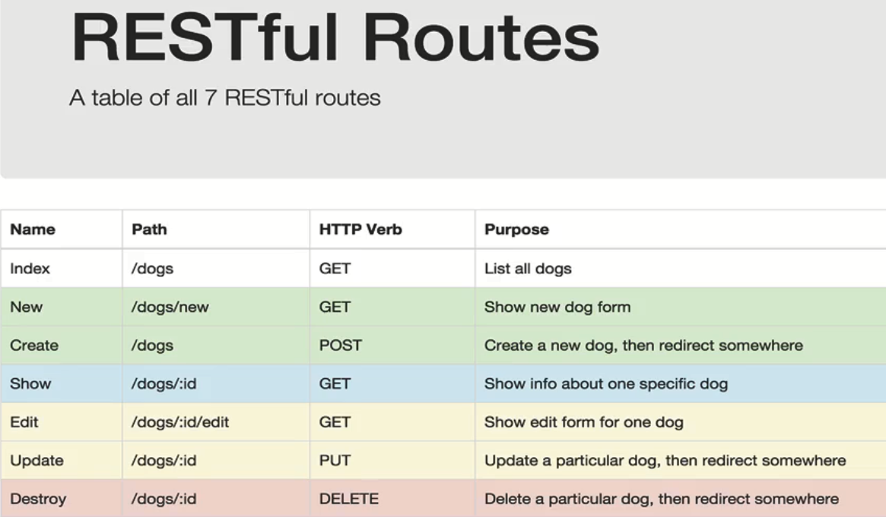

# NodeJs

!!! info ""

    **Reference:**

    [Official Docs](https://nodejs.org/en/docs/)

    [Node JS Cheat Sheet(by ZTM)](https://zerotomastery.io/cheatsheets/node-js-cheat-sheet/)

    

    Руководство по Node.js:

    <object data="./flavio-copes_rukovodstvo-po-node.js-2018.pdf" type="application/pdf" class="pdf"></object>

    **Installation:**

    [Official website](https://nodejs.org/en/)

## NodeJs Essentials

### NodeJs Basics

NodeJs allows computer to run JavaScript in a server, which is outside of the browser(it has a javascript engine V8).

+ enter node mode in terminal: `node`;
+ check function in node: `global.functionName`, e.g.: `global.setTimeout`;
+ exit node: `process.exit()`;
+ run script in node: `node script.js`;
+ get directory name: `__dirname`
+ import/export modules
    1. **using the *CommonJS* old way:**
        2. *created by ourselves modules*
            + export variable:`module.exports = {property: value}`, e.g. in *script2.js* file: `module.exports = {largeNumber: largeNumber}`

                `module` is a global object that we have access to(`global.module`). It has `exports` empty object property:

                ```node
                Module {
                  id: '<repl>',
                  path: '.',
                  exports: {},
                  filename: null,
                  loaded: false,
                  children: [],
                  paths: [
                    .
                    .
                    .
                  ]
                }
                ```

                We can add to this object any entities we want like variables, functions, objects etc. so they become availabe through this object in the file where this object imported(*as a global object*) to.

            + import variable: `require()`, e.g. in *script.js* file: `const script2 =  require('./script2')` and `const script2` here is the name(which can be whatever we want) of the imported global object `require('./script2)`
            + use imported variable: `importName.variableName`, e.g. in *script.js* file: `const a = script2.largeNumber`

        2. *built-in modules*
            + import only: `require('moduleName')`

        2. *npm modules*
            + import only: like built-in modules or by setting configuration in package.json file, e.g.:

                ```json
                "scripts": {
                  "start": "nodemon server.js"
                }
                ```

    1. **using *ES6* new way:**

        in order to be able to use this way we need either change the extension of each *.js* file to *.mjs* or insert `"type": "module"` line into the *package.json* file

+ `JSON.stringify()` converts JavaScript objects into strings. When sending data to a web server the data has to be a string.

### NodeJs built-in modules

These modules come already pre-installed with Node.

#### File System module

Allows operations with a file.

`#!js require('fs')`

+ read file content

    `#!js fs.readFile/readFileSync('filePath', (err, data) => {...})`

    ```js
    const fs = require('fs');

    // async with call back function: read code line by line and after finish reading file content, will callback to pass the data to the function
    fs.readFile('./hello.txt',(err,data)=>{
      if (err) { console.log('err!!')}
      console.log('1',data.toString()) // need to have encoding by toString('ENCODING'), default ENCODING is 'utf8' wich cover many languages
    })

    // sync, only read the next line if this line finished, so for large file, the program need to wait long time until it finish to continue
    const file = fs.readFileSync('./hello.txt')
    console.log('2',file.toString())

    // output 2 1
    ```

+ add text to the file(create a file in advance if it did not exist)

    `#!js fs.appendFile('filePath', 'Content', err =>{...})`

+ create text file and write to it

    `#!js fs.writeFile('filePath', 'Content', err => {...})`

+ delete file

    `#!js fs.unlink('filePath', err => {...})`

#### Http module

Allows build a server.

`#!js require('http')`

Simple example of building a server written inside *server.js* file:

```js
const http = require('http');

const server = http.createServer((request, response) => {
    console.log('headers', request.headers);
    console.log('method', request.method);
    console.log('url', request.url);
    const user = {
        name: 'John',
        hobby: 'Skating',
    }
    response.setHeader('Content-Type', 'application/json');
    response.end(JSON.stringify(user));
})

server.listen(3000);
```

### NodeJs useful npm modules

#### Nodemon module

Allows changing in js file reflect in terminal instantly.

`#!sh npm install nodemon --save-dev` or `#!sh npm install -D nodemon`

```json
"scripts": {
  "start": "nodemon server.js"
}
```

## Express.js library

!!! info ""

    **Reference:**

    [Official Website](https://expressjs.com/){target=_blank}

    

    **Installation:**

    `npm install express`

### Express.js Essentials

#### Express.js Basics

A node.js library to help build a server.

`npm install express`

Define server using just this 3 lines of code:

```js
const express = require('express');
const app = express();
.
.
.
app.listen(3000); // port
```

#### Express.js routing and RESTful API

**Routing:**

Express relies on routing to determine how an application responds to a client request to a particular *endpoint*, which is a [**U**niform **R**esource **I**dentifier](https://developer.mozilla.org/en-US/docs/Glossary/URI){target=_blank} (or path) and a specific HTTP request method (e.g., GET, POST, etc.).  Each route can have one or more handler functions, which are executed when the route is matched.

Routes follow the syntax below:

*app.METHOD(PATH, HANDLER)* e.g. `app.get('/', (req, res) => {...})`

+ **app**(`app`) is an instance of Express
+ **METHOD**(`.get`) is an HTTP request method(GET, POST, PUT, DELETE etc.), in lowercase

    !!! note

        1. Everything entered into the **adressbar** will always be a **GET** request.
        2. **POST** method can be used with a `fetch()` call or within a html form by defining `method="post"`.
        3. All other methods can be accessed programmatically only. GET and POST can be accessed programmatically too.
        4. Programmatically means using terminal or e.g. using [Postman](https://www.postman.com/){target=_blank} - a tool for API Development and testing server before connecting to front-end.

+ **PATH**(`'/'`) is a path on the server
+ **HANDLER**(`(req, res) => {...}`) is the function executed when the route is matched
    + `req` (*Request*) and `res` (*Response*) are actually objects (and can be named whatever we want, although **req** and **res** are conventions).
    + **"Request"** is an object containing all the information about the request that was made and which triggered the route.
    + **"Response"** is an object containing all of the data that the server is going to respond with.

**RESTful API:**

+ An API that defines a set of functions which developers can perform: *requests* and *receive responses* via a HTTP protocol using methods such as *GET*, *POST*, *PUT*, *DELETE* and it uses these methods as follows:

    + GET to receive a resource
    + POST to create a resource
    + PUT to change the state or update a resource
    + DELETE to remove a resource

+ REST APis are **stateless** - meaning that calls can be made independently of one another and each call contains all the data necessary to complete itself successfully. A server doesn't need to keep memorizing things, i.e. each request that comes in has enough information that the server can respond with, so each request sent to a server is a independent property of the *"Request"* object.

+ The most used properties of *Request* object:

    + `req.query`

        use in GET request, e.g. `localhost:3000/?name=andrei&age=31`. **?** is for query

    + `req.body`

        use in POST request with middleware(like bodyparser or new express.js methods passed through the genereic app.use() middleware) to receive data(urlencoded or json) sent in request body, e.g `req.body.email`

    + `req.headers`

        use in GET request to get all headers and the input

    + `req.params`

        use in GET request to get the parameters in the url(e.g. localhost:8000/12345), e.g. `app.get('/:id',(req,res)=>{const {id} = req.params})`, `app.get('/:id',(req,res) => console.log(req.params)`

+ The most used properties of *Response* object:

    + `res.send()`, e.g. `app.get('/',(req,res) => res.send('getting root')`

    + `res.status()`, e.g. `res.status(404).send('not found')` to set the response status of the request

+ RESTful routing can be described as an *architectural style(an approach to communications)*  that provides a map between HTTP verbs (e.g., GET, POST, etc.) and CRUD (create, read, update, delete) actions.  There are seven RESTful route conventions:

    {: .zoom}

#### Express.js Middleware

!!! note

    Middleware is a type of computer software that provides services to software applications beyond those available from the operating system. It can be described as "software glue"([Wikipedia](https://en.wikipedia.org/wiki/Middleware){target=_blank}).

+ `app.use()` - generic Express middleware(универсальное промежуточное программное обеспечение). It receives ahead of time before we get to the routes, **the request**, modifies it and then passes the `next()` callback function to keep it going and "trickle down" the **modifiyed request** to *apt.get/post/put/delete* etc.

    ```js
    app.use((req,res,next) => {
      console.log()
      next(); // allow express to run after this
    })
    ```

+ In order to get `req.body`(the body of our request, e.g. form data that user submitted through the `<form></from>` tag using POST method OR raw JSON data that was sent in the request body) we can use the *body-parser([npm](https://www.npmjs.com/package/body-parser))* middleware(the old way) or the *express built-in methods*(the new way):

    ```js
    // the old way
    const bodyParser = require('body-parser');

    app.use(bodyParser.urlencoded({extended: false})); // to get the form input
    app.use(bodyParser.json());  // to get JSON data sent in the request body

    // the new way
    app.use(express.urlencoded({extended: false})); // to get the form input
    app.use(express.json());  // to get JSON data sent in the request body
    ```

    !!! note

        The above middleware packages, already implement the `next()` within them. We only add the `next()` when we implement **our own** middleware.

+ To serve **static assets**, i.e. *index.html*, *css file* and *js file* we put'em in the *public* folder within our project folder and get Express to send these file using its following middleware: `app.user(express.static(__dirname + '/public'))`

    So the server(server.js file) that serves simple static assets will look like this:

    ```js
    const express = require('express');
    const app = express();

    app.use(express.static(__dirname + '/public'))

    app.listen(3000);
    ```

+ **CORS**([mdn](https://developer.mozilla.org/en-US/docs/Web/HTTP/CORS){target=_blank}) - to allow cross-origin request we use following npm package: `npm install cors` by calling it through generic Express.js middleware, e.g.:

    ```js
    const express = require('express');
    const app = express();

    app.user(cors())

    app.listen(3000);
    ```

### Connect frontend to backend

```js
// code from Signin.js react component of face-recognition-brain app
onSubmitSignIn = () => {
    fetch('http://localhost:3000/signin', {
        method: 'post',
        headers: { 'Content-Type': 'application/json' },
        body: JSON.stringify({
            email: this.state.signInEmail,
            password: this.state.signInPassword,
        })
    })
        // get the response from server: res.json()
        .then(response => response.json())
        .then(user => {
            if (user.id) { // does the user exist? Did we receive a user with a property of id?
                this.props.loadUser(user);
                this.props.onRouteChange('home');
            }
        })
}
```

## Knex.js library

SQL query builder library for Postgres, MSSQL, MySQL, MariaDB, SQLite3, Oracle, and Amazon Redshift.

!!! info ""

    **Reference:**

    [Official Website](https://knexjs.org/){target=_blank}

    **Installation:**

    1. instal postgreSQL database package: `npm install pg`
    2. install knex: `npm i knex`

**Connect server to database(code from server.js file):**

```js
const db = knex({
    client: 'pg',
    connection: {
        host: '127.0.0.1',
        user: 'tms',
        password: '',
        database: 'smart-brain'
    }
});

// signin by checking password match in login table and return user info in users table
app.post('/signin', (req, res) => {
    db.select('email', 'hash').from('login')
        .where('email', '=', req.body.email)
        .then(data => {
            const isValid = bcrypt.compareSync(req.body.password, data[0].hash)
            if (isValid) {
                return db.select('*').from('users')
                    .where('email', '=', req.body.email)
                    .then(user => {
                        res.json(user[0])
                    })
            } else {
                res.status(400).json('wrong credentials')
            }
        })
        .catch(err => res.status(400).json('unable to get user'))
})

// transaction + insert into two tables with foreign key
app.post('/register', (req, res) => {
    const { email, name, password } = req.body
    const hash = bcrypt.hashSync(password, 10)
    db.transaction(trx => {  // we create a transaction when we have to do more than two things at once and thus we use transaction object 'trx' instead of 'db'
        trx.insert({
            hash: hash,
            email: email,
            })
            .into('login')
            .returning('email')
            .then(loginEmail => {
                return trx('users')
                    .returning('*')
                    .insert({
                        email: loginEmail[0],
                        name: name,
                        joined: new (Date),
                    })
                    .then(user => {
                        res.json(user[0]);  // knex returns us an array of inserted to db rows, so we use here 'user[0]' and it only means, that we don't want to get it as an array, we want the response to be the object only instead
                    })
            })
            .then(trx.commit)
            .catch(trx.rollback)
     })
    .catch(err => res.status(400).json('unable to register'))
})

// get data
app.get('/profile/:id', (req, res) => {
    const { id } = req.params;
    db.select('*').from('users').where({id}) // {id} - here we use ES6 object property declaration shortcut
        .then(user => {
            if (user.length) {
                res.json(user[0])
            } else {
                res.status(400).json('Not found')
            }
        })
        .catch(err => res.status(404).json('error getting user'))
})

// update/increment
app.put('/image', (req, res) => {
    const { id } = req.body;
    db('users').where('id', '=', id)
    .increment('entries', 1)
    .returning('entries')
        .then(entries => {
        res.json(entries[0]);
    })
    .catch(err => res.status(400).json('unable to get entries'))
})
****
app.listen(3000, () => {
    console.log('app is running on port 3000...');
})
```

## NPM (Node Package Manager)

**Reference:**

[Official website](https://www.npmjs.com/){target=_blank}

!!! info ""

    **Installation:**

    NPM is installed with Node.js

    **Upgrading([according to official docs](https://docs.npmjs.com/try-the-latest-stable-version-of-npm){target=_blank}):**

    + to the latest version: `npm install -g npm@latest`

    + to the most recent version: `npm install -g npm@next`

        !!! note

            You may need to prefix these commands with `sudo`, especially on Linux, or OS X if you installed Node using its default installer.

    **Common commands:**

    + `npm init` create *package.json* file in your repo
    + `npm install packageName` only install in a project
    + `npm install -g packageName` will install globally, which can use in terminal
    + `npm run built` create a optimized js file that can put on the internet
    + `--save-dev` means the dependencies only use in development by you
    + run command in `scripts:{}` will look for file in `.bin`

### Npm Essentials

#### Dependencies: package.json file

+ Created after runnung `npm init`. Gets populated with git repo info, scripts and *dependecies*(locally installed NPM packages for our project)

    !!! note

        *Dependencies*: a new person can install all dependencies when start the  project by `npm install`

+ Script: run commands in a script by `npm run scriptName` e.g.:

    ```js
    // first define new script in package.json file like this:
    "script":{
        "build":"browserify script.js > bundle.js && live-server"
    }
    ```

    ```bash
    # then run it in terminal:
    npm run build
    ```

+ Check the version of packages you need to update to: [NPM Semver](https://semver.npmjs.com/){target=_blank}

### Useful Npm packages

#### Lodash

!!! info ""

    [Official website](https://lodash.com/){target=_blank}, [NPM](https://www.npmjs.com/package/lodash){target=_blank}

    `npm install lodash`

#### Live-server

!!! info ""

    [NPM](https://www.npmjs.com/package/live-server){target=_blank}

    `npm install -g live-server`

#### Browserify ==<small>outdated - used for old browsers that doesn't support ES6 Modules</small>==

!!! info ""

    [NPM](https://www.npmjs.com/package/browserify){target=_blank}

    `npm install -g browserify`

```js
// browserify syntax
var _ = require('lodash')
const array = [1,2,3]
console.log('answer',_.without(array,3)) //without is a function in lodash
```

```bash
# use broswerify to combine js files in terminal
browserify script.js > bundle.js
```

#### Bcrypt

!!! info ""

    [NPM](https://www.npmjs.com/package/bcrypt){target=_blank}

    `npm install bcrypt`

To securily store sensitive data like passwords we store it in hashes:

```js
/*
* You can copy and run the code below to play around with bcrypt
* However this is for demonstration purposes only. Use these concepts
* to adapt to your own project needs.
*/

import bcrypt from 'bcrypt'
const saltRounds = 10 // increase this if you want more iterations
const userPassword = 'supersecretpassword'
const randomPassword = 'fakepassword'

const storeUserPassword = (password, salt) =>
  bcrypt.hash(password, salt).then(storeHashInDatabase)

const storeHashInDatabase = (hash) => {
    // Store the hash in your password DB
    return hash // For now we are returning the hash for testing at the bottom
}

// Returns true if user password is correct, returns false otherwise
const checkUserPassword = (enteredPassword, storedPasswordHash) =>
  bcrypt.compare(enteredPassword, storedPasswordHash)


// This is for demonstration purposes only.
storeUserPassword(userPassword, saltRounds)
  .then(hash =>
    // change param userPassword to randomPassword to get false
    checkUserPassword(userPassword, hash)
  )
  .then(console.log)
  .catch(console.error)
```

!!! note

    United States National Institute for Standards and Technology (NIST) recommendations for password management:

    + Password length: 8-64 characters
    + Do accept both ASCII and UNICODE characters and encourage people to set long passwords with high entropy (upper case letters, lower case letters, digits, special characters).
    + Don’t allow password hints.
    + Avoid security questions.
    + Use 2FA (2 factor authentication) if you want an extra layer of security in your application, but avoid using SMS as this can be easily hacked to have the attackers phone receive the confirmation code.
    + Once the user has registered, there are two things to keep in mind:
        1. Don’t let the user know the password was incorrect when logging in. Instead, mention that the username and password combination is incorrect.
        2. The only time passwords should be reset by an administrator is when they suspect that an account has been compromised. Otherwise, passwords should only be reset by a user when he or she has forgotten their credentials.

#### Dotenv

!!! info ""

    [NPM](https://www.npmjs.com/package/dotenv){target=_blank}

    `npm i dotenv`

As early as possible in your application, require and configure dotenv.

```js
require('dotenv').config()
```

Create a `.env` file in the root directory of your project. Add environment-specific variables on new lines in the form of NAME=VALUE. For example:

```ini
PORT=3050

DB_HOST=localhost
DB_USER=root
DB_PASS=s1mpl3
```

`process.env` now has the keys and values you defined in your `.env` file.

```js
const PORT = process.env.PORT || 3000
app.listen(PORT, () => {
    console.log(`app is running on port ${PORT}...`);
})

const db = require('db')
db.connect({
  host: process.env.DB_HOST,
  username: process.env.DB_USER,
  password: process.env.DB_PASS
})
```

#### Serve

!!! info ""

    [NPM](https://www.npmjs.com/package/serve){target=_blank}

    `npm i serve`

Used to serve a static site, single page application or just a static file (no matter if on your device or on the local network).

In particular to serve a react spa pass this script into package.json `#!json "scripts": { "start": "serve -s build" }`. This is the preffered way of deployment according to CRA(Create React App) documentation.

### NPX (Execute NPM Package Binaries)

NPX it's a package runner tool that comes with npm 5.2+

!!! info ""

    **Refernce:**

    [Medium](https://medium.com/@maybekatz/introducing-npx-an-npm-package-runner-55f7d4bd282b){target=_blank}

    **Installation:**

    NPX is installed with Node.js

## NVM (Node Version Manager)

Allows to install multiple versions of NodeJs and change between them.

!!! info ""

    [Official GitHub](https://github.com/nvm-sh/nvm#installing-and-updating){target=_blank}, [Unofficial tutorial](https://www.sitepoint.com/quick-tip-multiple-versions-node-nvm/){target=_blank}
