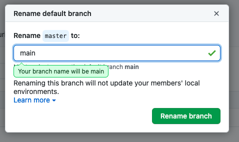

# Git

!!! info ""

    [OhMyGit game](https://ohmygit.org/){target=_blank}

    [Ignoring Files and Directories in Git (.gitignore)](https://linuxize.com/post/gitignore-ignoring-files-in-git/){target=_blank}

    gitignore.io - Create useful .gitignore files for your project: [Site](https://www.toptal.com/developers/gitignore){target=_blank}, [Documentation](https://docs.gitignore.io/install/command-line){target=_blank}

## Git Essentials

<object data="./git-big-episode.pdf" type="application/pdf" class="pdf"></object>

<object data="./heroku-git-cheatsheet.pdf" type="application/pdf" class="pdf"></object>

**Offline:**


## Useful Git Guides

### Setting the default branch name

```bash
git config --global init.defaultBranch main
```

You only have to do this once. Now all new repositories you create with `git init` will have a default branch named `main`.

### Renaming the default branch for an existing repository<small>([source](https://cyberhelp.sesync.org/faq/change-git-default-branch-name-from-master-to-main.html){target=_blank})</small>

1. Rename the local `master` branch to `main`, i.e. use the `--move` command in Git to copy the entire `master` branch to a new branch called `main`

      ```bash
      git branch -m master main
      ```

2. Check that the renaming worked

      ```bash
      git status
      ```

      If the renaming was successful you should see:

      ```terminal
      On branch main
      Your branch is up to date with 'origin/master'.

      nothing to commit, working tree clean
      ```

3. Rename the default branch for the remote repos

   **GitHub:**

   GitHub now allows you to rename any branch, including the default branch, from the web.

   1. Rename the default branch from the web:

      {: .zoom}

   2. Update your local clone:

      ```bash
      # Get the latest commits and branches from the remote
      git fetch origin

      # Create a new tracking connection with the new origin/main branch
      git branch -u origin/main main
      git remote set-head origin -a
      ```

   **GitLab:**

   1. Locally: push `main` to your remote repository:

      ```bash
      git push -u origin main
      ```

      You will then see an option to start a merge request which we are not going to do because we want `main` to become the default branch, not `master`.

   2. Change it on GitLab on your project:

      1. Go to **Admin Area --> Settings --> Repository**.
      2. Expand **Default initial branch name**.
      3. Change the default to **main**.
      4. Save changes.

      The next time someone clones your repository, they will automatically be on the `main` branch. When they make changes, the link to create a merge request will automatically be pointed at the `main` branch.

   3. Remove the master branch:

      You can remove the `master` branch completely. Removing the `master` branch is recommended to avoid any confusion around what branch is the default one. If you choose to remove the `master` branch make sure you update any dependencies.

      To remove the `master` branch:

      1. In your project go to **Repository --> Branches**.
      2. Under **Active branches** find **master**.
      3. Click the trash can to the right to delete the branch.

### GitHub URL Shortener

**Using [git.io](https://git.io/){target=_blank} - a service provided by GitHub to shorten the URLs**

!!! note

      This URL shortener can only be used for GitHub URLs and not for other URLs.

!!! warning

      You can create only one shortened URL for each URL. You cannot create another shortened URL if that GitHub URL has already been shortened. If you try to shorten the same URL again, it will return the existing shortened URL.

+ Option 1: Using `curl` command

      `curl -i https://git.io -F "url=GITHUB_URL"` - outputs url with arbitrary text after last slash

      `curl -i https://git.io -F "url=GITHUB_URL" -F "code=CUSTOM_TEXT"` - outputs url with custom text after last slash

      `curl -i SHORTENED-URL` - to retrieve the complete URL from the shortened URL

      > If you get SSL Error, then pass the `--insecure` flag along with the command to skip certificate verification.
      >
      > The (un)shortened URL will appear in the `Location` field of the response header.

+ Option 2: Using following Python scripts

      To create shortened URL:

      ```python
      import requests

      url = 'https://git.io/'
      data = {'url': 'https://github.com/jimit105/Intro-to-Deep-Learning-with-PyTorch',
               'code': 'pytorch'}

      r = requests.post(url, data=data)
      print(r.headers.get('Location'))

      """ Output:
      https://git.io/pytorch """
      ```

      > If you get `SSLError` while running the above script, add the parameter `verify=False` in the `requests.post` method to skip certificate validation.

      To retrieve full URL:

      ```python
      import requests

      r = requests.head('https://git.io/pytorch')

      print(r.headers.get('Location'))

      """ Output:
      https://github.com/jimit105/Intro-to-Deep-Learning-with-PyTorch """
      ```

## Git Started Guide by ZTM

<object data="./ztm-git-started-guide.pdf" type="application/pdf" class="pdf"></object>

## Conventional Commits<small>([link](https://www.conventionalcommits.org/en/v1.0.0/#specification){target=_blank})</small>

Commit Messages Cheat Sheet(rus) -> [link](https://cheatography.com/admitad/cheat-sheets/commit-messages/){target=_blank}

<object data="./commit-messages(rus).pdf" type="application/pdf" class="pdf"></object>
