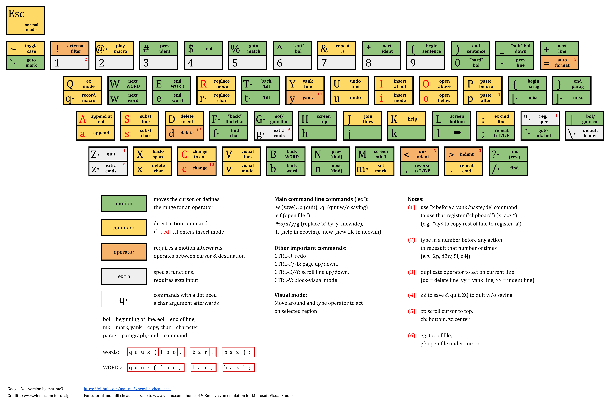

# Vim

!!! info ""

    + [Vim Tips Wiki](https://vim.fandom.com/wiki/Vim_Tips_Wiki)

## Vim Essentials

### Vim Cheatsheet

!!! info ""

    [Neovim Cheat Sheet fro various keyboard layouts :material-github:](https://github.com/mattmc3/neovim-cheatsheet)

<figure markdown>
  {: .zoom}
  <figcaption>
      <a href="[image-source-link](https://docs.google.com/spreadsheets/d/15k_UgeY0C3j8tVQnR2hD_kNljB1AApG3x3gYrKtUAlw/edit#gid=1082709605)" target="_blank">neovim/vim graphical cheat sheet(google sheets)</a>
  </figcaption>
</figure>

### Vim Shortcuts

!!! note "Legend:"

    **bol** - begining of line <br>
    **"soft" bol** - first non-whitespace character of line <br>
    **eol** - end of line <br>
    **"soft" eol** - last non-whitespace character of line <br>
    **buffer** - content of opened in vim file <br>
    **register** - vim's clipboard

#### MODES

^^Normal Mode^^

+ Default mode vim starts in. Key presses don’t insert text into the document.
+ To get back to the mode from other ones: <br>
    ++esc++ or ++ctrl+bracket-left++ - back from any mode <br>
    ++"v"++ / ++"v"++++"v"++ - back from charwise / linewise *visual mode* <br>

^^Insert Mode^^

+ Typing inserts characters just like a regular text editor.
+ Accessed from *normal mode* by pressing: ++"i"++, ++i++, ++"a"++, ++a++, ++"o"++, ++o++, ++"c"++, ++c++ or ++"s"++, ++s++

^^Replace Mode^^

+ Allows replace existing text by directly typing over it.
+ Accessed from *normal mode* by pressing: ++r++

^^Visual Mode^^

+ Used to make selections of text, similar to how clicking and dragging with a mouse behaves.
+ Accessed from *normal mode* by pressing: ++"v"++, ++v++ or ++ctrl+"q"++

^^Command Mode^^

+ Has a wide variety of commands and can do things that *normal mode* can’t do as easily.
+ Accessed by pressing: ++slash++, ++question++ or ++colon++

#### SAVING, CLOSING

+ ++z++++z++ - save and close the current file
+ ++z++++q++ - close the current file without saving
+ `:q` / `:q!` - close / force-close a file without saving
+ `:w` - save the current file
+ `:wq` (or `:x`) / `:wq!` (or `:x!`) - save and close the current file / force save and close the current file; exits vim if no open files remain
+ `:w {newfile}` (`:{x},{y}w {newfile}`) - ^^write^^ the whole ( from line {x} to line {y} ) current buffer into {newfile}, but continue editing the original file; `:w! {file}` (`:{x},{y}w! {file}`) to ^^overwrite^^ content of {file} that already exists
+ `:w >> {file}` (`:{x},{y}w >> {file}`) - ^^append^^ the whole ( from line {x} to line {y} ) current buffer to {file}
+ `:sav {newname}` - save a copy of the current file as {newname} and continue editing the file {newname}

#### REPEATING

+ ***{num}{command}*** - repeat command {num} times
+ ++"&"++ - repeat `:s` ==[command](#navigation-search-replace-buffers)==
+ ++period++ - repeat previous change

#### MACROS

+ ++"q"++*{a-z}* - start recording macro named {a-z}
+ ++"q"++ - stop recording macro(after it started with the above command)
+ ++"@"++*{a-z}* - replay {a-z} macro
+ ++"@"++++"@"++ - replay the last macro played

#### NAVIGATION

##### Tabs

##### Windows

+ ++ctrl+"w"++ ++"s"++ / ++ctrl+"w"++ ++"v"++ - create a horizontal / vertical split; ++ctrl+"w"++ ++"w"++ to switch windows
+ ++ctrl+"w"++ ++"c"++ - close current window in splitted layout i.e. doesn't close the last window

##### Buffers

+ ++ctrl+"^"++ - switch between two last buffers
+ `:ls` - show opened buffers; focused buffer named with `%a`
+ `:bp` / `:bn` / `:b#` / `:b{N}` / `:b {Name}` - switch to previous / next/ alternate(heretofore opened) / {N}'s(as shown by `:ls`) / {Name}(as shown by `:ls`) buffer
+ `:bd` / `:%bd` /  `:bd#` / `:bd{N}` / `:bd {Name}` - unload current / all / alternate(heretofore opened) / {N}'s(as shown by `:ls`) / {Name}(as shown by `:ls`) buffer and delete it from the buffer list
    1. to force unload use `!` after `bd`; changes are lost in this case
    2. in splitted layout that command will also close all windows currently showing the buffer

##### Screen

+ ++ctrl+"f"++ / ++"b"++ ( or ++shift+up++ / ++down++ or ++page-up++ / ++page-down++ ) - move pages up / down
+ ++ctrl+"u"++ / ++"d"++ - move up / down 1/2 a screen
+ ++ctrl+"e"++ / ++"y"++ - ^^scroll^^ line up / down
+ ++"z"++++"t"++ , ++"z"++++"z"++ , ++"z"++++"b"++ - ^^scroll^^ cursor to top, center, bottom
<br/><br/>

+ ++"m"++*{a/A-z/Z}* - set a mark {a/A-z/Z}; {a-z} - per buffer marks, {A-Z} - global marks
<br/><br/>

+ ++k++ - jumps to the help for the word under the cursor: neovim help, man page, etc...( ++"q"++++"q"++ - to get back to the editor)

###### Motion

!!! note

    Motion - move the cursor, or define the range for an operator.

+ ++"h"++ , ++"j"++ , ++"k"++ , ++"l"++ (or ++left++ , ++down++ , ++up++ , ++right++ ) - move the cursor left, down, up, right
+ ++"g"++++"j"++ / ++"g"++++"k"++ - move the cursor down / up in multi-line text
+ ++"w"++ ( or ++shift+right++ ) / ++w++ ( or ++ctrl+right++ ) - move cursor to ^^begining of next^^ word / whitespace-separated segment of text
+ ++"b"++ ( or ++shift+left++ ) / ++b++ ( or ++ctrl+left++ ) - move cursor to ^^previous begining^^ of word / whitespace-separated segment of text
+ ++"e"++ / ++e++ - move the cursor to ^^end^^ of word / whitespace-separated segment of text
+ ++"g"++++"e"++ / ++"g"++++e++ - move the cursor to ^^end^^ of ^^previous^^ word / whitespace-separated segment of text
<br/><br/>

+ ++0++ or ++pipe++ - bol of current line
+ ++"^"++ or ++underscore++ - "soft" bol of current line
+ ++"$"++ - eol of current line
+ ++"g"++++underscore++ - "soft" eol of current line
+ ++plus++ or ++enter++ - "soft" bol of next line
+ ++minus++ - "soft" bol of previous line
<br/><br/>

+ ++"%"++ - move the cursor to matching parenthesis, bracket or brace
+ ++"f"++*{char}* / ++f++*{char}* - move the cursor ^^to^^ the next / previous instance of {char}
+ ++"t"++*{char}* / ++t++*{char}* - move the cursor ^^till^^ the next / previous instance of {char}
+ ++semicolon++ - repeat ++"f"++ , ++f++ , ++"t"++ , ++t++ commands
+ ++comma++ - reverse ++"f"++ , ++f++ , ++"t"++ , ++t++ commands
<br/><br/>

+ ++"("++ / ++")"++ - move the cursor ^^backwards^^ to the beginning of the current(if cursor is not at the first letter of the sentence) or next sentence / ^^forward^^ to the beginning of the next sentence
+ ++brace-left++ / ++brace-right++ - move the cursor to the previous / next empty line
+ ++grave++*{a/A-z/Z}* / ++grave++++period++ - move the cursor to mark {a/A-z/Z} / to the position of the last modification
+ ++single-quote++*{a/A-z/Z}* / ++single-quote++++period++ - move the cursor to "soft" bol of {a/A-z/Z} mark / of the last modification position
+ ++grave++++0++ - move the cursor to the position where Vim was previously exited
+ ++h++ , ++m++ , ++l++ - move the cursor to the top, middle, bottom line on screen
+ ++"g"++++"g"++ / ++g++ - move the cursor first / last line of the file
+ ++colon++*{num}* or *{num}*++"gg"++ or *{num}*++g++ - move the cursor to line {num} of the file
<br/><br/>

+ ++"*"++ / ++"#"++ - search forward / backwards for the next instance of the identifier(word) under the cursor
+ ++"n"++ / ++n++ - repeats the last search in the same / opposite direction specified by
the last use of ++"*"++ , ++"#"++ , ++slash++ , ++question++ (the last two are command mode motion commands)
+ `/{pattern}` / `?{pattern}` - forward / reverse search for {pattern}
+ `/\<{word}\>` - find the next occurrence of the word {word}, where {word} is bounded by word
boundaries (ex. space, dash)

!!! note

    **Regular expressions:**

    Both vim’s find and replace functions accept regular expressions. <br>
    Characters assumed by vim as part of regular expression(must be escaped with `\` to be searched for literally): `(`, `)`,  `*`,  `.`, `^`, `$` <br>
    Regular expression patterns that interpreted literally(must be escaped with `\` to be used as a part of a regular expression): `+`

    **Ignoring case:**

    `\c` in searching and replacing commands - can be placed anywhere in the sequence being searched for and affects the whole sequence

#### EDITING

+ `:new` - new file
+ `:e {file}` - open {file} in the current buffer
+ `:r {file}` - insert {file} content at the current cursor position
<br/><br/>

+ ++"i"++ - insert at cursor
+ ++"a"++ - append after cursor
+ ++i++ - insert at the beginning of the line
+ ++a++ - append at the end of the line
+ ++"o"++ - insert a line below the current line
+ ++o++ - insert a line above the current line
<br/><br/>

+ ++"u"++ - undo the previous operation
+ ++u++ - restore (undo) last changed line
+ ++ctrl+"r"++ - redo last undo change
<br/><br/>

+ ++tilde++ - toggle case of character beneath the cursor
+ ++"r"++ - replace a character at the cursor position
+ ++r++ - replace characters starting at the cursor position using overstrike cursor, which types over existing characters
+ ++j++ - joins the current line with the next one, or all the lines in the current visual selection
<br/><br/>

+ ++"p"++ - *put* : to paste after (if charwise, to the right; if linewise, below)
+ ++p++ - *put* : to paste before (if charwise, to the left; if linewise, above)
+ ++dblquote++*{char}* - select from register the {char} register before a *yank*/*delete*/*put* commands, e.g. ++dblquote++++"a"++++y++ - copy rest of line to register *a*
    1. ++dblquote++*{A-Z}* before *yank*/*delete* - ^^append-copy^^ to register {a-z}
    2. following *{chars}* are *special registers*: <br>
        `0` - last yank <br>
        `"` - unnamed register, last delete or yank <br>
        `%` - current file name <br>
        `#` - alternate file name <br>
        `*` - X11 PRIMARY(data copied upon highlighting with mouse) clipboard contents <br>
        `+` - X11 CLIPBOARD(traditional windows-like) clipboard contents <br>
        `/` - last search pattern <br>
        `:` - last command-line <br>
        `.` - last inserted text <br>
        `-` - last small (less than a line) delete <br>
        `=` - expression register <br>
        `_` - black hole register <br>

!!! tip

    Registers are being stored in ~/.viminfo, and will be loaded again on next restart of vim.

+ ++shift+insert++ - paste from system PRIMARY clipboard
+ ++ctrl+shift+"v"++ - paste from system CLIPBOARD clipboard

##### Replace

+ `:[range]s/{old}/{new}/[flags]` - replace {old} with {new} in ^^range^^ according to ^^flags^^

    ^^Ranges:^^

    + `%` - the entire file
    + `'<,'>` - the current selection; the default range while in visual mode
    + `25` - line 25
    + `25,50` - lines 25-50
    + `$` - last line;  can be combined with other lines as in `50,$`
    + `.` (or just empty sign) - current line; can be combined with other lines as in `.,50` (or `,50`)
    + `,+2` or `+2,` - the current lines and the two lines therebelow
    + `-2,` or `,-2` - the current line and the two lines thereabove

    ^^Flags:^^

    + `g` - replace all occurrences on the specified line(or lines selected in *visual mode*); without this flag just the ^^first^^ occurrence is changed per line
    + `i` - ignore case
    + `c` - confirm each substitution

##### Operators

!!! info ""

    Operator - operate on the specified range depending on current vim mode:

    + *normal mode* - range is specified by a series of ==[modifiers](#operators-modifiers)==
    + *visual mode* - range is the highlighted text

+ ++"y"++ - *yank* : copy
+ ++"d"++ - *delete* : cut
+ ++"c"++ - *change* : cut
+ ++equal++ - format code
+ ++gt++ / ++lt++ - un-indent / indent

##### ==[Operator's](#operators)== Modifiers

###### Operator Doubling

double an operator to make it operate on a whole line:

+ ++"y"++++"y"++ - copy current line(no matter where the cursor located in it), including *invisible newline sign* at the end
+ ++"d"++++"d"++ - cut current line(no matter where the cursor located in it), including *invisible newline sign* at the end
+ ++"c"++++"c"++ - cut current line(no matter where the cursor located in it), including *invisible newline sign* at the end
+ ++"="++++"="++ - format line
+ ++">"++++">"++ / ++"<"++++"<"++ - increase / decrease current line indentation(no matter where the cursor located in it)

useful shorthands:

+ ++s++ ( same as ++"c"++++"c"++ ) - *substitute line*

###### Motions

use operators and ==[motions](#motion)== together by following any of these patterns:

+ ***{operator}{num}{motion}***
+ ***{num}{operator}{motion}***

useful shorthands:

!!! tip

    When you capitalize a command it performs a stronger (or alternate) version of the original command.

+ ++y++ ( same as ++"y"++++"$"++ ) - copy from cursor position to end of line
<br/><br/>

+ ++d++ ( same as ++"d"++++"$"++ ) - cut from cursor position to end of line
+ ++"x"++ ( same as ++"d"++++"l"++ ) - cut character after the cursor
+ ++x++ ( same as ++"d"++++"h"++ ) - cut character before the cursor
<br/><br/>

+ ++"s"++ ( same as ++"c"++++"l"++ ) - *substitute character* :  cut character after the cursor and enter *insert mode*
+ ++c++ ( same as ++"c"++++"$"++ ) - cut from cursor position to end of line and enter *insert mode*

###### Text Objects

Text objects are special motions that describe structured pieces of text(the entities of a document domain model), e.g. words, sentences, quoted text, paragraphs, blocks, (HTML) tags, etc.

Specify a text object within a command by following this pattern: ***{operator}{a|i}{text-object}***

+ **a** (think **a** or **a**ll) - ^^a^^ text object plus surrounding whitespace
+ **i** (think **i**nner) - ^^inner^^ object without whitespace
+ **text-object** - one of the built-in text objects:

    + `w` - word
    + `s` - sentence
    + `'`, `"`, `` ` `` - quotes
    + `p` - paragraph
    + `b` (or `(`, `)`) - block surrounded by ( )
    + `B` (or `{`, `}`) - block surrounded by { }
    + `<`, `>` - block surrounded by < >
    + `[`, `]` - block surrounded by [ ]
    + `t` - tag


#### SELECTING

+ ++"v"++ - *visual* : marks starting selection point, then move the cursor to the desired end selection point
+ ++v++ - *linewise-visual* : always select full lines
+ ++ctrl+"q"++ - *block-visual* : select any rectangular region
+ Upon selecting one can use various ==[operators](#operator)==.

#### GLOBAL

+ ++"q"++++colon++ - show commands history list in a new horisontally-splitted window
+ `:h` (or `:help`) - help
+ `:noh` - un-highlight search matches
+ `:map` - mapping a key in command mode to a group of commands, e.g. `:map de :1,$d^M` will delete all lines when using the `:de` command
+ `:ab` - define a text abbreviation in *insert node*, e.g. `:ab VIM Vi Improved` will auto-complete "VIM" in *insert mode* for the phrase "Vi Improved"
+ `:set` / `:set {options}` - show / define editor options

    ^^Some of the commmon *{options}* are:^^

    + *all* - display all current vi options
    + *[no]nu* - display line numbers
    + *[no]ruler* (and optionally *rulerformat*) - showing line number headers; if you don't want to see the ruler all the time but want to know where you are, use ++"g"++ ++ctrl+"g"++
    + *[no]wrap* - text wrapping
    + *[no]linebreak* - line breaking
    + *[no]spell* - spellchecking
    + *syntax on/off* - syntax highlighting
    + *expandtab* - space-tabbing
    + *softtabstop=4* - soft tab
    + *shiftwidth=4* - indent sizing

+ `noremap x "_x` - re-map ++"x"++ command to work with the "black hole" register, i.e. to allow deleting characters without copying them to the clipboard, so that a following ++"p"++ / ++p++ commands would paste the previously *yanked* value instead
+ `:pwd` - print working directory
+ `:!{cmd}` - execute a shell command named {cmd}
+ `:ter` - load an inline terminal to new buffer in *normal mode*; to exit use `:bd!` or `exit` command in *insert mode*

## Vim Tips & Tricks

### Execute vim's commands in a file from the command line

Use `-c` flag. You can separate multiple commands with a pipe `|`. Example:

``` bash
vi -c "%s/false/true/g|:wq" file.txt
```
